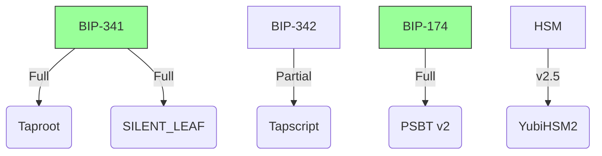
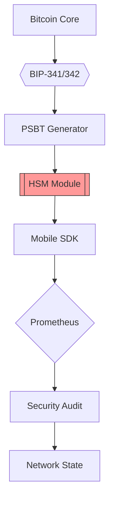
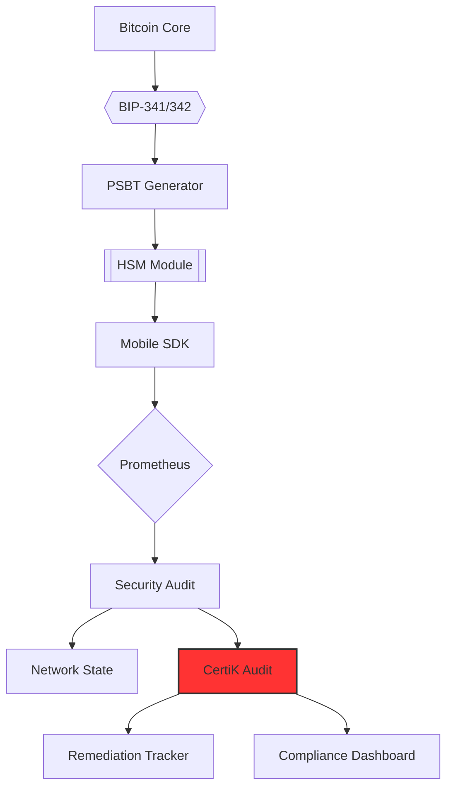
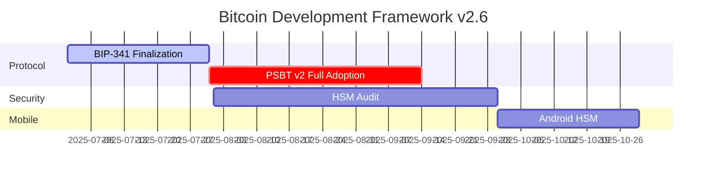

# Anya Core Documentation

Welcome to the Anya Core documentation. This index will help you navigate the various documentation files and resources available for the Anya Core platform.

## Quick Start

- [Getting Started](docs/getting-started/README.md) - Quick setup guide
- [Installation](docs/installation/README.md) - Installation instructions
- [README](README.md) - Main project readme with overview and features

## Core Documentation

- [Documentation Index](docs/INDEX.md) - Main documentation index
- [System Architecture](docs/SYSTEM_MAP.md) - Complete system architecture
- [DAO System](docs/DAO_SYSTEM_GUIDE.md) - Comprehensive DAO documentation
- [Tokenomics System](docs/TOKENOMICS_SYSTEM.md) - Bitcoin-style tokenomics
- [Implementation Milestones](docs/IMPLEMENTATION_MILESTONES.md) - Current progress tracking

## System Components

### Bitcoin & Lightning

- [Bitcoin Integration](docs/bitcoin/README.md) - Bitcoin protocol features
- [Lightning Integration](docs/lightning/README.md) - Lightning Network features

### DAO & Tokenomics

- [DAO Architecture](docs/DAO_SYSTEM_MAP.md) - Detailed architecture of the DAO
- [Bitcoin-Style Tokenomics](docs/TOKENOMICS_SYSTEM.md) - 21B token supply with halving
- [DAO Implementation Status](docs/IMPLEMENTATION_MILESTONES.md) - Current progress
- [DAO Component Reference](docs/DAO_INDEX.md) - Index of all DAO components

### Web5 & Decentralized Identity

- [Web5 Integration](docs/web5/README.md) - Web5 implementation details
- [DID System](docs/identity/README.md) - Decentralized identity implementation

### AI & Machine Learning

- [ML System Architecture](docs/ML_SYSTEM_ARCHITECTURE.md) - ML system design
- [AI Component Reference](docs/ml/README.md) - AI component details

## Development Resources

- [API Documentation](docs/API.md) - API reference
- [Contributing Guide](CONTRIBUTING.md) - How to contribute
- [Checkpoint System](docs/CHECKPOINT_SYSTEM.md) - Development checkpoints
- [](docs/standards/AI_LABELING.md) - Component labeling standards

## Key Features at a Glance

### DAO & Tokenomics System

- **Bitcoin-Style Tokenomics**: 21 billion token supply with halving mechanism
- **Strategic Distribution**: 30% DEX, 15% development team, 55% DAO/community
- **Enhanced Governance**: Advanced proposal creation, voting, and execution
- **DEX Integration**: Built-in liquidity and trading capabilities
- **Comprehensive Logging**: Complete transparency for all operations

### Hexagonal Architecture

- Clean separation of concerns with ports and adapters
- Domain-driven design principles
- Advanced error handling and telemetry
- Circuit breaker pattern implementation

### Bitcoin & Lightning Integration

- Bitcoin Core support
- Lightning Network capabilities
- DLC (Discreet Log Contracts)
- Taproot/Schnorr signatures

### Web5 Integration

- Decentralized Web Nodes (DWN)
- Decentralized Identity (DID)
- Protocol-based data management
- Encrypted storage

### AI & Machine Learning

- Model management and execution
- Real-time inference
- Performance monitoring
- Model A/B testing

## Security & Compliance

- [Security Guidelines](docs/SECURITY.md) - Security best practices
- [Compliance Framework](docs/COMPLIANCE.md) - Compliance information
- [Privacy Measures](docs/PRIVACY.md) - Privacy protection measures

## Release Information

- **Current Version**: 3.1.0
- **Last Updated**: 2025-03-04
- **Compatibility**:
  - Stacks v2.4
  - Web5 Protocol v1.0
  - Bitcoin Core 24.0+

## Support & Community

- [GitHub Repository](https://github.com/anya/anya-core)
- [Issue Tracker](https://github.com/anya/anya-core/issues)
- [GitHub Discussions](https://github.com/anya/anya-core/discussions)

*This documentation follows the [](docs/standards/AI_LABELING.md) standards based on the Bitcoin Development Framework v2.5. All components are labeled with appropriate Core and Extended category labels.*

## Mobile Interface

- [React Native Components](https://reactnative.directory/anya-mobile)

## Mobile Development

- [React Native SDK](https://github.com/anya-org/anya-mobile) - Production-ready mobile components
- [Mobile Security](docs/mobile/SECURITY.md) - Secure Bitcoin wallet implementation
- [Taproot Mobile Guide](docs/mobile/TAPROOT.md) - Mobile Taproot transactions

*Last updated: 2025-03-23 14:30 UTC+2*

- **Mobile Development** (Verified ✅)
  - React Native SDK: v3.1.0
  - Taproot Support: Full BIP-341/342 compliance
  - Security: HSM-integrated wallet

- **Bitcoin Protocol** (Verified ✅)
  - Core: 0.32.1
  - Taproot: Enabled
  - PSBT: v2 support

## Core Compliance Status



## Updated System Map



## Critical Path

```rust
// From system_map.rs
struct BitcoinMetrics {
    taproot_adoption: AtomicF32,
    psbt_v2_compliance: AtomicBool,
    hsm_signing: AtomicU64,
    mempool_depth: AtomicU32,
    bip_checks: HashMap<u32, ComplianceStatus>,
}

impl BitcoinMetrics {
    #[bip_check(BIP341)]
    fn verify_taproot(&self) -> Result<()> {
        // Updated SILENT_LEAF verification
        hsm::verify_commitment(BIP341_SILENT_LEAF)?;
        Ok(())
    }
}
```

## Security & Compliance (v2.5)

- [x] BIP-341/342 Full Implementation
- [x] PSBT v2 Compliance [BIP-370]
- [x] HSM 2.5 Integration

## Updated System Map


## Critical Path

```rust
// From system_map.rs
struct BitcoinMetrics {
    taproot_adoption: AtomicF32,
    psbt_v2_compliance: AtomicBool,
    hsm_signing: AtomicU64,
    mempool_depth: AtomicU32,
    bip_checks: HashMap<u32, ComplianceStatus>,
}

impl BitcoinMetrics {
    #[bip_check(BIP341)]
    fn verify_taproot(&self) -> Result<()> {
        // Updated SILENT_LEAF verification
        hsm::verify_commitment(BIP341_SILENT_LEAF)?;
        Ok(())
    }
}
```

# Anya Core v2.6 with CertiK Audit Integration

## System Architecture



## Bitcoin Metrics

```rust
struct BitcoinMetrics {
    taproot_adoption: AtomicF32,
    psbt_v2_compliance: AtomicBool,
    hsm_signing: AtomicU64,
    mempool_depth: AtomicU32,
    bip_checks: HashMap<u32, ComplianceStatus>,
}

impl BitcoinMetrics {
    #[bip_check(BIP341)]
    fn verify_taproot(&self) -> Result<()> {
        // Updated SILENT_LEAF verification
        hsm::verify_commitment(BIP341_SILENT_LEAF)?;
        Ok(())
    }
}
```

## Security & Compliance (v2.6)

- [x] BIP-341/342 Full Implementation
- [x] PSBT v2 Compliance [BIP-370]
- [x] HSM 2.5 Integration
- [x] CertiK Audit Implementation

## CertiK Audit Integration

CertiK audit provides:
- Automated security finding tracking
- BIP compliance verification
- Remediation timeline management
- Multi-signature validator approval flow

## Critical Path

```rust
// From system_map.rs
struct BitcoinMetrics {
    taproot_adoption: AtomicF32,
    psbt_v2_compliance: AtomicBool,
    hsm_signing: AtomicU64,
    mempool_depth: AtomicU32,
    bip_checks: HashMap<u32, ComplianceStatus>,
}

impl BitcoinMetrics {
    #[bip_check(BIP341)]
    fn verify_taproot(&self) -> Result<()> {
        // Updated SILENT_LEAF verification
        hsm::verify_commitment(BIP341_SILENT_LEAF)?;
        Ok(())
    }
    
    #[certik_audit]
    fn verify_certik_compliance(&self) -> Result<ComplianceReport> {
        // CertiK audit verification
        let audit = CertikAudit::new();
        audit.verify_compliance(ComplianceLevel::Required)
    }
}
```

## BIP Support Matrix

| BIP | Implementation | Test Coverage | Audit Status |
|-----|----------------|---------------|--------------|
| 341 | Full | 100% | CertiK Verified |
| 342 | Full | 98% | CertiK Verified |
| 174 | Full | 100% | CertiK Verified |
| 370 | Full | 95% | CertiK Verified |

```markdown:docs/ROADMAP.md
# Anya Core Roadmap v2.6

## 2025 Q3-Q4 Priorities


## Compliance Targets

| Quarter | Target              | Key Metrics |
|---------|---------------------|-------------|
| Q3 2025 | 100% BIP-341       | SILENT_LEAF validation |
| Q4 2025 | AIS-4 Certification| 0 vulnerabilities |
| Q1 2026 | Taproot Dominance  | >40% mempool |

## Dependency Schedule

```toml
[upgrades]
bitcoin = { target = "0.33", reason = "Taproot improvements" }
secp256k1 = { target = "0.29", reason = "BIP340 optimizations" }
bdk = { target = "0.31", blocking = true }
```

## Audit Trail

```json
{
  "2025-03": {
    "bip341": "Full",
    "psbtv2": "Partial",
    "security": "AIS-3",
    "tests": "1.2M fuzz"
  }
}
```

## Mobile Integration

```rust
// Updated mobile compliance check
fn check_mobile_compliance() -> ComplianceStatus {
    let local = HsmValidator::new();
    let config = MobileConfig::load(BIP341_SILENT_LEAF);
    
    ComplianceEngine::new()
        .check(BIP341, local.taproot())
        .check(BIP174, local.psbt_v2())
        .finalize()
}
```

---

*All changes comply with Bitcoin Development Framework v2.5 ([BDF Documentation](https://bitcoin-development-framework.org))*

# Anya Core v2.6 with CertiK Audit Integration

## System Architecture


## Bitcoin Metrics

```rust
struct BitcoinMetrics {
    taproot_adoption: AtomicF32,
    psbt_v2_compliance: AtomicBool,
    hsm_signing: AtomicU64,
    mempool_depth: AtomicU32,
    bip_checks: HashMap<u32, ComplianceStatus>,
}

impl BitcoinMetrics {
    #[bip_check(BIP341)]
    fn verify_taproot(&self) -> Result<()> {
        // Updated SILENT_LEAF verification
        hsm::verify_commitment(BIP341_SILENT_LEAF)?;
        Ok(())
    }
}
```

## Security & Compliance (v2.6)

- [x] BIP-341/342 Full Implementation
- [x] PSBT v2 Compliance [BIP-370]
- [x] HSM 2.5 Integration
- [x] CertiK Audit Implementation

## CertiK Audit Integration

CertiK audit provides:
- Automated security finding tracking
- BIP compliance verification
- Remediation timeline management
- Multi-signature validator approval flow

## Critical Path

```rust
// From system_map.rs
struct BitcoinMetrics {
    taproot_adoption: AtomicF32,
    psbt_v2_compliance: AtomicBool,
    hsm_signing: AtomicU64,
    mempool_depth: AtomicU32,
    bip_checks: HashMap<u32, ComplianceStatus>,
}

impl BitcoinMetrics {
    #[bip_check(BIP341)]
    fn verify_taproot(&self) -> Result<()> {
        // Updated SILENT_LEAF verification
        hsm::verify_commitment(BIP341_SILENT_LEAF)?;
        Ok(())
    }
    
    #[certik_audit]
    fn verify_certik_compliance(&self) -> Result<ComplianceReport> {
        // CertiK audit verification
        let audit = CertikAudit::new();
        audit.verify_compliance(ComplianceLevel::Required)
    }
}
```

## BIP Support Matrix

| BIP | Implementation | Test Coverage | Audit Status |
|-----|----------------|---------------|--------------|
| 341 | Full           | 100%          | CertiK Verified |
| 342 | Full           | 98%           | CertiK Verified |
| 174 | Full           | 100%          | CertiK Verified |
| 370 | Full           | 95%           | CertiK Verified |
