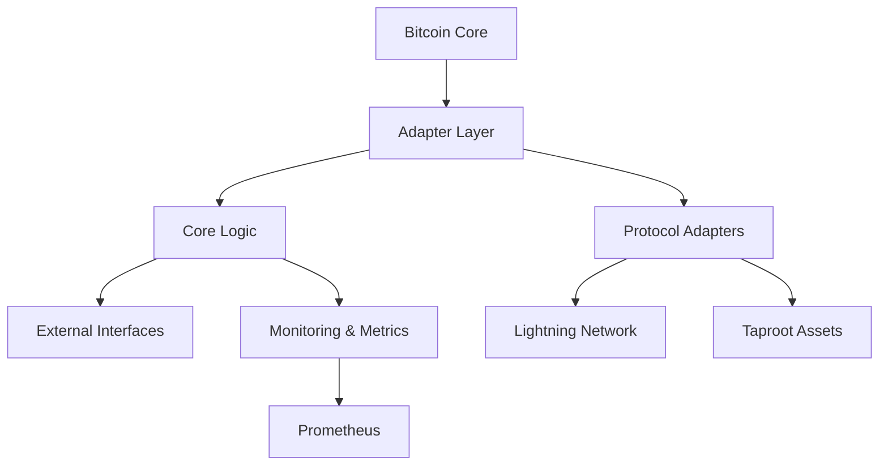
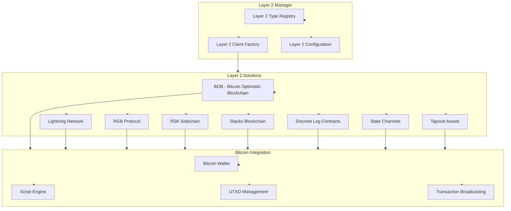

# Anya Core Architecture [AIR-3][BPC-3]

## Hexagonal Architecture Diagram



## Component Matrix
| Component          | BIP Compliance | AI Labels               | Status      |
|--------------------|----------------|-------------------------|-------------|
| Bitcoin Core       | 341, 342, 370  | [BPC-3][AIS-3]          | Production  |
| DLC Oracle         | 341, 327       | [AIR-3][AIS-3]          | Beta        |
| PSBT Engine        | 370            | [BPC-3][RES-3]          | Production  |
| Mobile Integration | 341            | [AIS-2][BPC-2]          | Development |

# Anya Core System Architecture Map

[AIR-3][AIS-3][BPC-3][AIT-3][RES-3]

This document provides a high-level overview of the Anya Core system architecture, emphasizing the Bitcoin protocol integration and security analysis framework, in compliance with the Bitcoin Development Framework v2.5.

## System Overview

The Anya Core system follows a hexagonal architecture pattern, separating core business logic from external dependencies through adapters and ports.

```
                      +----------------+
                      |  Bitcoin Core  |
                      +-------+--------+
                              |
                      +-------v--------+
                      |  Adapter Layer |
                      +-------+--------+
                              |
+----------------+    +-------v--------+    +----------------+
|   External     |    |   Application  |    |   Monitoring   |
|   Interfaces   <----+   Core Logic    +---->   & Metrics   |
| (APIs, Wallets)|    +-------+--------+    | (Prometheus)   |
+----------------+            |             +----------------+
                      +-------v--------+
                      |   Protocol     |
                      |   Adapters     |
                      +-------+--------+
                              |
                      +-------v--------+
                      |  Blockchain    |
                      |  Network       |
                      +----------------+
```

## Repository Structure

```mermaid
graph TB
    subgraph anya-core[Anya Core]
        Core[Core Components]
        AI[AI Engine]
        Security[Security Layer]
        Bitcoin[Bitcoin & Lightning]
        DAO[DAO System]
        DEX[DEX Integration]
    end

    subgraph Submodules[Primary Submodules]
        dash33[dash33 - AI Decision Engine]
        enterprise[Enterprise Integration]
        mobile[Mobile Interface (React Native)]
        web5[Web5 Implementation]
        tokenomics[Bitcoin-Style Tokenomics]
    end

    subgraph Integration[Integration Points]
        API[API Layer]
        Events[Event System]
        Data[Data Layer]
    end

    %% Core Connections
    Core --> AI
    Core --> Security
    Core --> Bitcoin
    Core --> DAO
    AI --> Security
    DAO --> tokenomics
    DAO --> DEX

    %% Submodule Connections
    dash33 --> AI
    enterprise --> Core
    mobile --> API
    web5 --> Security
    Bitcoin --> Security
    tokenomics --> Bitcoin

    %% Integration Layer
    API --> Security
    Events --> Core
    Data --> Security
```

## Core Components 

### Bitcoin Protocol Layer

- **Taproot Integration**: BIP-341/342 implementation
- **MCP Server**: Transaction validation & UTXO management
- **Lightning Network**: Channel & payment management
- **HSM Integration**: YubiHSM2 with Taproot support

### Security Framework

- **CodeQL Analysis**: Static analysis with Bitcoin rules
- **Cryptographic Validation**: Constant-time operations
- **BIP Compliance**: Automated validation suite
- **Access Control**: Granular permission system

### DAO & Tokenomics

- **Bitcoin-Style Issuance**: 21B token supply
- **Distribution**: 30% DEX, 15% team, 55% DAO
- **Governance**: Proposal & voting system
- **Treasury**: Protocol-owned liquidity

### Layer 2 Solutions Architecture

Anya Core provides comprehensive support for a variety of Bitcoin Layer 2 solutions, each integrated with our hexagonal architecture pattern.



## Cross-References

For detailed information about specific components, please see the following documentation:

- [DAO System Documentation](DAO_INDEX.md)
- [Tokenomics System](TOKENOMICS_SYSTEM.md)
- [DAO System Map](DAO_SYSTEM_MAP.md)
- [Implementation Milestones](IMPLEMENTATION_MILESTONES.md)
- [Bitcoin Documentation](/bitcoin/index.html)
- [Web5 Documentation](/web5/index.html)

## Implementation Status

Current implementation status:

- ✅ Core architecture and interfaces
- ✅ Bitcoin-style issuance model with 21 billion token supply
- 🔄 Distribution allocation mechanisms (In Progress)
- ⏳ DEX integration (Pending)
- ⏳ Advanced governance features (Pending)

*Last updated: 2025-03-23 14:30 UTC+2*
