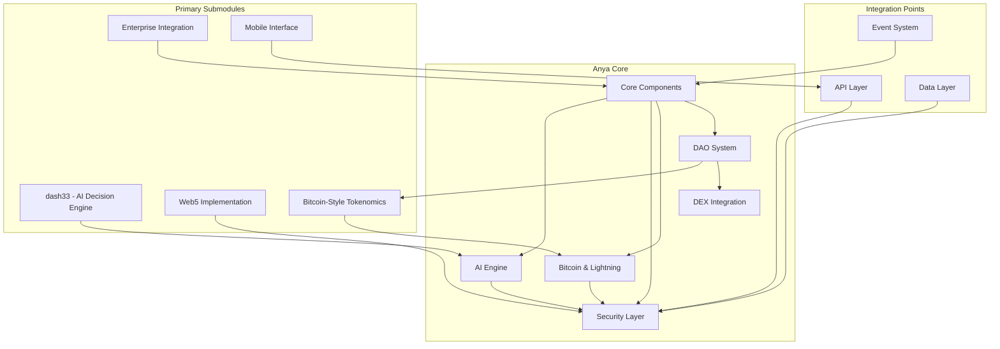
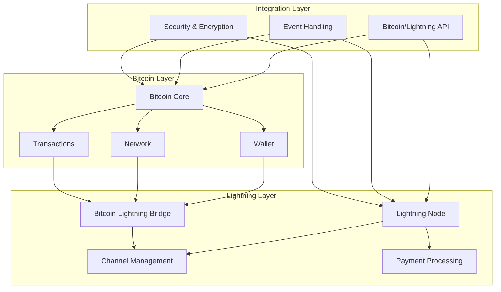
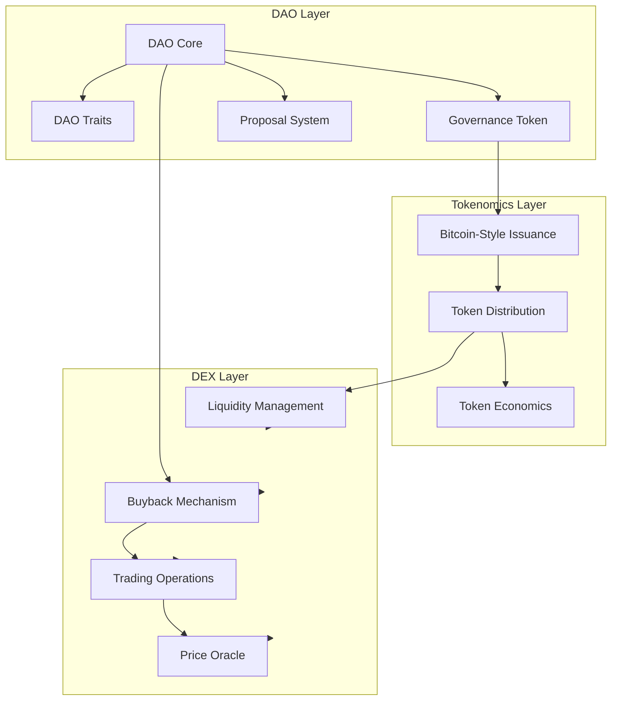
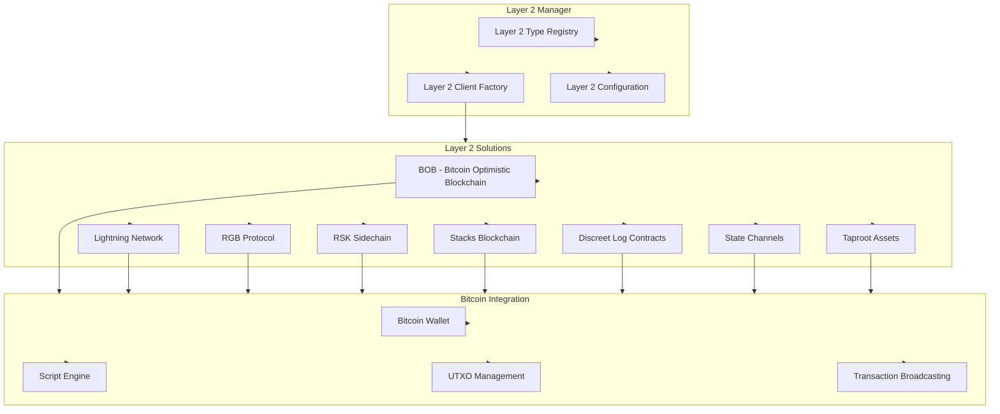
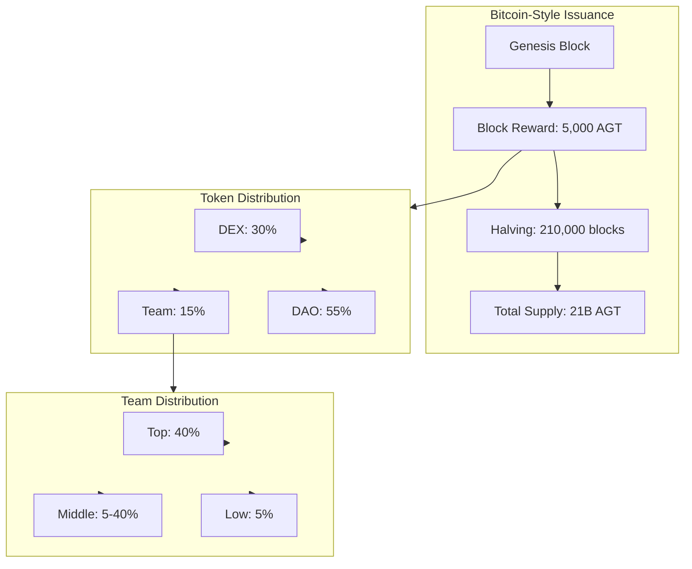

# Anya Core System Architecture Map

[AIR-3][AIS-3][BPC-3][AIT-3][RES-3]

This document provides a high-level overview of the Anya Core system architecture, emphasizing the Bitcoin protocol integration and security analysis framework, in compliance with the Bitcoin Development Framework v2.5.

## System Overview

The Anya Core system follows a hexagonal architecture pattern, separating core business logic from external dependencies through adapters and ports.

```
                      +----------------+
                      |  Bitcoin Core  |
                      +-------+--------+
                              |
                      +-------v--------+
                      |  Adapter Layer |
                      +-------+--------+
                              |
+----------------+    +-------v--------+    +----------------+
|   External     |    |   Application  |    |   Monitoring   |
|   Interfaces   <----+   Core Logic    +---->   & Metrics   |
| (APIs, Wallets)|    +-------+--------+    | (Prometheus)   |
+----------------+            |             +----------------+
                      +-------v--------+
                      |   Protocol     |
                      |   Adapters     |
                      +-------+--------+
                              |
                      +-------v--------+
                      |  Blockchain    |
                      |  Network       |
                      +----------------+
```

## Repository Structure



## Key Components

### Core Bitcoin Implementation (scripts/bitcoin/)

- **MCP Server** (mcp-server.js)
  - Main Bitcoin protocol implementation
  - Handles transaction validation and processing
  - Manages UTXO state
  - Implements BIP standards

- **BIP Compliance Validation** (validate-bip-compliance.js)
  - Validates implementation against Bitcoin Improvement Proposals
  - Checks for BIP-340, BIP-341, BIP-342, BIP-174, BIP-370 compliance
  - Reports compliance status

- **Security Validation** (validate-security.js)
  - Basic security validation for Bitcoin components
  - Initial security checks for core functionality

### Security Analysis Framework (scripts/security/)

- **CodeQL Analysis** (run-codeql-analysis.ps1)
  - Automated static code analysis
  - Security vulnerability detection
  - Custom Bitcoin-specific security rules
  - Integration with CI/CD pipeline

- **Cryptographic Validation** (crypto-validation.js)
  - Validates cryptographic implementations
  - Checks for secure random number generation
  - Validates constant-time operations
  - Ensures appropriate key sizes
  - Checks for modern cryptographic algorithms

- **MCP Server Analysis** (analyze-mcp-server.js)
  - Deep analysis of MCP server implementation
  - Checks for Bitcoin protocol compliance
  - Validates security measures
  - Reports vulnerabilities and compliance issues

- **Permissions Setup** (setup-permissions.sh)
  - Sets up secure permissions for scripts
  - Ensures least privilege principle
  - Manages access control

## Bitcoin & Lightning Architecture



## DAO System Architecture



## Core Subsystems

### Transaction Processing

1. **Validation Layer** - Validates incoming transactions
2. **UTXO Management** - Maintains the UTXO set
3. **Mempool Management** - Handles pending transactions
4. **Block Processing** - Processes new blocks

### Cryptographic Operations

1. **Key Management** - Handles cryptographic keys
2. **Signature Operations** - Implements signature algorithms (ECDSA, Schnorr)
3. **Hash Functions** - Implements cryptographic hash functions
4. **Random Number Generation** - Secure random number generation

### Network Integration

1. **P2P Protocol** - Implements the Bitcoin P2P protocol
2. **Block Synchronization** - Handles block synchronization
3. **Transaction Relay** - Manages transaction broadcasting

### Security Framework

1. **Static Analysis** - CodeQL-based static code analysis
2. **Compliance Validation** - BIP and protocol compliance checking
3. **Cryptographic Validation** - Validation of cryptographic implementations
4. **Vulnerability Reporting** - Reporting of security issues

## Layer 2 Solutions Architecture

Anya Core provides comprehensive support for a variety of Bitcoin Layer 2 solutions, each integrated with our hexagonal architecture pattern.



## Implementation-Specific Components

### Bitcoin Protocol Adapters

- **Taproot Integration** (BIP-341)
- **Schnorr Signatures** (BIP-340)
- **PSBT Support** (BIP-174)
- **DLC Oracle Implementation**
- **Lightning Network Integration**

### Security Validation

- **Bitcoin-specific Security Checks**
- **Cryptographic Algorithm Validation**
- **Protocol Compliance Verification**
- **AI System Security (AIS-3)**

## Tokenomics System Flow



## Data Flow

1. **Incoming Transactions**
   - P2P Network → Validation Layer → Mempool → Block Template

2. **Block Processing**
   - P2P Network → Block Validation → UTXO Updates → Chain State

3. **Security Analysis**
   - Code Repository → CodeQL Analysis → Vulnerability Reports

4. **Compliance Validation**
   - Implementation → BIP Validators → Compliance Reports

## Integration Points

1. **Bitcoin Core Compatibility**
   - Compatible with Bitcoin Core RPC interface
   - Follows Bitcoin P2P protocol standards
   - Implements standard Bitcoin script validation

2. **Security Tool Integration**
   - CI/CD pipeline integration for CodeQL
   - Automated reporting of security issues
   - Integration with development workflow

3. **Monitoring and Metrics**
   - Prometheus integration for metrics
   - Alert system for security events
   - Performance monitoring

## AI System Labeling

All components adhere to the Bitcoin Development Framework v2.5 AI labeling system:

1. **[AIR-3]** - AI Readiness Level 3
   - Production-ready implementation
   - Stable API interfaces
   - Comprehensive documentation

2. **[AIS-3]** - AI Security Level 3
   - Comprehensive security measures
   - Regular security audits
   - Vulnerability reporting system

3. **[BPC-3]** - Bitcoin Protocol Compliance Level 3
   - Full compliance with Bitcoin protocol
   - Implementation of required BIPs
   - Rigorous testing against Bitcoin Core

4. **[AIT-3]** - AI Testing Level 3
   - Exhaustive testing methodology
   - High test coverage
   - Regression testing suite

5. **[RES-3]** - Resilience Level 3
   - Robust fault tolerance
   - Error recovery mechanisms
   - Graceful degradation

## Cross-References

For detailed information about specific components, please see the following documentation:

- [DAO System Documentation](DAO_INDEX.md)
- [Tokenomics System](TOKENOMICS_SYSTEM.md)
- [DAO System Map](DAO_SYSTEM_MAP.md)
- [Implementation Milestones](IMPLEMENTATION_MILESTONES.md)
- [Bitcoin Documentation](/bitcoin/index.html)
- [Web5 Documentation](/web5/index.html)

## Implementation Status

Current implementation status:
- ✅ Core architecture and interfaces
- ✅ Bitcoin-style issuance model with 21 billion token supply
- 🔄 Distribution allocation mechanisms (In Progress)
- ⏳ DEX integration (Pending)
- ⏳ Advanced governance features (Pending)

## Last Updated

March 20, 2025 