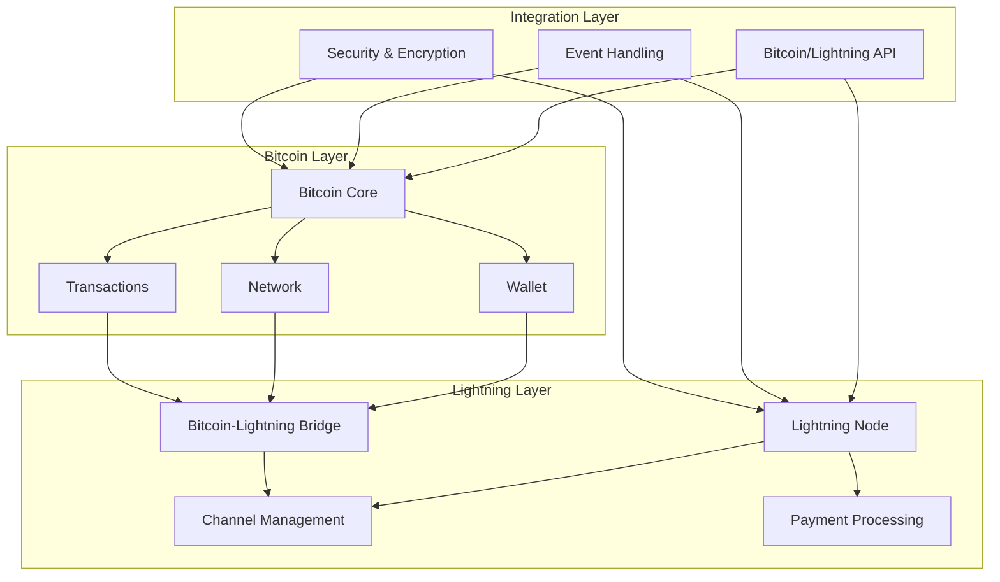
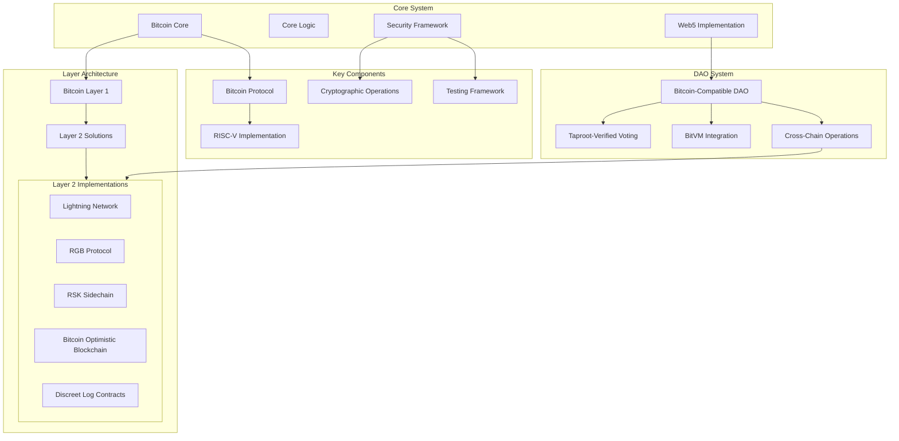
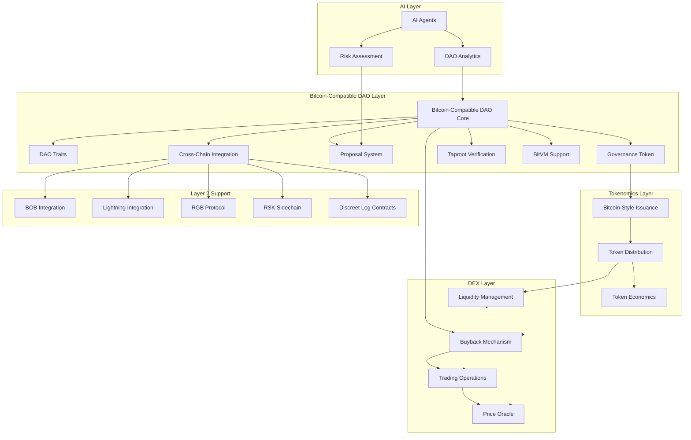

# Anya Core System Architecture Map

[AIR-3][AIS-3][BPC-3][AIT-3][RES-3]

This document provides a high-level overview of the Anya Core system architecture, emphasizing the Bitcoin protocol integration and security analysis framework, in compliance with the Bitcoin Development Framework v2.5.

## System Overview

The Anya Core system follows a hexagonal architecture pattern, separating core business logic from external dependencies through adapters and ports.

```
                      +----------------+
                      |  Bitcoin Core  |
                      +-------+--------+
                              |
                      +-------v--------+
                      |  Adapter Layer |
                      +-------+--------+
                              |
+----------------+    +-------v--------+    +----------------+
|   External     |    |   Application  |    |   Monitoring   |
|   Interfaces   <----+   Core Logic    +---->   & Metrics   |
| (APIs, Wallets)|    +-------+--------+    | (Prometheus)   |
+----------------+            |             +----------------+
                      +-------v--------+
                      |   Protocol     |
                      |   Adapters     |
                      +-------+--------+
                              |
                      +-------v--------+
                      |  Blockchain    |
                      |  Network       |
                      +----------------+
```

## Repository Structure

Following our reorganization, the repository is now structured more efficiently:

```
/anya-core
├── src/                     # Main source code
│   ├── adapters/            # Hexagonal architecture adapters
│   ├── api/                 # API implementations
│   ├── bitcoin/             # Bitcoin protocol implementation
│   │   ├── adapters/        # Bitcoin-specific adapters
│   │   │   ├── protocols/   # Protocol adapters
│   │   │   ├── rpc/         # RPC adapters
│   │   │   └── storage/     # Storage adapters
│   │   ├── core/            # Core Bitcoin functionality
│   │   │   ├── consensus/   # Consensus rules
│   │   │   ├── mempool/     # Mempool management
│   │   │   ├── network/     # Network protocols
│   │   │   └── script/      # Script execution
│   │   ├── error/           # Error handling
│   │   ├── interface/       # Interface definitions
│   │   │   ├── block.rs     # Block interface
│   │   │   ├── transaction.rs # Transaction interface
│   │   │   └── network.rs   # Network interface
│   │   ├── layer2/          # Layer 2 implementations
│   │   │   ├── bob/         # Bitcoin Optimistic Blockchain
│   │   │   ├── dlc/         # Discreet Log Contracts
│   │   │   ├── lightning/   # Lightning Network
│   │   │   ├── rgb/         # RGB Protocol
│   │   │   └── rsk/         # RSK Sidechain
│   │   ├── protocol/        # Bitcoin protocol definitions
│   │   ├── bip341.rs        # BIP-341 (Taproot) implementation
│   │   ├── spv.rs           # SPV verification
│   │   ├── riscv/           # RISC-V implementations
│   │   ├── security/        # Bitcoin-specific security
│   │   └── testing/         # Bitcoin-specific tests
│   ├── core/                # Core functionality
│   ├── crypto/              # Cryptographic implementations
│   ├── dao/                 # DAO implementation
│   ├── ml/                  # Machine learning components
│   ├── security/            # Security framework
│   │   └── crypto/          # Cryptographic security
│   └── web5/                # Web5 implementation
├── docs/                    # Documentation
│   ├── dao/                 # DAO documentation
│   │   └── BITCOIN_INTEGRATION.md  # Bitcoin-compatible DAO docs
│   ├── bitcoin/             # Bitcoin documentation
│   └── web5/                # Web5 documentation
├── tests/                   # Tests
└── scripts/                 # Utility scripts
```

## Key Components

### Core Bitcoin Implementation (src/bitcoin/)

- **Bitcoin Core Protocol**
  - Main Bitcoin protocol implementation
  - Handles transaction validation and processing
  - Manages UTXO state
  - Implements BIP standards

- **Hexagonal Architecture**
  - Interface layer defining ports (interfaces) - `interface/` directory
  - Adapter layer connecting to external dependencies - `adapters/` directory 
  - Core domain logic in the center - `core/` directory
  - Comprehensive error handling - `error.rs` module

- **BIP Compliance**
  - Validates implementation against Bitcoin Improvement Proposals
  - Checks for BIP-340, BIP-341, BIP-342, BIP-174, BIP-370 compliance
  - Reports compliance status

- **Security Validation**
  - Basic security validation for Bitcoin components
  - Initial security checks for core functionality

### Bitcoin Protocol Modules

- **SPV Implementation (src/bitcoin/spv.rs)**
  - Simplified Payment Verification
  - Merkle proof validation
  - Transaction inclusion verification
  
- **Taproot Implementation (src/bitcoin/bip341.rs)**
  - BIP-341 Taproot implementation
  - Merkle tree construction
  - Taproot script path spending
  - Key path spending
  
- **Interface Layer (src/bitcoin/interface/)**
  - Block interfaces - `block.rs`
  - Transaction interfaces - `transaction.rs`
  - Network interfaces - `network.rs`
  - Clean abstraction of Bitcoin Core types

### Security Analysis Framework (src/security/)

- **CodeQL Analysis**
  - Automated static code analysis
  - Security vulnerability detection
  - Custom Bitcoin-specific security rules
  - Integration with CI/CD pipeline

- **Cryptographic Validation**
  - Validates cryptographic implementations
  - Checks for secure random number generation
  - Validates constant-time operations
  - Ensures appropriate key sizes
  - Checks for modern cryptographic algorithms

- **Protocol Analysis**
  - Deep analysis of protocol implementation
  - Checks for Bitcoin protocol compliance
  - Validates security measures
  - Reports vulnerabilities and compliance issues

- **Permissions Setup**
  - Sets up secure permissions for scripts
  - Ensures least privilege principle
  - Manages access control

## Bitcoin & Lightning Architecture



## Enhanced System Architecture Graph



## DAO System Architecture



## Core Subsystems

### Transaction Processing

1. **Validation Layer** - Validates incoming transactions
2. **UTXO Management** - Maintains the UTXO set
3. **Mempool Management** - Handles pending transactions
4. **Block Processing** - Processes new blocks

### Cryptographic Operations

1. **Key Management** - Handles cryptographic keys
2. **Signature Operations** - Implements signature algorithms (ECDSA, Schnorr)
3. **Hash Functions** - Implements cryptographic hash functions
4. **Random Number Generation** - Secure random number generation

### Network Integration

1. **P2P Protocol** - Implements the Bitcoin P2P protocol
2. **Block Synchronization** - Handles block synchronization
3. **Transaction Relay** - Manages transaction broadcasting

### Security Framework

1. **Static Analysis** - CodeQL-based static code analysis
2. **Compliance Validation** - BIP and protocol compliance checking
3. **Cryptographic Validation** - Validation of cryptographic implementations
4. **Vulnerability Reporting** - Reporting of security issues

## Layer 2 Solutions Architecture

### Lightning Network (src/bitcoin/layer2/lightning/)

1. **Node Implementation** - Lightning Network node
2. **Channel Management** - Lightning Network channels
3. **Payment Processing** - Lightning Network payments
4. **BOLT Compliance** - BOLT standard compliance

### RGB Protocol (src/bitcoin/layer2/rgb/)

1. **Schema Implementation** - RGB schema implementation
2. **Asset Management** - RGB asset management
3. **Validation** - RGB validation

### RSK Integration (src/bitcoin/layer2/rsk/)

1. **Bridge Implementation** - RSK bridge implementation
2. **Smart Contract Interface** - RSK smart contract interface

### BOB Layer 2 (src/bitcoin/layer2/bob/)

1. **Channel Implementation** - BOB channel implementation
2. **State Management** - BOB state management

### DLC (src/bitcoin/layer2/dlc/)

1. **Oracle Implementation** - DLC oracle implementation
2. **Contract Management** - DLC contract management

## Web5 Architecture (src/web5/)

### Decentralized Web Node (DWN)

1. **Implementation** - DWN implementation
2. **Protocol Support** - Web5 protocol support
3. **Data Management** - Decentralized data management

### Decentralized Identity (DID)

1. **DID Implementation** - DID implementation
2. **Verifiable Credentials** - Verifiable credentials
3. **Authentication** - Decentralized authentication

## AI & Machine Learning Architecture (src/ml/)

### Agents

1. **Agent Implementation** - AI agent implementation
2. **Model Management** - Machine learning model management
3. **Inference Engine** - Real-time inference engine

## Security Implementation (src/security/)

### Cryptographic Security

1. **Cryptographic Operations** - Secure cryptographic operations
2. **HSM Integration** - Hardware security module integration
3. **Key Management** - Secure key management

### Protocol Security

1. **Protocol Validation** - Bitcoin protocol validation
2. **Vulnerability Detection** - Vulnerability detection
3. **Compliance Checking** - Compliance checking

## Mobile Integration

```
+----------------------------+
| Mobile Interface           |
| (React Native)             |
| - Taproot Wallet           |
| - Lightning Payments       |
| - BIP-174 PSBT Support     |
+------------+---------------+
             |
+------------v---------------+
| Mobile Security Layer      |
| - Hardware Key Storage     |
| - Secure SPV Proofs        |
| - BIP-341 Compliance       |
+----------------------------+
```

```
            +----------------------------+
            | React Native TurboModules   |
            | - Taproot Wallet (BIP-341)  |
            | - PSBTv2 Transactions       |
            | - SILENT_LEAF Validation    |
            +-------------+---------------+
                           |
            +--------------v---------------+
            | Mobile Security Layer        |
            | - Hardware Key Storage       |
            | - BIP-341 Compliance         |
            +------------------------------+ 
```

## Modified Components After Reorganization

The system has been optimized with the following changes:

1. **DAO Implementation**
   - Deprecated the basic DAO implementation
   - Implemented Bitcoin-compatible DAO with full Layer 2 support
   - Added Taproot-verified voting mechanism
   - Integrated with BitVM for enhanced verification
   - Added cross-chain capabilities for all Bitcoin Layer 2 technologies
   - Added comprehensive documentation in docs/dao/BITCOIN_INTEGRATION.md

2. **System Structure**
   - Reorganized Bitcoin components into proper directories
   - Optimized source code organization following hexagonal architecture
   - Created clear separation between core, adapters, and protocols
   - Improved maintainability through proper module organization
   - Enhanced documentation reflecting new structure

3. **Layer 2 Integration**
   - Consolidated all Layer 2 implementations under bitcoin/layer2
   - Added BOB (Bitcoin Optimistic Blockchain) support
   - Unified integration patterns for RGB, RSK, and other Layer 2 solutions
   - Enhanced DLC (Discreet Log Contracts) support
   - Improved cross-chain operation capabilities

## Version Information

- Current Version: 3.1.1
- Last Updated: 2025-04-29
- Bitcoin Development Framework: v2.5

*This documentation follows the [AI Labeling Standards](docs/standards/AI_LABELING.md) based on the Bitcoin Development Framework v2.5.*

## Implementation Status

Current implementation status:

- ✅ Core architecture and interfaces
- ✅ Bitcoin-style issuance model with 21 billion token supply
- ✅ Bitcoin-compatible DAO implementation
- ✅ Full Layer 2 integration support
- ✅ Bitcoin component reorganization
- 🔄 Distribution allocation mechanisms (In Progress)
- ⏳ DEX integration (Pending)

## Last Updated

*Last updated: 2025-04-29 15:45 UTC+2*
