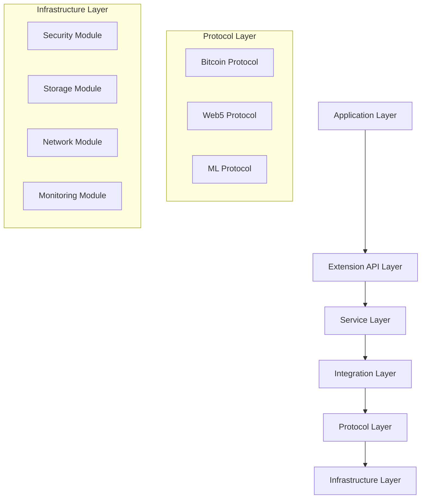

# Extension Architecture

[AIR-3][AIS-3][AIT-3][RES-3] Comprehensive guide to Anya's extension architecture patterns, design principles, and implementation strategies.

*Last updated: May 30, 2025*

## Table of Contents

- [Architectural Overview](#architectural-overview)
- [Core Architecture Patterns](#core-architecture-patterns)
- [Layer Architecture](#layer-architecture)
- [Component Architecture](#component-architecture)
- [Integration Architecture](#integration-architecture)
- [Security Architecture](#security-architecture)
- [Performance Architecture](#performance-architecture)
- [Extension Lifecycle](#extension-lifecycle)
- [Best Practices](#best-practices)
- [Common Patterns](#common-patterns)

## Architectural Overview

### Design Principles

Anya's extension architecture follows these core principles:

```rust
// Core architectural traits that define the extension system
use anya_core::{Extension, Context, Result};
use bitcoin::Network;
use web5::did::Document;
use serde::{Serialize, Deserialize};

/// Core extension trait that all extensions must implement
pub trait AnyaExtension: Send + Sync {
    /// Extension metadata and capabilities
    fn metadata(&self) -> ExtensionMetadata;
    
    /// Initialize the extension with context
    fn initialize(&mut self, context: &Context) -> Result<()>;
    
    /// Execute extension functionality
    fn execute(&self, request: ExtensionRequest) -> Result<ExtensionResponse>;
    
    /// Cleanup and shutdown
    fn shutdown(&mut self) -> Result<()>;
}

/// Extension metadata defining capabilities and requirements
#[derive(Debug, Serialize, Deserialize)]
pub struct ExtensionMetadata {
    pub name: String,
    pub version: String,
    pub capabilities: Vec<Capability>,
    pub dependencies: Vec<Dependency>,
    pub bitcoin_networks: Vec<Network>,
    pub web5_protocols: Vec<String>,
    pub ml_models: Vec<String>,
}
```

### Architectural Layers



## Core Architecture Patterns

### 1. Plugin Architecture

```rust
use std::collections::HashMap;
use async_trait::async_trait;

/// Plugin manager for dynamic extension loading
pub struct ExtensionManager {
    extensions: HashMap<String, Box<dyn AnyaExtension>>,
    registry: ExtensionRegistry,
    security: SecurityManager,
}

impl ExtensionManager {
    pub async fn load_extension(&mut self, path: &str) -> Result<()> {
        // Security validation
        self.security.validate_extension(path)?;
        
        // Dynamic loading
        let extension = self.registry.load_from_path(path)?;
        
        // Capability validation
        self.validate_capabilities(&extension)?;
        
        // Initialize with context
        let mut ext = extension;
        ext.initialize(&self.create_context()?)?;
        
        self.extensions.insert(ext.metadata().name.clone(), ext);
        Ok(())
    }
    
    pub async fn execute_extension(
        &self, 
        name: &str, 
        request: ExtensionRequest
    ) -> Result<ExtensionResponse> {
        let extension = self.extensions.get(name)
            .ok_or_else(|| Error::ExtensionNotFound(name.to_string()))?;
            
        // Pre-execution security checks
        self.security.validate_request(&request)?;
        
        // Execute with monitoring
        let response = self.monitor_execution(|| {
            extension.execute(request)
        }).await?;
        
        // Post-execution validation
        self.security.validate_response(&response)?;
        
        Ok(response)
    }
}
```

### 2. Event-Driven Architecture

```rust
use tokio::sync::{broadcast, mpsc};
use serde_json::Value;

/// Event-driven system for extension communication
#[derive(Debug, Clone)]
pub enum ExtensionEvent {
    BitcoinTransaction {
        txid: String,
        network: Network,
        confirmations: u32,
    },
    Web5Identity {
        did: String,
        operation: String,
        timestamp: u64,
    },
    MLInference {
        model: String,
        input_hash: String,
        confidence: f64,
    },
    SystemEvent {
        event_type: String,
        data: Value,
    },
}

pub struct EventBus {
    sender: broadcast::Sender<ExtensionEvent>,
    handlers: HashMap<String, Vec<EventHandler>>,
}

impl EventBus {
    pub async fn publish(&self, event: ExtensionEvent) -> Result<()> {
        // Broadcast to all subscribers
        self.sender.send(event.clone())?;
        
        // Execute specific handlers
        if let Some(handlers) = self.handlers.get(&event.event_type()) {
            for handler in handlers {
                handler.handle(event.clone()).await?;
            }
        }
        
        Ok(())
    }
    
    pub fn subscribe(&mut self, extension: &str) -> broadcast::Receiver<ExtensionEvent> {
        self.sender.subscribe()
    }
}
```

### 3. Microservices Architecture

```rust
use tonic::{transport::Server, Request, Response, Status};
use serde::{Serialize, Deserialize};

/// gRPC service definition for extension communication
#[tonic::async_trait]
impl ExtensionService for ExtensionServer {
    async fn execute_request(
        &self,
        request: Request<ExecutionRequest>,
    ) -> Result<Response<ExecutionResponse>, Status> {
        let req = request.into_inner();
        
        // Route to appropriate extension
        let response = match req.extension_type {
            ExtensionType::Bitcoin => self.bitcoin_service.execute(req).await?,
            ExtensionType::Web5 => self.web5_service.execute(req).await?,
            ExtensionType::ML => self.ml_service.execute(req).await?,
            ExtensionType::Custom => self.custom_service.execute(req).await?,
        };
        
        Ok(Response::new(response))
    }
}

/// Extension service configuration
#[derive(Debug, Serialize, Deserialize)]
pub struct ServiceConfig {
    pub address: String,
    pub port: u16,
    pub tls_config: Option<TlsConfig>,
    pub rate_limits: RateLimitConfig,
    pub monitoring: MonitoringConfig,
}
```

## Layer Architecture

### Application Layer

```rust
/// High-level application interface
pub struct ApplicationLayer {
    extension_manager: ExtensionManager,
    request_router: RequestRouter,
    response_processor: ResponseProcessor,
}

impl ApplicationLayer {
    pub async fn process_request(&self, request: ApplicationRequest) -> Result<ApplicationResponse> {
        // Route request to appropriate extension
        let extension_request = self.request_router.route(request)?;
        
        // Execute through extension manager
        let extension_response = self.extension_manager
            .execute_extension(&extension_request.extension, extension_request)
            .await?;
        
        // Process and format response
        let response = self.response_processor
            .process(extension_response)
            .await?;
        
        Ok(response)
    }
}
```

### Service Layer

```rust
/// Service layer providing core functionality
pub struct ServiceLayer {
    bitcoin_service: BitcoinService,
    web5_service: Web5Service,
    ml_service: MLService,
    security_service: SecurityService,
}

impl ServiceLayer {
    pub async fn execute_bitcoin_operation(&self, operation: BitcoinOperation) -> Result<BitcoinResult> {
        // Validate operation
        self.security_service.validate_bitcoin_operation(&operation)?;
        
        // Execute with proper error handling
        let result = self.bitcoin_service.execute(operation).await
            .map_err(|e| Error::BitcoinOperation(e))?;
        
        // Log and monitor
        self.monitor_operation("bitcoin", &result).await?;
        
        Ok(result)
    }
}
```

## Component Architecture

### Component Composition

```rust
use std::sync::Arc;
use tokio::sync::RwLock;

/// Component-based architecture for modular design
pub struct Component {
    id: String,
    dependencies: Vec<String>,
    interfaces: Vec<Interface>,
    implementation: Box<dyn ComponentImpl>,
}

pub trait ComponentImpl: Send + Sync {
    fn initialize(&mut self, context: &ComponentContext) -> Result<()>;
    fn execute(&self, input: ComponentInput) -> Result<ComponentOutput>;
    fn health_check(&self) -> HealthStatus;
}

/// Component registry for dependency injection
pub struct ComponentRegistry {
    components: Arc<RwLock<HashMap<String, Component>>>,
    dependency_graph: DependencyGraph,
}

impl ComponentRegistry {
    pub async fn resolve_dependencies(&self, component_id: &str) -> Result<Vec<Component>> {
        let graph = self.dependency_graph.read().await;
        let dependencies = graph.get_dependencies(component_id)?;
        
        let mut resolved = Vec::new();
        for dep_id in dependencies {
            let component = self.get_component(&dep_id).await?;
            resolved.push(component);
        }
        
        Ok(resolved)
    }
}
```

### Interface Definition

```rust
/// Standard interfaces for extension components
pub trait BitcoinInterface {
    async fn create_transaction(&self, inputs: Vec<TxInput>, outputs: Vec<TxOutput>) -> Result<Transaction>;
    async fn broadcast_transaction(&self, tx: Transaction) -> Result<String>;
    async fn get_balance(&self, address: &str) -> Result<u64>;
    async fn monitor_address(&self, address: &str) -> Result<AddressMonitor>;
}

pub trait Web5Interface {
    async fn create_did(&self, method: &str) -> Result<Document>;
    async fn resolve_did(&self, did: &str) -> Result<Document>;
    async fn create_credential(&self, subject: &str, claims: Value) -> Result<VerifiableCredential>;
    async fn verify_credential(&self, credential: &VerifiableCredential) -> Result<bool>;
}

pub trait MLInterface {
    async fn load_model(&self, model_path: &str) -> Result<ModelHandle>;
    async fn predict(&self, model: &ModelHandle, input: &Tensor) -> Result<Tensor>;
    async fn train_model(&self, dataset: &Dataset, config: &TrainingConfig) -> Result<ModelHandle>;
    async fn evaluate_model(&self, model: &ModelHandle, test_data: &Dataset) -> Result<Metrics>;
}
```

## Integration Architecture

### Cross-Protocol Integration

```rust
/// Cross-protocol integration manager
pub struct IntegrationManager {
    bitcoin_client: BitcoinClient,
    web5_client: Web5Client,
    ml_client: MLClient,
    state_manager: StateManager,
}

impl IntegrationManager {
    pub async fn execute_cross_protocol_operation(
        &self,
        operation: CrossProtocolOperation,
    ) -> Result<CrossProtocolResult> {
        match operation {
            CrossProtocolOperation::BitcoinWeb5 { bitcoin_op, web5_op } => {
                // Execute Bitcoin operation
                let bitcoin_result = self.bitcoin_client.execute(bitcoin_op).await?;
                
                // Use Bitcoin result in Web5 operation
                let web5_op_updated = web5_op.with_bitcoin_context(bitcoin_result)?;
                let web5_result = self.web5_client.execute(web5_op_updated).await?;
                
                Ok(CrossProtocolResult::BitcoinWeb5 { bitcoin_result, web5_result })
            },
            CrossProtocolOperation::MLBitcoin { ml_op, bitcoin_op } => {
                // ML inference to guide Bitcoin operation
                let ml_result = self.ml_client.infer(ml_op).await?;
                
                // Use ML result to optimize Bitcoin operation
                let bitcoin_op_optimized = bitcoin_op.with_ml_guidance(ml_result)?;
                let bitcoin_result = self.bitcoin_client.execute(bitcoin_op_optimized).await?;
                
                Ok(CrossProtocolResult::MLBitcoin { ml_result, bitcoin_result })
            },
        }
    }
}
```

## Security Architecture

### Security Layers

```rust
/// Multi-layered security architecture
pub struct SecurityArchitecture {
    authentication: AuthenticationLayer,
    authorization: AuthorizationLayer,
    encryption: EncryptionLayer,
    audit: AuditLayer,
}

impl SecurityArchitecture {
    pub async fn secure_extension_execution(
        &self,
        extension: &str,
        request: ExtensionRequest,
    ) -> Result<SecureExecutionContext> {
        // Authentication
        let identity = self.authentication.authenticate(&request).await?;
        
        // Authorization
        self.authorization.authorize(&identity, extension, &request).await?;
        
        // Create secure context
        let secure_context = SecureExecutionContext {
            identity,
            permissions: self.authorization.get_permissions(&identity)?,
            encryption_keys: self.encryption.get_keys(&identity)?,
            audit_logger: self.audit.create_logger(&identity)?,
        };
        
        Ok(secure_context)
    }
}

/// Security enforcement at execution time
pub struct SecureExecutor {
    security: SecurityArchitecture,
    sandboxing: SandboxManager,
    monitoring: SecurityMonitor,
}

impl SecureExecutor {
    pub async fn execute_with_security(
        &self,
        extension: &dyn AnyaExtension,
        request: ExtensionRequest,
    ) -> Result<ExtensionResponse> {
        // Create secure execution environment
        let secure_context = self.security.secure_extension_execution(
            &extension.metadata().name,
            request.clone(),
        ).await?;
        
        // Execute in sandbox
        let response = self.sandboxing.execute_in_sandbox(|| {
            extension.execute(request)
        }).await?;
        
        // Security monitoring and logging
        self.monitoring.log_execution(&secure_context, &response).await?;
        
        Ok(response)
    }
}
```

## Performance Architecture

### Performance Optimization

```rust
use tokio::time::{Duration, Instant};
use std::sync::atomic::{AtomicU64, Ordering};

/// Performance monitoring and optimization
pub struct PerformanceArchitecture {
    metrics_collector: MetricsCollector,
    cache_manager: CacheManager,
    load_balancer: LoadBalancer,
    circuit_breaker: CircuitBreaker,
}

impl PerformanceArchitecture {
    pub async fn optimized_execution(
        &self,
        operation: Operation,
    ) -> Result<OperationResult> {
        let start_time = Instant::now();
        
        // Check cache first
        if let Some(cached_result) = self.cache_manager.get(&operation.cache_key()).await? {
            self.metrics_collector.record_cache_hit();
            return Ok(cached_result);
        }
        
        // Circuit breaker protection
        if self.circuit_breaker.is_open(&operation.service_name()) {
            return Err(Error::ServiceUnavailable);
        }
        
        // Load balancing
        let executor = self.load_balancer.select_executor(&operation)?;
        
        // Execute with monitoring
        let result = match executor.execute(operation.clone()).await {
            Ok(result) => {
                self.circuit_breaker.record_success(&operation.service_name());
                
                // Cache successful results
                self.cache_manager.set(&operation.cache_key(), &result).await?;
                
                result
            },
            Err(e) => {
                self.circuit_breaker.record_failure(&operation.service_name());
                return Err(e);
            }
        };
        
        // Record metrics
        let duration = start_time.elapsed();
        self.metrics_collector.record_execution_time(&operation.service_name(), duration);
        
        Ok(result)
    }
}
```

## Extension Lifecycle

### Lifecycle Management

```rust
/// Complete extension lifecycle management
pub struct ExtensionLifecycle {
    loader: ExtensionLoader,
    validator: ExtensionValidator,
    monitor: LifecycleMonitor,
    dependency_manager: DependencyManager,
}

impl ExtensionLifecycle {
    pub async fn manage_extension_lifecycle(
        &self,
        extension_path: &str,
    ) -> Result<ExtensionHandle> {
        // Phase 1: Loading and Validation
        let extension_manifest = self.loader.load_manifest(extension_path)?;
        self.validator.validate_manifest(&extension_manifest)?;
        
        // Phase 2: Dependency Resolution
        let dependencies = self.dependency_manager
            .resolve_dependencies(&extension_manifest.dependencies)
            .await?;
        
        // Phase 3: Security Validation
        self.validator.validate_security(&extension_manifest)?;
        
        // Phase 4: Initialization
        let extension = self.loader.load_extension(extension_path)?;
        let context = self.create_initialization_context(&dependencies)?;
        extension.initialize(&context)?;
        
        // Phase 5: Health Monitoring
        let handle = ExtensionHandle::new(extension, self.monitor.clone());
        self.monitor.start_monitoring(&handle).await?;
        
        // Phase 6: Registration
        self.register_extension(&handle).await?;
        
        Ok(handle)
    }
    
    pub async fn shutdown_extension(&self, handle: ExtensionHandle) -> Result<()> {
        // Phase 1: Graceful shutdown
        handle.extension.shutdown()?;
        
        // Phase 2: Cleanup monitoring
        self.monitor.stop_monitoring(&handle).await?;
        
        // Phase 3: Dependency cleanup
        self.dependency_manager.cleanup_dependencies(&handle).await?;
        
        // Phase 4: Deregistration
        self.deregister_extension(&handle).await?;
        
        Ok(())
    }
}
```

## Best Practices

### 1. Extension Design Patterns

```rust
/// Repository pattern for extension data access
pub trait ExtensionRepository<T> {
    async fn find_by_id(&self, id: &str) -> Result<Option<T>>;
    async fn find_all(&self) -> Result<Vec<T>>;
    async fn save(&self, entity: &T) -> Result<()>;
    async fn delete(&self, id: &str) -> Result<()>;
}

/// Factory pattern for extension creation
pub trait ExtensionFactory {
    fn create_bitcoin_extension(&self, config: BitcoinConfig) -> Result<Box<dyn BitcoinInterface>>;
    fn create_web5_extension(&self, config: Web5Config) -> Result<Box<dyn Web5Interface>>;
    fn create_ml_extension(&self, config: MLConfig) -> Result<Box<dyn MLInterface>>;
}

/// Observer pattern for extension events
pub trait ExtensionObserver {
    async fn on_extension_loaded(&self, extension: &ExtensionMetadata) -> Result<()>;
    async fn on_extension_executed(&self, extension: &str, duration: Duration) -> Result<()>;
    async fn on_extension_error(&self, extension: &str, error: &Error) -> Result<()>;
}
```

### 2. Error Handling Patterns

```rust
use thiserror::Error;

/// Comprehensive error handling for extensions
#[derive(Error, Debug)]
pub enum ExtensionError {
    #[error("Extension not found: {0}")]
    NotFound(String),
    
    #[error("Extension validation failed: {0}")]
    ValidationFailed(String),
    
    #[error("Extension execution failed: {0}")]
    ExecutionFailed(String),
    
    #[error("Bitcoin operation failed: {0}")]
    BitcoinError(#[from] bitcoin::Error),
    
    #[error("Web5 operation failed: {0}")]
    Web5Error(#[from] web5::Error),
    
    #[error("ML operation failed: {0}")]
    MLError(#[from] ml::Error),
    
    #[error("Security violation: {0}")]
    SecurityViolation(String),
    
    #[error("Configuration error: {0}")]
    ConfigurationError(String),
}

/// Error recovery strategies
pub struct ErrorRecovery {
    retry_policy: RetryPolicy,
    fallback_handler: FallbackHandler,
    circuit_breaker: CircuitBreaker,
}

impl ErrorRecovery {
    pub async fn handle_error(&self, error: ExtensionError) -> Result<RecoveryAction> {
        match error {
            ExtensionError::ExecutionFailed(_) => {
                if self.retry_policy.should_retry(&error) {
                    Ok(RecoveryAction::Retry)
                } else {
                    Ok(RecoveryAction::Fallback)
                }
            },
            ExtensionError::SecurityViolation(_) => {
                Ok(RecoveryAction::Terminate)
            },
            _ => Ok(RecoveryAction::Fallback)
        }
    }
}
```

## Common Patterns

### 1. Chain of Responsibility

```rust
/// Chain of responsibility for extension processing
pub trait ExtensionHandler {
    async fn handle(&self, request: ExtensionRequest) -> Result<Option<ExtensionResponse>>;
    fn next(&self) -> Option<Box<dyn ExtensionHandler>>;
}

pub struct ExtensionChain {
    handlers: Vec<Box<dyn ExtensionHandler>>,
}

impl ExtensionChain {
    pub async fn process(&self, request: ExtensionRequest) -> Result<ExtensionResponse> {
        for handler in &self.handlers {
            if let Some(response) = handler.handle(request.clone()).await? {
                return Ok(response);
            }
        }
        Err(ExtensionError::NotFound("No handler found".to_string()))
    }
}
```

### 2. Command Pattern

```rust
/// Command pattern for extension operations
pub trait ExtensionCommand {
    async fn execute(&self) -> Result<ExtensionResult>;
    async fn undo(&self) -> Result<()>;
    fn description(&self) -> String;
}

pub struct CommandInvoker {
    commands: Vec<Box<dyn ExtensionCommand>>,
    executed: Vec<usize>,
}

impl CommandInvoker {
    pub async fn execute_command(&mut self, command: Box<dyn ExtensionCommand>) -> Result<ExtensionResult> {
        let result = command.execute().await?;
        self.commands.push(command);
        self.executed.push(self.commands.len() - 1);
        Ok(result)
    }
    
    pub async fn undo_last(&mut self) -> Result<()> {
        if let Some(index) = self.executed.pop() {
            self.commands[index].undo().await?;
        }
        Ok(())
    }
}
```

---

## Related Documentation

- [Development Guide](README.md) - Complete development workflow
- [API Reference](api-reference.md) - Detailed API documentation
- [Best Practices](best-practices.md) - Security and performance guidelines
- [Testing](../testing/README.md) - Comprehensive testing strategies
- [Integration](../integration/README.md) - System integration patterns

## Community and Support

- **Documentation**: [https://docs.anya-ai.org](https://docs.anya-ai.org)
- **Community**: [https://github.com/anya-ai/community](https://github.com/anya-ai/community)
- **Issues**: [https://github.com/anya-ai/core/issues](https://github.com/anya-ai/core/issues)
- **Discussions**: [https://github.com/anya-ai/core/discussions](https://github.com/anya-ai/core/discussions)
