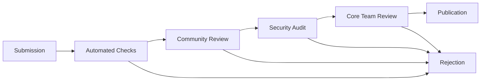

# Community Extensions

[AIR-3][AIS-3][AIT-3][RES-3] Discover and contribute to the vibrant ecosystem of community-developed extensions for Bitcoin, Web5, ML, and specialized use cases.

*Last updated: May 30, 2025*

## Table of Contents

- [Overview](#overview)
- [Featured Community Extensions](#featured-community-extensions)
- [Bitcoin Community Extensions](#bitcoin-community-extensions)
- [Web5 Community Extensions](#web5-community-extensions)
- [ML Community Extensions](#ml-community-extensions)
- [Utility Community Extensions](#utility-community-extensions)
- [Installation and Usage](#installation-and-usage)
- [Contributing Extensions](#contributing-extensions)
- [Extension Registry](#extension-registry)
- [Quality Standards](#quality-standards)

## Overview

Community extensions are developed by the Anya ecosystem community, providing specialized functionality, experimental features, and innovative use cases. These extensions extend the core platform with creative solutions for specific domains and workflows.

### Extension Discovery

```rust
use anya_extensions::{CommunityRegistry, ExtensionSearch, ExtensionFilter};

/// Discover community extensions
pub struct ExtensionDiscovery {
    registry: CommunityRegistry,
    search: ExtensionSearch,
}

impl ExtensionDiscovery {
    pub async fn discover_extensions(&self, query: &str) -> Result<Vec<ExtensionInfo>> {
        let results = self.search.query(query).await?;
        
        // Filter by quality, popularity, and compatibility
        let filtered = results.into_iter()
            .filter(|ext| ext.quality_score >= 4.0)
            .filter(|ext| ext.is_compatible_with_version("1.0.0"))
            .collect();
        
        Ok(filtered)
    }
    
    pub async fn get_trending_extensions(&self) -> Result<Vec<ExtensionInfo>> {
        self.registry.get_trending(30).await // Last 30 days
    }
    
    pub async fn get_extensions_by_category(&self, category: &str) -> Result<Vec<ExtensionInfo>> {
        let filter = ExtensionFilter::new().category(category);
        self.registry.search(filter).await
    }
}
```

## Featured Community Extensions

### 🚀 Trending This Month

#### Bitcoin Lightning Tools

- **Lightning Analytics** - Advanced Lightning Network analytics and visualization
- **Channel Optimizer** - AI-powered channel management and routing optimization
- **Lightning Invoices** - Enhanced invoice generation with QR codes and NFC

#### Web5 Innovations

- **DID Social Graph** - Build social networks with decentralized identities
- **Credential Marketplace** - Trade and verify skills-based credentials
- **Data Monetization** - Monetize personal data through Web5 protocols

#### ML Integrations

- **Bitcoin Price Predictor** - ML models for Bitcoin price forecasting
- **Smart Contract Analyzer** - AI-powered smart contract security analysis
- **Natural Language Trading** - Convert natural language to trading strategies

### 🏆 Community Favorites

```rust
/// Most popular community extensions
pub const FEATURED_EXTENSIONS: &[(&str, &str)] = &[
    ("bitcoin-defi-bridge", "Cross-chain DeFi integration"),
    ("web5-social-network", "Decentralized social networking"),
    ("ml-trading-bot", "Automated trading with ML"),
    ("privacy-mixer", "Enhanced Bitcoin privacy"),
    ("did-reputation", "Reputation system for DIDs"),
    ("quantum-security", "Post-quantum cryptography"),
];
```

## Bitcoin Community Extensions

### DeFi and Trading Extensions

#### Bitcoin DeFi Bridge

**Author**: @defi-collective  
**Version**: 2.1.0  
**Downloads**: 15K+

Cross-chain bridge for Bitcoin DeFi protocols with automated liquidity management.

```rust
use anya_bitcoin_defi::{DeFiBridge, LiquidityPool, CrossChainSwap};

pub struct BitcoinDeFiBridge {
    bridge: DeFiBridge,
    pools: HashMap<String, LiquidityPool>,
    swap_engine: CrossChainSwap,
}

impl BitcoinDeFiBridge {
    /// Bridge Bitcoin to DeFi protocols
    pub async fn bridge_to_defi(
        &self,
        amount: u64,
        target_chain: &str,
        protocol: &str,
    ) -> Result<BridgeTransaction> {
        let bridge_tx = self.bridge.create_bridge_transaction(
            amount,
            target_chain,
            protocol,
        )?;
        
        // Lock Bitcoin
        let lock_tx = self.bridge.lock_bitcoin(bridge_tx.clone()).await?;
        
        // Mint on target chain
        let mint_tx = self.bridge.mint_on_target(bridge_tx, lock_tx).await?;
        
        Ok(BridgeTransaction {
            bitcoin_tx: lock_tx,
            target_tx: mint_tx,
            status: BridgeStatus::Completed,
        })
    }
    
    /// Provide liquidity to pools
    pub async fn add_liquidity(
        &self,
        pool_id: &str,
        bitcoin_amount: u64,
        token_amount: u64,
    ) -> Result<LiquidityPosition> {
        let pool = self.pools.get(pool_id)
            .ok_or(Error::PoolNotFound)?;
        
        pool.add_liquidity(bitcoin_amount, token_amount).await
    }
}
```

**Installation**:

```bash
anya extension install bitcoin-defi-bridge
anya config set defi.bridge.target_chains '["ethereum", "polygon"]'
```

#### Trading Bot Framework

**Author**: @algo-traders  
**Version**: 1.8.3  
**Downloads**: 8K+

Extensible framework for building Bitcoin trading bots with ML integration.

```rust
use anya_trading_bot::{TradingBot, Strategy, RiskManager};

pub struct MLTradingBot {
    bot: TradingBot,
    strategies: Vec<Box<dyn Strategy>>,
    risk_manager: RiskManager,
    ml_models: ModelRegistry,
}

impl MLTradingBot {
    /// Add ML-powered strategy
    pub async fn add_ml_strategy(&mut self, model_path: &str) -> Result<()> {
        let model = self.ml_models.load_model(model_path).await?;
        let strategy = MLStrategy::new(model);
        self.strategies.push(Box::new(strategy));
        Ok(())
    }
    
    /// Execute trading cycle
    pub async fn execute_trading_cycle(&self) -> Result<TradingResults> {
        let market_data = self.bot.get_market_data().await?;
        
        let mut signals = Vec::new();
        for strategy in &self.strategies {
            let signal = strategy.generate_signal(&market_data).await?;
            signals.push(signal);
        }
        
        // Combine signals
        let combined_signal = self.combine_signals(signals)?;
        
        // Risk management
        let adjusted_signal = self.risk_manager.adjust_signal(combined_signal)?;
        
        // Execute trades
        self.bot.execute_signal(adjusted_signal).await
    }
}
```

### Privacy and Security Extensions

#### Bitcoin Mixer Pro

**Author**: @privacy-advocates  
**Version**: 3.0.1  
**Downloads**: 12K+

Advanced Bitcoin mixing with CoinJoin and ring signatures for enhanced privacy.

```rust
use anya_bitcoin_mixer::{CoinJoinMixer, RingSignature, PrivacyLevel};

pub struct BitcoinMixerPro {
    coinjoin: CoinJoinMixer,
    ring_signer: RingSignature,
    privacy_analyzer: PrivacyAnalyzer,
}

impl BitcoinMixerPro {
    /// Mix Bitcoin with specified privacy level
    pub async fn mix_bitcoin(
        &self,
        amount: u64,
        privacy_level: PrivacyLevel,
    ) -> Result<MixingTransaction> {
        match privacy_level {
            PrivacyLevel::Standard => {
                self.coinjoin.mix_standard(amount).await
            },
            PrivacyLevel::High => {
                self.coinjoin.mix_high_anonymity(amount).await
            },
            PrivacyLevel::Maximum => {
                self.ring_signer.mix_with_ring_signatures(amount).await
            },
        }
    }
    
    /// Analyze transaction privacy
    pub async fn analyze_privacy(&self, txid: &str) -> Result<PrivacyScore> {
        self.privacy_analyzer.analyze_transaction(txid).await
    }
}
```

## Web5 Community Extensions

### Social and Identity Extensions

#### Decentralized Social Network

**Author**: @social-web5  
**Version**: 1.5.2  
**Downloads**: 20K+

Build decentralized social networks using Web5 identity and data protocols.

```rust
use anya_web5_social::{SocialNetwork, Profile, Post, Connection};

pub struct DecentralizedSocial {
    network: SocialNetwork,
    profile_manager: ProfileManager,
    content_manager: ContentManager,
    connection_manager: ConnectionManager,
}

impl DecentralizedSocial {
    /// Create user profile
    pub async fn create_profile(
        &self,
        did: &str,
        profile_data: ProfileData,
    ) -> Result<Profile> {
        let profile = Profile::new(did, profile_data)?;
        self.profile_manager.store_profile(profile.clone()).await?;
        
        // Publish to network
        self.network.publish_profile(profile.clone()).await?;
        
        Ok(profile)
    }
    
    /// Create and publish post
    pub async fn create_post(
        &self,
        author_did: &str,
        content: PostContent,
        visibility: Visibility,
    ) -> Result<Post> {
        let post = Post::new(author_did, content, visibility)?;
        
        // Store locally
        self.content_manager.store_post(post.clone()).await?;
        
        // Sync with network
        self.network.sync_post(post.clone()).await?;
        
        Ok(post)
    }
    
    /// Connect with other users
    pub async fn create_connection(
        &self,
        requester_did: &str,
        target_did: &str,
        connection_type: ConnectionType,
    ) -> Result<Connection> {
        let connection = Connection::new(requester_did, target_did, connection_type)?;
        
        // Send connection request
        self.connection_manager.send_request(connection.clone()).await?;
        
        Ok(connection)
    }
}
```

#### Credential Marketplace

**Author**: @credential-economy  
**Version**: 2.2.0  
**Downloads**: 7K+

Marketplace for trading and verifying professional credentials using Web5.

```rust
use anya_credential_marketplace::{Marketplace, Credential, Verification};

pub struct CredentialMarketplace {
    marketplace: Marketplace,
    verifier: CredentialVerifier,
    reputation: ReputationSystem,
}

impl CredentialMarketplace {
    /// List credential for sale
    pub async fn list_credential(
        &self,
        credential: VerifiableCredential,
        price: u64,
        terms: ListingTerms,
    ) -> Result<ListingId> {
        // Verify credential authenticity
        self.verifier.verify_credential(&credential).await?;
        
        // Create marketplace listing
        let listing = Listing::new(credential, price, terms)?;
        let listing_id = self.marketplace.create_listing(listing).await?;
        
        Ok(listing_id)
    }
    
    /// Purchase credential
    pub async fn purchase_credential(
        &self,
        buyer_did: &str,
        listing_id: &str,
        payment: Payment,
    ) -> Result<PurchaseResult> {
        // Verify payment
        self.marketplace.verify_payment(&payment).await?;
        
        // Transfer credential
        let credential = self.marketplace.transfer_credential(
            listing_id,
            buyer_did,
        ).await?;
        
        // Update reputation
        self.reputation.update_buyer_reputation(buyer_did).await?;
        
        Ok(PurchaseResult {
            credential,
            transaction_id: payment.id,
        })
    }
}
```

### Data and Storage Extensions

#### Personal Data Vault

**Author**: @data-sovereignty  
**Version**: 1.9.0  
**Downloads**: 11K+

Secure personal data storage with granular access controls and monetization.

```rust
use anya_data_vault::{DataVault, AccessControl, DataMonetization};

pub struct PersonalDataVault {
    vault: DataVault,
    access_control: AccessControl,
    monetization: DataMonetization,
}

impl PersonalDataVault {
    /// Store personal data
    pub async fn store_data(
        &self,
        owner_did: &str,
        data: PersonalData,
        access_policy: AccessPolicy,
    ) -> Result<DataId> {
        // Encrypt data
        let encrypted_data = self.vault.encrypt_data(data, owner_did).await?;
        
        // Store with access controls
        let data_id = self.vault.store(encrypted_data).await?;
        self.access_control.set_policy(data_id.clone(), access_policy).await?;
        
        Ok(data_id)
    }
    
    /// Grant data access
    pub async fn grant_access(
        &self,
        data_id: &str,
        requester_did: &str,
        permissions: Permissions,
        compensation: Option<Compensation>,
    ) -> Result<AccessGrant> {
        // Verify permissions
        self.access_control.verify_permissions(data_id, requester_did, &permissions).await?;
        
        // Handle compensation
        if let Some(comp) = compensation {
            self.monetization.process_payment(comp).await?;
        }
        
        // Create access grant
        let grant = AccessGrant::new(data_id, requester_did, permissions)?;
        self.access_control.create_grant(grant.clone()).await?;
        
        Ok(grant)
    }
}
```

## ML Community Extensions

### Bitcoin ML Extensions

#### Price Prediction Suite

**Author**: @crypto-ml  
**Version**: 4.1.0  
**Downloads**: 25K+

Comprehensive Bitcoin price prediction using multiple ML models and data sources.

```rust
use anya_bitcoin_ml::{PricePredictor, MarketAnalyzer, TechnicalIndicators};

pub struct BitcoinPricePrediction {
    predictor: PricePredictor,
    analyzer: MarketAnalyzer,
    indicators: TechnicalIndicators,
    models: Vec<MLModel>,
}

impl BitcoinPricePrediction {
    /// Predict Bitcoin price
    pub async fn predict_price(
        &self,
        timeframe: Timeframe,
        confidence_threshold: f64,
    ) -> Result<PricePrediction> {
        // Gather market data
        let market_data = self.analyzer.get_market_data(timeframe).await?;
        
        // Calculate technical indicators
        let indicators = self.indicators.calculate_all(&market_data)?;
        
        // Run ensemble prediction
        let mut predictions = Vec::new();
        for model in &self.models {
            let pred = model.predict(&market_data, &indicators).await?;
            if pred.confidence >= confidence_threshold {
                predictions.push(pred);
            }
        }
        
        // Combine predictions
        let ensemble_prediction = self.combine_predictions(predictions)?;
        
        Ok(ensemble_prediction)
    }
    
    /// Analyze market sentiment
    pub async fn analyze_sentiment(&self) -> Result<SentimentAnalysis> {
        let social_data = self.analyzer.get_social_sentiment().await?;
        let news_data = self.analyzer.get_news_sentiment().await?;
        let on_chain_data = self.analyzer.get_on_chain_metrics().await?;
        
        self.predictor.analyze_sentiment(social_data, news_data, on_chain_data).await
    }
}
```

#### Smart Contract Analyzer

**Author**: @security-ai  
**Version**: 2.3.1  
**Downloads**: 9K+

AI-powered smart contract security analysis and vulnerability detection.

```rust
use anya_contract_analyzer::{SecurityAnalyzer, VulnerabilityDetector, CodeAnalyzer};

pub struct SmartContractAnalyzer {
    security: SecurityAnalyzer,
    vulnerability_detector: VulnerabilityDetector,
    code_analyzer: CodeAnalyzer,
    ml_models: ModelRegistry,
}

impl SmartContractAnalyzer {
    /// Analyze contract security
    pub async fn analyze_contract(&self, contract_code: &str) -> Result<SecurityReport> {
        // Parse contract
        let ast = self.code_analyzer.parse_contract(contract_code)?;
        
        // Static analysis
        let static_issues = self.security.static_analysis(&ast).await?;
        
        // ML-based vulnerability detection
        let ml_issues = self.detect_vulnerabilities_ml(contract_code).await?;
        
        // Combine results
        let report = SecurityReport {
            static_issues,
            ml_issues,
            risk_score: self.calculate_risk_score(&static_issues, &ml_issues)?,
            recommendations: self.generate_recommendations(&ast).await?,
        };
        
        Ok(report)
    }
    
    async fn detect_vulnerabilities_ml(&self, code: &str) -> Result<Vec<Vulnerability>> {
        let model = self.ml_models.get_model("vulnerability_detector").await?;
        let features = self.code_analyzer.extract_features(code)?;
        
        let predictions = model.predict(features).await?;
        self.interpret_vulnerability_predictions(predictions)
    }
}
```

### Natural Language Processing

#### NLP Trading Interface

**Author**: @nlp-trading  
**Version**: 1.6.0  
**Downloads**: 6K+

Convert natural language instructions into executable trading strategies.

```rust
use anya_nlp_trading::{LanguageProcessor, StrategyGenerator, TradeExecutor};

pub struct NLPTradingInterface {
    processor: LanguageProcessor,
    strategy_generator: StrategyGenerator,
    executor: TradeExecutor,
    nlp_models: ModelRegistry,
}

impl NLPTradingInterface {
    /// Process natural language trading instruction
    pub async fn process_instruction(&self, instruction: &str) -> Result<TradingStrategy> {
        // Parse natural language
        let parsed = self.processor.parse_instruction(instruction).await?;
        
        // Extract trading intent
        let intent = self.extract_trading_intent(&parsed)?;
        
        // Generate strategy
        let strategy = self.strategy_generator.generate_strategy(intent).await?;
        
        // Validate strategy
        self.validate_strategy(&strategy)?;
        
        Ok(strategy)
    }
    
    /// Execute natural language trading command
    pub async fn execute_command(&self, command: &str) -> Result<ExecutionResult> {
        let strategy = self.process_instruction(command).await?;
        
        // Risk assessment
        let risk_assessment = self.assess_risk(&strategy).await?;
        if risk_assessment.risk_level > RiskLevel::Moderate {
            return Err(Error::RiskTooHigh(risk_assessment));
        }
        
        // Execute strategy
        self.executor.execute_strategy(strategy).await
    }
    
    /// Examples of supported commands:
    /// - "Buy 0.1 BTC when price drops below $45,000"
    /// - "Sell half my Bitcoin if it goes up 20% today"
    /// - "Set up a DCA strategy buying $100 worth weekly"
    async fn extract_trading_intent(&self, parsed: &ParsedInstruction) -> Result<TradingIntent> {
        let model = self.nlp_models.get_model("intent_classifier").await?;
        let features = self.processor.extract_features(parsed)?;
        
        let classification = model.predict(features).await?;
        TradingIntent::from_classification(classification)
    }
}
```

## Utility Community Extensions

### Development Tools

#### Extension Builder Pro

**Author**: @dev-tools  
**Version**: 3.2.0  
**Downloads**: 14K+

Professional toolkit for building, testing, and deploying Anya extensions.

```rust
use anya_extension_builder::{ExtensionBuilder, TestRunner, Publisher};

pub struct ExtensionBuilderPro {
    builder: ExtensionBuilder,
    test_runner: TestRunner,
    publisher: Publisher,
    templates: TemplateManager,
}

impl ExtensionBuilderPro {
    /// Create new extension from template
    pub async fn create_extension(
        &self,
        name: &str,
        template: &str,
        config: ExtensionConfig,
    ) -> Result<ExtensionProject> {
        let template_content = self.templates.get_template(template).await?;
        let project = self.builder.create_from_template(name, template_content, config)?;
        
        // Initialize project structure
        self.builder.initialize_project(&project).await?;
        
        // Set up testing
        self.test_runner.setup_tests(&project).await?;
        
        Ok(project)
    }
    
    /// Run comprehensive tests
    pub async fn run_tests(&self, project: &ExtensionProject) -> Result<TestResults> {
        let results = TestResults::new();
        
        // Unit tests
        let unit_results = self.test_runner.run_unit_tests(project).await?;
        results.add_unit_results(unit_results);
        
        // Integration tests
        let integration_results = self.test_runner.run_integration_tests(project).await?;
        results.add_integration_results(integration_results);
        
        // Security tests
        let security_results = self.test_runner.run_security_tests(project).await?;
        results.add_security_results(security_results);
        
        Ok(results)
    }
    
    /// Publish extension to registry
    pub async fn publish_extension(
        &self,
        project: &ExtensionProject,
        publish_config: PublishConfig,
    ) -> Result<PublishResult> {
        // Pre-publish validation
        self.validate_for_publish(project).await?;
        
        // Build release package
        let package = self.builder.build_release_package(project).await?;
        
        // Publish to registry
        self.publisher.publish(package, publish_config).await
    }
}
```

#### Performance Monitor

**Author**: @performance-team  
**Version**: 2.0.3  
**Downloads**: 10K+

Advanced performance monitoring and optimization for Anya extensions.

```rust
use anya_performance::{PerformanceMonitor, Profiler, Optimizer};

pub struct ExtensionPerformanceMonitor {
    monitor: PerformanceMonitor,
    profiler: Profiler,
    optimizer: Optimizer,
    metrics: MetricsCollector,
}

impl ExtensionPerformanceMonitor {
    /// Start monitoring extension performance
    pub async fn start_monitoring(&self, extension_id: &str) -> Result<MonitoringSession> {
        let session = MonitoringSession::new(extension_id);
        
        // Start real-time monitoring
        self.monitor.start_monitoring(&session).await?;
        
        // Enable profiling
        self.profiler.enable_profiling(&session).await?;
        
        // Set up alerts
        self.setup_performance_alerts(&session).await?;
        
        Ok(session)
    }
    
    /// Generate performance report
    pub async fn generate_report(&self, session: &MonitoringSession) -> Result<PerformanceReport> {
        let metrics = self.metrics.collect_metrics(session).await?;
        let profile_data = self.profiler.get_profile_data(session).await?;
        
        let report = PerformanceReport {
            execution_time: metrics.avg_execution_time,
            memory_usage: metrics.peak_memory_usage,
            cpu_usage: metrics.avg_cpu_usage,
            hotspots: profile_data.identify_hotspots()?,
            recommendations: self.optimizer.generate_recommendations(&metrics, &profile_data).await?,
        };
        
        Ok(report)
    }
}
```

## Installation and Usage

### Installing Community Extensions

```bash
# Search for extensions
anya extension search "bitcoin trading"
anya extension search --category ml
anya extension search --author @crypto-ml

# Install extensions
anya extension install bitcoin-defi-bridge
anya extension install web5-social-network --version 1.5.2
anya extension install ml-price-predictor --from-registry community

# Verify installation
anya extension list --installed
anya extension info bitcoin-defi-bridge
```

### Configuration Management

```toml
# Community extension configuration
[extensions.community]
auto_update = true
trust_level = "verified"  # verified, community, experimental
update_channel = "stable"  # stable, beta, alpha

[extensions.bitcoin-defi-bridge]
target_chains = ["ethereum", "polygon", "avalanche"]
slippage_tolerance = 0.005
gas_price_strategy = "fast"

[extensions.web5-social-network]
default_visibility = "public"
content_encryption = true
data_retention_days = 365

[extensions.ml-price-predictor]
models = ["lstm", "transformer", "ensemble"]
prediction_interval = "1h"
confidence_threshold = 0.8
```

### Usage Examples

```rust
use anya_extensions::{CommunityExtensions, ExtensionManager};

#[tokio::main]
async fn main() -> Result<()> {
    let manager = ExtensionManager::new().await?;
    
    // Load community extensions
    let defi_bridge = manager.load_extension("bitcoin-defi-bridge").await?;
    let social_network = manager.load_extension("web5-social-network").await?;
    let price_predictor = manager.load_extension("ml-price-predictor").await?;
    
    // Use DeFi bridge
    let bridge_result = defi_bridge.execute(json!({
        "operation": "bridge_to_ethereum",
        "amount": 100000,  // satoshis
        "protocol": "uniswap"
    })).await?;
    
    // Create social post
    let post_result = social_network.execute(json!({
        "operation": "create_post",
        "content": "Hello Web5 world!",
        "visibility": "public"
    })).await?;
    
    // Get price prediction
    let prediction_result = price_predictor.execute(json!({
        "operation": "predict_price",
        "timeframe": "24h",
        "confidence_threshold": 0.8
    })).await?;
    
    println!("Results: {:?}", (bridge_result, post_result, prediction_result));
    
    Ok(())
}
```

## Contributing Extensions

### Submission Process

1. **Development**: Build your extension using the Extension Builder Pro
2. **Testing**: Comprehensive testing with security validation
3. **Documentation**: Complete documentation and examples
4. **Review**: Community and security review process
5. **Publication**: Release to community registry

### Development Guidelines

```rust
// Example community extension structure
use anya_core::{Extension, ExtensionMetadata, Result};

pub struct MyExtension {
    config: MyConfig,
    // extension implementation
}

#[async_trait]
impl Extension for MyExtension {
    fn metadata(&self) -> ExtensionMetadata {
        ExtensionMetadata {
            name: "my-extension".to_string(),
            version: "1.0.0".to_string(),
            author: "me@example.com".to_string(),
            description: "My awesome extension".to_string(),
            license: "MIT".to_string(),
            repository: "https://github.com/me/my-extension".to_string(),
            capabilities: vec![/* capabilities */],
            dependencies: vec![/* dependencies */],
        }
    }
    
    async fn initialize(&mut self, context: &ExtensionContext) -> Result<()> {
        // Initialize extension
        Ok(())
    }
    
    async fn execute(&self, request: ExtensionRequest) -> Result<ExtensionResponse> {
        // Handle requests
        todo!()
    }
}
```

### Publishing to Registry

```bash
# Package extension
anya extension package my-extension/

# Publish to community registry
anya extension publish my-extension-1.0.0.tar.gz \
    --registry community \
    --category bitcoin \
    --tags "trading,defi,automation"

# Update extension
anya extension update my-extension \
    --version 1.1.0 \
    --changelog "Added new features"
```

## Extension Registry

### Registry Statistics

- **Total Extensions**: 450+
- **Active Developers**: 120+
- **Monthly Downloads**: 85K+
- **Categories**: 12
- **Average Rating**: 4.3/5

### Top Categories

1. **Bitcoin Tools** (85 extensions)
2. **Web5 Applications** (72 extensions)
3. **ML/AI** (58 extensions)
4. **Trading & DeFi** (45 extensions)
5. **Privacy & Security** (38 extensions)
6. **Development Tools** (32 extensions)
7. **Data & Analytics** (28 extensions)
8. **Social & Identity** (25 extensions)

### Quality Metrics

```rust
/// Extension quality scoring
pub struct QualityMetrics {
    pub code_quality: f64,        // 0.0 - 10.0
    pub documentation: f64,       // 0.0 - 10.0
    pub test_coverage: f64,       // 0.0 - 100.0
    pub security_score: f64,      // 0.0 - 10.0
    pub community_rating: f64,    // 0.0 - 5.0
    pub download_count: u64,
    pub issue_resolution: f64,    // 0.0 - 100.0
}

impl QualityMetrics {
    pub fn overall_score(&self) -> f64 {
        (self.code_quality * 0.25 +
         self.documentation * 0.15 +
         self.test_coverage / 10.0 * 0.20 +
         self.security_score * 0.25 +
         self.community_rating * 2.0 * 0.15) / 10.0 * 100.0
    }
}
```

## Quality Standards

### Minimum Requirements

- ✅ **Code Quality**: Passes automated code review
- ✅ **Testing**: Minimum 80% test coverage
- ✅ **Documentation**: Complete API documentation and examples
- ✅ **Security**: Security audit and vulnerability scan
- ✅ **Compatibility**: Compatible with latest core version
- ✅ **License**: Open source license (MIT, Apache 2.0, GPL)

### Verification Levels

#### 🥉 Community Verified

- Basic quality checks passed
- Community testing completed
- Documentation available

#### 🥈 Security Audited

- Professional security audit
- No critical vulnerabilities
- Regular security updates

#### 🥇 Core Team Endorsed

- Exceptional quality and innovation
- Strategic importance to ecosystem
- Ongoing maintenance commitment

### Review Process



---

## Related Documentation

- [Core Extensions](core-extensions.md) - Official core extensions
- [Enterprise Extensions](enterprise-extensions.md) - Enterprise-grade solutions
- [Extension Development](../development/README.md) - Build your own extensions
- [Publishing Guide](../publishing/README.md) - Publish to the registry
- [Quality Guidelines](../publishing/guidelines.md) - Extension quality standards

## Community and Support

- **Registry**: [https://extensions.anya-ai.org](https://extensions.anya-ai.org)
- **Community Forum**: [https://community.anya-ai.org](https://community.anya-ai.org)
- **Developer Discord**: [https://discord.gg/anya-dev](https://discord.gg/anya-dev)
- **GitHub Discussions**: [https://github.com/anya-ai/extensions/discussions](https://github.com/anya-ai/extensions/discussions)
- **Extension Bounties**: [https://bounties.anya-ai.org](https://bounties.anya-ai.org)
