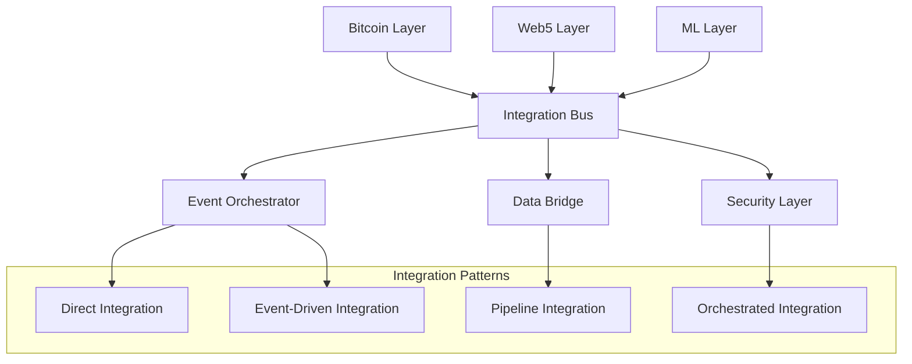

# Core Integration Patterns

[AIR-3][AIS-3][AIT-3][RES-3] Essential integration patterns for connecting Bitcoin, Web5, and ML systems within the Anya core platform.

*Last updated: May 30, 2025*

## Table of Contents

- [Integration Architecture](#integration-architecture)
- [Bitcoin Integration Patterns](#bitcoin-integration-patterns)
- [Web5 Integration Patterns](#web5-integration-patterns)
- [ML Integration Patterns](#ml-integration-patterns)
- [Cross-Protocol Integration](#cross-protocol-integration)
- [Event-Driven Integration](#event-driven-integration)
- [Data Flow Patterns](#data-flow-patterns)
- [Error Handling and Resilience](#error-handling-and-resilience)
- [Performance Optimization](#performance-optimization)
- [Security Considerations](#security-considerations)

## Integration Architecture

### Core Integration Framework

The Anya platform provides a unified integration framework that enables seamless communication between Bitcoin, Web5, and ML components while maintaining security, performance, and reliability.

```rust
use anya_core::{IntegrationManager, Protocol, EventBus, DataBridge};
use serde::{Serialize, Deserialize};

/// Core integration manager coordinating all protocol interactions
pub struct CoreIntegrationManager {
    bitcoin_bridge: BitcoinBridge,
    web5_bridge: Web5Bridge,
    ml_bridge: MLBridge,
    event_bus: EventBus,
    data_bridge: DataBridge,
    orchestrator: IntegrationOrchestrator,
}

impl CoreIntegrationManager {
    /// Initialize core integration system
    pub async fn initialize(config: IntegrationConfig) -> Result<Self> {
        let event_bus = EventBus::new(config.event_config).await?;
        
        let manager = Self {
            bitcoin_bridge: BitcoinBridge::new(config.bitcoin_config, event_bus.clone()).await?,
            web5_bridge: Web5Bridge::new(config.web5_config, event_bus.clone()).await?,
            ml_bridge: MLBridge::new(config.ml_config, event_bus.clone()).await?,
            event_bus: event_bus.clone(),
            data_bridge: DataBridge::new(config.data_config).await?,
            orchestrator: IntegrationOrchestrator::new(event_bus).await?,
        };
        
        // Start cross-protocol monitoring
        manager.start_monitoring().await?;
        
        Ok(manager)
    }
    
    /// Execute cross-protocol operation
    pub async fn execute_cross_protocol_operation(
        &self,
        operation: CrossProtocolOperation,
    ) -> Result<IntegrationResult> {
        match operation {
            CrossProtocolOperation::BitcoinToWeb5(op) => {
                self.execute_bitcoin_to_web5(op).await
            },
            CrossProtocolOperation::Web5ToML(op) => {
                self.execute_web5_to_ml(op).await
            },
            CrossProtocolOperation::MLToBitcoin(op) => {
                self.execute_ml_to_bitcoin(op).await
            },
            CrossProtocolOperation::TriProtocol(op) => {
                self.execute_tri_protocol_operation(op).await
            },
        }
    }
}

/// Cross-protocol operation types
#[derive(Debug, Clone, Serialize, Deserialize)]
pub enum CrossProtocolOperation {
    BitcoinToWeb5(BitcoinToWeb5Operation),
    Web5ToML(Web5ToMLOperation),
    MLToBitcoin(MLToBitcoinOperation),
    TriProtocol(TriProtocolOperation),
}
```

### Integration Patterns Overview



## Bitcoin Integration Patterns

### Bitcoin Event Integration

```rust
use anya_bitcoin::{BitcoinClient, TransactionMonitor, BlockMonitor};
use anya_events::{EventPublisher, BitcoinEvent};

pub struct BitcoinEventIntegration {
    client: BitcoinClient,
    tx_monitor: TransactionMonitor,
    block_monitor: BlockMonitor,
    event_publisher: EventPublisher,
}

impl BitcoinEventIntegration {
    /// Monitor Bitcoin transactions and publish events
    pub async fn start_transaction_monitoring(&self) -> Result<()> {
        let mut tx_stream = self.tx_monitor.subscribe_to_transactions().await?;
        
        while let Some(transaction) = tx_stream.next().await {
            let bitcoin_event = BitcoinEvent::TransactionConfirmed {
                txid: transaction.txid().to_string(),
                confirmations: transaction.confirmations,
                amount: transaction.total_output(),
                timestamp: transaction.timestamp,
            };
            
            // Publish to integration bus
            self.event_publisher.publish(bitcoin_event.clone()).await?;
            
            // Trigger cross-protocol workflows
            self.trigger_cross_protocol_workflows(bitcoin_event).await?;
        }
        
        Ok(())
    }
    
    /// Monitor Bitcoin blocks for Web5 and ML integration
    pub async fn start_block_monitoring(&self) -> Result<()> {
        let mut block_stream = self.block_monitor.subscribe_to_blocks().await?;
        
        while let Some(block) = block_stream.next().await {
            // Extract relevant data for Web5
            let web5_data = self.extract_web5_relevant_data(&block).await?;
            if !web5_data.is_empty() {
                self.forward_to_web5(web5_data).await?;
            }
            
            // Extract data for ML analysis
            let ml_features = self.extract_ml_features(&block).await?;
            if !ml_features.is_empty() {
                self.forward_to_ml(ml_features).await?;
            }
            
            let block_event = BitcoinEvent::BlockMined {
                block_hash: block.hash().to_string(),
                height: block.height(),
                transaction_count: block.transactions().len(),
                timestamp: block.timestamp(),
            };
            
            self.event_publisher.publish(block_event).await?;
        }
        
        Ok(())
    }
    
    async fn trigger_cross_protocol_workflows(&self, event: BitcoinEvent) -> Result<()> {
        match event {
            BitcoinEvent::TransactionConfirmed { txid, amount, .. } => {
                // Trigger Web5 identity verification if applicable
                if self.is_identity_transaction(&txid).await? {
                    self.trigger_web5_identity_verification(&txid).await?;
                }
                
                // Trigger ML analysis for fraud detection
                if amount > self.large_transaction_threshold() {
                    self.trigger_ml_fraud_analysis(&txid, amount).await?;
                }
            },
            _ => {}
        }
        
        Ok(())
    }
}
```

### Bitcoin Data Bridge

```rust
use anya_bitcoin::{UTXOSet, MemPool, ChainAnalyzer};
use anya_data::{DataTransformer, DataSink};

pub struct BitcoinDataBridge {
    utxo_set: UTXOSet,
    mempool: MemPool,
    chain_analyzer: ChainAnalyzer,
    data_transformer: DataTransformer,
}

impl BitcoinDataBridge {
    /// Bridge UTXO data to Web5 storage
    pub async fn bridge_utxo_to_web5(
        &self,
        address: &str,
        target_did: &str,
    ) -> Result<Web5StorageResult> {
        // Get UTXO data
        let utxos = self.utxo_set.get_utxos_for_address(address).await?;
        
        // Transform to Web5 format
        let web5_data = self.data_transformer.bitcoin_to_web5(utxos)?;
        
        // Store in Web5 data space
        let storage_result = self.store_in_web5_dataspace(target_did, web5_data).await?;
        
        Ok(storage_result)
    }
    
    /// Bridge mempool data to ML for analysis
    pub async fn bridge_mempool_to_ml(&self) -> Result<MLAnalysisJob> {
        // Get current mempool state
        let mempool_data = self.mempool.get_current_state().await?;
        
        // Extract features for ML
        let ml_features = self.data_transformer.mempool_to_ml_features(mempool_data)?;
        
        // Submit to ML pipeline
        let analysis_job = self.submit_to_ml_pipeline(ml_features).await?;
        
        Ok(analysis_job)
    }
    
    /// Bridge chain analysis to both Web5 and ML
    pub async fn bridge_chain_analysis(&self, analysis_type: ChainAnalysisType) -> Result<()> {
        let analysis_result = self.chain_analyzer.analyze(analysis_type).await?;
        
        // Fork to Web5 for identity correlation
        let web5_task = self.forward_analysis_to_web5(analysis_result.clone());
        
        // Fork to ML for pattern recognition
        let ml_task = self.forward_analysis_to_ml(analysis_result);
        
        // Execute in parallel
        let (web5_result, ml_result) = tokio::try_join!(web5_task, ml_task)?;
        
        // Correlate results
        self.correlate_analysis_results(web5_result, ml_result).await?;
        
        Ok(())
    }
}
```

## Web5 Integration Patterns

### Web5 Identity Integration

```rust
use anya_web5::{DIDResolver, CredentialManager, DataStore};
use anya_bitcoin::{AddressManager, MultiSigManager};

pub struct Web5IdentityIntegration {
    did_resolver: DIDResolver,
    credential_manager: CredentialManager,
    data_store: DataStore,
    address_manager: AddressManager,
}

impl Web5IdentityIntegration {
    /// Link Bitcoin addresses to Web5 identity
    pub async fn link_bitcoin_address_to_did(
        &self,
        did: &str,
        bitcoin_address: &str,
        proof_type: AddressProofType,
    ) -> Result<LinkingCredential> {
        // Resolve DID document
        let did_document = self.did_resolver.resolve(did).await?;
        
        // Verify address ownership
        let ownership_proof = self.verify_address_ownership(
            bitcoin_address,
            &did_document,
            proof_type,
        ).await?;
        
        // Create linking credential
        let linking_credential = self.credential_manager.create_address_linking_credential(
            did,
            bitcoin_address,
            ownership_proof,
        ).await?;
        
        // Store in Web5 data space
        self.data_store.store_credential(linking_credential.clone()).await?;
        
        // Update Bitcoin address metadata
        self.address_manager.update_address_metadata(
            bitcoin_address,
            AddressMetadata {
                linked_did: Some(did.to_string()),
                verification_method: did_document.verification_method[0].id.clone(),
                linking_timestamp: Utc::now(),
            },
        ).await?;
        
        Ok(linking_credential)
    }
    
    /// Create Bitcoin multisig with Web5 identities
    pub async fn create_multisig_with_dids(
        &self,
        dids: Vec<String>,
        threshold: u8,
        purpose: MultisigPurpose,
    ) -> Result<Web5MultisigWallet> {
        let mut verification_keys = Vec::new();
        
        // Resolve DIDs and extract verification keys
        for did in &dids {
            let did_document = self.did_resolver.resolve(did).await?;
            let verification_key = did_document.get_bitcoin_verification_key()
                .ok_or(Error::NoBitcoinKeyInDID)?;
            verification_keys.push(verification_key);
        }
        
        // Create Bitcoin multisig
        let multisig_wallet = self.address_manager.create_multisig(
            threshold,
            verification_keys.clone(),
        ).await?;
        
        // Create Web5 multisig metadata
        let web5_multisig = Web5MultisigWallet {
            wallet_id: multisig_wallet.id(),
            bitcoin_address: multisig_wallet.address().clone(),
            participant_dids: dids,
            threshold,
            verification_keys,
            purpose,
            created_at: Utc::now(),
        };
        
        // Store multisig metadata in Web5
        self.data_store.store_multisig_metadata(web5_multisig.clone()).await?;
        
        Ok(web5_multisig)
    }
    
    /// Integrate Web5 data with Bitcoin transactions
    pub async fn attach_web5_data_to_transaction(
        &self,
        transaction: &BitcoinTransaction,
        data_references: Vec<Web5DataReference>,
    ) -> Result<EnhancedTransaction> {
        let mut enhanced_tx = EnhancedTransaction::from_bitcoin_tx(transaction.clone());
        
        for data_ref in data_references {
            // Resolve Web5 data
            let web5_data = self.data_store.retrieve_data(&data_ref.data_id).await?;
            
            // Verify data integrity
            self.verify_data_integrity(&web5_data, &data_ref.integrity_proof).await?;
            
            // Attach to transaction
            enhanced_tx.attach_web5_data(data_ref, web5_data);
        }
        
        Ok(enhanced_tx)
    }
}
```

### Web5 Data Flow Integration

```rust
use anya_web5::{ProtocolManager, SyncEngine, DataProtocol};
use anya_ml::{DataPipeline, FeatureExtractor};

pub struct Web5DataFlowIntegration {
    protocol_manager: ProtocolManager,
    sync_engine: SyncEngine,
    data_pipeline: DataPipeline,
    feature_extractor: FeatureExtractor,
}

impl Web5DataFlowIntegration {
    /// Create data flow from Web5 to ML
    pub async fn create_web5_to_ml_pipeline(
        &self,
        protocol: &str,
        ml_model_id: &str,
        flow_config: DataFlowConfig,
    ) -> Result<DataFlowPipeline> {
        // Set up Web5 data subscription
        let data_subscription = self.protocol_manager.subscribe_to_protocol_data(
            protocol,
            flow_config.filter_criteria.clone(),
        ).await?;
        
        // Create ML feature extraction pipeline
        let feature_pipeline = self.feature_extractor.create_pipeline(
            flow_config.feature_extraction_config.clone(),
        ).await?;
        
        // Create data flow pipeline
        let pipeline = DataFlowPipeline::new(
            DataSource::Web5(data_subscription),
            DataSink::ML(ml_model_id.to_string()),
            vec![
                DataProcessor::FeatureExtraction(feature_pipeline),
                DataProcessor::Validation(flow_config.validation_rules),
                DataProcessor::Transformation(flow_config.transformation_rules),
            ],
        );
        
        // Start pipeline
        pipeline.start().await?;
        
        Ok(pipeline)
    }
    
    /// Bidirectional Web5-ML data synchronization
    pub async fn setup_bidirectional_web5_ml_sync(
        &self,
        web5_protocol: &str,
        ml_model_id: &str,
        sync_config: BidirectionalSyncConfig,
    ) -> Result<BidirectionalSync> {
        // Web5 to ML flow
        let web5_to_ml = self.create_web5_to_ml_pipeline(
            web5_protocol,
            ml_model_id,
            sync_config.web5_to_ml_config,
        ).await?;
        
        // ML to Web5 flow
        let ml_to_web5 = self.create_ml_to_web5_pipeline(
            ml_model_id,
            web5_protocol,
            sync_config.ml_to_web5_config,
        ).await?;
        
        // Create bidirectional synchronizer
        let sync = BidirectionalSync::new(
            web5_to_ml,
            ml_to_web5,
            sync_config.conflict_resolution_strategy,
        );
        
        // Start synchronization
        sync.start().await?;
        
        Ok(sync)
    }
}
```

## ML Integration Patterns

### ML Model Integration

```rust
use anya_ml::{ModelRegistry, InferenceEngine, TrainingEngine};
use anya_bitcoin::{TransactionAnalyzer, PricePredictor};
use anya_web5::{ReputationEngine, IdentityVerifier};

pub struct MLModelIntegration {
    model_registry: ModelRegistry,
    inference_engine: InferenceEngine,
    training_engine: TrainingEngine,
    bitcoin_analyzer: TransactionAnalyzer,
    web5_reputation: ReputationEngine,
}

impl MLModelIntegration {
    /// Deploy ML model for Bitcoin transaction analysis
    pub async fn deploy_bitcoin_analysis_model(
        &self,
        model_config: BitcoinAnalysisModelConfig,
    ) -> Result<DeployedModel> {
        // Load pre-trained model or train new one
        let model = if let Some(model_path) = &model_config.pretrained_model_path {
            self.model_registry.load_model(model_path).await?
        } else {
            self.train_bitcoin_analysis_model(&model_config.training_config).await?
        };
        
        // Deploy for real-time inference
        let deployed_model = self.inference_engine.deploy_model(
            model,
            DeploymentConfig {
                auto_scaling: true,
                batch_size: model_config.batch_size,
                max_latency: Duration::from_millis(100),
                throughput_target: 1000, // transactions per second
            },
        ).await?;
        
        // Integrate with Bitcoin transaction stream
        self.bitcoin_analyzer.register_ml_model(
            deployed_model.id(),
            BitcoinAnalysisType::FraudDetection,
        ).await?;
        
        Ok(deployed_model)
    }
    
    /// Create ML-powered Web5 reputation system
    pub async fn create_web5_reputation_system(
        &self,
        reputation_config: ReputationSystemConfig,
    ) -> Result<MLReputationSystem> {
        // Train reputation model on historical data
        let reputation_model = self.train_reputation_model(&reputation_config).await?;
        
        // Deploy reputation inference
        let deployed_model = self.inference_engine.deploy_model(
            reputation_model,
            DeploymentConfig::realtime(),
        ).await?;
        
        // Create reputation system
        let reputation_system = MLReputationSystem::new(
            deployed_model,
            reputation_config.reputation_factors,
            reputation_config.update_frequency,
        );
        
        // Integrate with Web5 identity system
        self.web5_reputation.register_ml_backend(reputation_system.clone()).await?;
        
        Ok(reputation_system)
    }
    
    /// Cross-protocol ML pipeline
    pub async fn create_cross_protocol_ml_pipeline(
        &self,
        pipeline_config: CrossProtocolMLConfig,
    ) -> Result<CrossProtocolMLPipeline> {
        let pipeline = CrossProtocolMLPipeline::new();
        
        // Add Bitcoin data sources
        for bitcoin_source in &pipeline_config.bitcoin_sources {
            let data_stream = self.bitcoin_analyzer.create_data_stream(bitcoin_source).await?;
            pipeline.add_data_source(DataSource::Bitcoin(data_stream));
        }
        
        // Add Web5 data sources
        for web5_source in &pipeline_config.web5_sources {
            let data_stream = self.web5_reputation.create_data_stream(web5_source).await?;
            pipeline.add_data_source(DataSource::Web5(data_stream));
        }
        
        // Configure ML processing stages
        for stage_config in &pipeline_config.processing_stages {
            let stage = self.create_ml_processing_stage(stage_config).await?;
            pipeline.add_processing_stage(stage);
        }
        
        // Set up output sinks
        for sink_config in &pipeline_config.output_sinks {
            let sink = self.create_output_sink(sink_config).await?;
            pipeline.add_output_sink(sink);
        }
        
        // Start pipeline
        pipeline.start().await?;
        
        Ok(pipeline)
    }
}
```

### ML Feature Engineering Integration

```rust
use anya_ml::{FeatureEngine, FeatureStore};
use anya_bitcoin::{OnChainAnalytics, MempoolAnalytics};
use anya_web5::{IdentityAnalytics, DataAnalytics};

pub struct MLFeatureIntegration {
    feature_engine: FeatureEngine,
    feature_store: FeatureStore,
    bitcoin_analytics: OnChainAnalytics,
    web5_analytics: IdentityAnalytics,
}

impl MLFeatureIntegration {
    /// Extract and combine features from Bitcoin and Web5
    pub async fn extract_cross_protocol_features(
        &self,
        feature_request: CrossProtocolFeatureRequest,
    ) -> Result<FeatureVector> {
        let mut feature_vector = FeatureVector::new();
        
        // Extract Bitcoin features
        if feature_request.include_bitcoin_features {
            let bitcoin_features = self.extract_bitcoin_features(
                &feature_request.bitcoin_context,
            ).await?;
            feature_vector.extend(bitcoin_features);
        }
        
        // Extract Web5 features
        if feature_request.include_web5_features {
            let web5_features = self.extract_web5_features(
                &feature_request.web5_context,
            ).await?;
            feature_vector.extend(web5_features);
        }
        
        // Extract cross-protocol interaction features
        if feature_request.include_interaction_features {
            let interaction_features = self.extract_interaction_features(
                &feature_request.bitcoin_context,
                &feature_request.web5_context,
            ).await?;
            feature_vector.extend(interaction_features);
        }
        
        // Store features for future use
        self.feature_store.store_features(
            &feature_request.entity_id,
            feature_vector.clone(),
        ).await?;
        
        Ok(feature_vector)
    }
    
    async fn extract_bitcoin_features(
        &self,
        context: &BitcoinFeatureContext,
    ) -> Result<Vec<Feature>> {
        let mut features = Vec::new();
        
        // Transaction-based features
        if let Some(tx_hash) = &context.transaction_hash {
            let tx_features = self.bitcoin_analytics.extract_transaction_features(tx_hash).await?;
            features.extend(tx_features);
        }
        
        // Address-based features
        if let Some(address) = &context.address {
            let addr_features = self.bitcoin_analytics.extract_address_features(address).await?;
            features.extend(addr_features);
        }
        
        // Network-based features
        let network_features = self.bitcoin_analytics.extract_network_features().await?;
        features.extend(network_features);
        
        Ok(features)
    }
    
    async fn extract_web5_features(
        &self,
        context: &Web5FeatureContext,
    ) -> Result<Vec<Feature>> {
        let mut features = Vec::new();
        
        // Identity-based features
        if let Some(did) = &context.did {
            let identity_features = self.web5_analytics.extract_identity_features(did).await?;
            features.extend(identity_features);
        }
        
        // Data interaction features
        if let Some(protocol) = &context.protocol {
            let protocol_features = self.web5_analytics.extract_protocol_features(protocol).await?;
            features.extend(protocol_features);
        }
        
        // Reputation features
        let reputation_features = self.web5_analytics.extract_reputation_features(context).await?;
        features.extend(reputation_features);
        
        Ok(features)
    }
}
```

## Cross-Protocol Integration

### Orchestrated Integration

```rust
use anya_orchestration::{WorkflowEngine, StepExecutor, StateManager};

pub struct CrossProtocolOrchestrator {
    workflow_engine: WorkflowEngine,
    step_executor: StepExecutor,
    state_manager: StateManager,
    bitcoin_client: BitcoinClient,
    web5_client: Web5Client,
    ml_client: MLClient,
}

impl CrossProtocolOrchestrator {
    /// Execute complex cross-protocol workflow
    pub async fn execute_workflow(
        &self,
        workflow_definition: WorkflowDefinition,
        input_context: InputContext,
    ) -> Result<WorkflowResult> {
        // Initialize workflow state
        let workflow_state = self.state_manager.initialize_workflow(
            &workflow_definition,
            input_context,
        ).await?;
        
        // Execute workflow steps
        for step in workflow_definition.steps {
            let step_result = match step.protocol {
                Protocol::Bitcoin => {
                    self.execute_bitcoin_step(step, &workflow_state).await?
                },
                Protocol::Web5 => {
                    self.execute_web5_step(step, &workflow_state).await?
                },
                Protocol::ML => {
                    self.execute_ml_step(step, &workflow_state).await?
                },
                Protocol::CrossProtocol => {
                    self.execute_cross_protocol_step(step, &workflow_state).await?
                },
            };
            
            // Update workflow state
            self.state_manager.update_state(&workflow_state.id, step_result).await?;
            
            // Check for early termination conditions
            if self.should_terminate_workflow(&workflow_state).await? {
                break;
            }
        }
        
        // Finalize workflow
        let final_result = self.state_manager.finalize_workflow(&workflow_state.id).await?;
        
        Ok(final_result)
    }
    
    /// Example: Bitcoin payment with Web5 identity verification and ML fraud detection
    pub async fn execute_verified_payment_workflow(
        &self,
        payment_request: VerifiedPaymentRequest,
    ) -> Result<VerifiedPaymentResult> {
        let workflow = WorkflowDefinition {
            id: uuid::Uuid::new_v4().to_string(),
            name: "verified_payment".to_string(),
            steps: vec![
                // Step 1: Verify sender identity via Web5
                WorkflowStep {
                    id: "verify_sender".to_string(),
                    protocol: Protocol::Web5,
                    operation: "verify_identity".to_string(),
                    input_mapping: json!({
                        "did": "{{input.sender_did}}",
                        "verification_method": "biometric"
                    }),
                    output_mapping: json!({
                        "sender_verified": "{{output.verified}}",
                        "verification_score": "{{output.confidence}}"
                    }),
                },
                
                // Step 2: ML fraud risk assessment
                WorkflowStep {
                    id: "fraud_assessment".to_string(),
                    protocol: Protocol::ML,
                    operation: "assess_fraud_risk".to_string(),
                    input_mapping: json!({
                        "sender_did": "{{input.sender_did}}",
                        "recipient_address": "{{input.recipient_address}}",
                        "amount": "{{input.amount}}",
                        "sender_verification_score": "{{steps.verify_sender.verification_score}}"
                    }),
                    output_mapping: json!({
                        "risk_score": "{{output.risk_score}}",
                        "risk_factors": "{{output.risk_factors}}"
                    }),
                },
                
                // Step 3: Conditional Bitcoin transaction
                WorkflowStep {
                    id: "execute_payment".to_string(),
                    protocol: Protocol::Bitcoin,
                    operation: "send_transaction".to_string(),
                    condition: "{{steps.verify_sender.sender_verified}} && {{steps.fraud_assessment.risk_score}} < 0.7",
                    input_mapping: json!({
                        "from_address": "{{input.sender_address}}",
                        "to_address": "{{input.recipient_address}}",
                        "amount": "{{input.amount}}",
                        "metadata": {
                            "sender_did": "{{input.sender_did}}",
                            "verification_score": "{{steps.verify_sender.verification_score}}",
                            "risk_score": "{{steps.fraud_assessment.risk_score}}"
                        }
                    }),
                    output_mapping: json!({
                        "transaction_id": "{{output.txid}}",
                        "status": "{{output.status}}"
                    }),
                },
                
                // Step 4: Record transaction in Web5 data space
                WorkflowStep {
                    id: "record_transaction".to_string(),
                    protocol: Protocol::Web5,
                    operation: "store_transaction_record".to_string(),
                    condition: "{{steps.execute_payment.status}} == 'success'",
                    input_mapping: json!({
                        "did": "{{input.sender_did}}",
                        "transaction_data": {
                            "bitcoin_txid": "{{steps.execute_payment.transaction_id}}",
                            "amount": "{{input.amount}}",
                            "recipient": "{{input.recipient_address}}",
                            "verification_score": "{{steps.verify_sender.verification_score}}",
                            "risk_assessment": "{{steps.fraud_assessment}}"
                        }
                    }),
                },
            ],
        };
        
        let input_context = InputContext::from_payment_request(payment_request);
        let workflow_result = self.execute_workflow(workflow, input_context).await?;
        
        Ok(VerifiedPaymentResult::from_workflow_result(workflow_result))
    }
}
```

## Event-Driven Integration

### Event Bus Architecture

```rust
use anya_events::{EventBus, EventHandler, EventFilter, EventProcessor};
use tokio::sync::broadcast;

pub struct IntegrationEventBus {
    bus: EventBus,
    handlers: HashMap<String, Box<dyn EventHandler>>,
    processors: Vec<Box<dyn EventProcessor>>,
    filters: Vec<EventFilter>,
}

impl IntegrationEventBus {
    /// Register cross-protocol event handler
    pub async fn register_cross_protocol_handler(
        &mut self,
        handler_id: &str,
        handler: impl EventHandler + 'static,
        event_pattern: EventPattern,
    ) -> Result<()> {
        // Wrap handler for cross-protocol coordination
        let wrapped_handler = CrossProtocolEventHandler::new(
            handler,
            event_pattern,
            self.create_protocol_coordinators().await?,
        );
        
        self.handlers.insert(handler_id.to_string(), Box::new(wrapped_handler));
        Ok(())
    }
    
    /// Process event across protocols
    pub async fn process_cross_protocol_event(
        &self,
        event: IntegrationEvent,
    ) -> Result<Vec<EventResult>> {
        let mut results = Vec::new();
        
        // Apply filters
        let filtered_event = self.apply_filters(event).await?;
        
        // Route to appropriate handlers
        let relevant_handlers = self.find_relevant_handlers(&filtered_event).await?;
        
        // Process in parallel where possible
        let handler_futures = relevant_handlers.into_iter().map(|handler| {
            handler.handle_event(filtered_event.clone())
        });
        
        let handler_results = futures::future::try_join_all(handler_futures).await?;
        results.extend(handler_results);
        
        // Apply post-processing
        for processor in &self.processors {
            let processed = processor.process_results(&results).await?;
            results = processed;
        }
        
        Ok(results)
    }
}

/// Cross-protocol event handler
pub struct CrossProtocolEventHandler {
    inner_handler: Box<dyn EventHandler>,
    event_pattern: EventPattern,
    bitcoin_coordinator: BitcoinCoordinator,
    web5_coordinator: Web5Coordinator,
    ml_coordinator: MLCoordinator,
}

impl EventHandler for CrossProtocolEventHandler {
    async fn handle_event(&self, event: IntegrationEvent) -> Result<EventResult> {
        // Pre-process event for cross-protocol context
        let enhanced_event = self.enhance_event_with_context(event).await?;
        
        // Handle with inner handler
        let mut result = self.inner_handler.handle_event(enhanced_event).await?;
        
        // Coordinate cross-protocol side effects
        if result.requires_bitcoin_action() {
            let bitcoin_result = self.bitcoin_coordinator.execute_action(
                result.bitcoin_action.as_ref().unwrap()
            ).await?;
            result.add_side_effect(SideEffect::Bitcoin(bitcoin_result));
        }
        
        if result.requires_web5_action() {
            let web5_result = self.web5_coordinator.execute_action(
                result.web5_action.as_ref().unwrap()
            ).await?;
            result.add_side_effect(SideEffect::Web5(web5_result));
        }
        
        if result.requires_ml_action() {
            let ml_result = self.ml_coordinator.execute_action(
                result.ml_action.as_ref().unwrap()
            ).await?;
            result.add_side_effect(SideEffect::ML(ml_result));
        }
        
        Ok(result)
    }
}
```

## Data Flow Patterns

### Stream Processing Integration

```rust
use anya_streams::{StreamProcessor, DataStream, StreamJoin, StreamTransform};
use futures::StreamExt;

pub struct IntegrationStreamProcessor {
    bitcoin_stream: DataStream<BitcoinEvent>,
    web5_stream: DataStream<Web5Event>,
    ml_stream: DataStream<MLEvent>,
    joined_stream: Option<DataStream<JoinedEvent>>,
}

impl IntegrationStreamProcessor {
    /// Create joined stream from all protocols
    pub async fn create_joined_stream(
        &mut self,
        join_config: StreamJoinConfig,
    ) -> Result<&DataStream<JoinedEvent>> {
        let bitcoin_keyed = self.bitcoin_stream
            .map(|event| (event.entity_key(), ProtocolEvent::Bitcoin(event)));
        
        let web5_keyed = self.web5_stream
            .map(|event| (event.entity_key(), ProtocolEvent::Web5(event)));
        
        let ml_keyed = self.ml_stream
            .map(|event| (event.entity_key(), ProtocolEvent::ML(event)));
        
        // Create temporal join window
        let joined = StreamJoin::new(join_config.window_size)
            .join_streams(vec![
                ("bitcoin".to_string(), bitcoin_keyed),
                ("web5".to_string(), web5_keyed),
                ("ml".to_string(), ml_keyed),
            ])
            .map(|(key, events)| JoinedEvent {
                entity_key: key,
                events,
                timestamp: Utc::now(),
            });
        
        self.joined_stream = Some(joined);
        Ok(self.joined_stream.as_ref().unwrap())
    }
    
    /// Process cross-protocol patterns
    pub async fn process_cross_protocol_patterns(
        &self,
        pattern_config: PatternConfig,
    ) -> Result<DataStream<PatternMatch>> {
        let joined_stream = self.joined_stream.as_ref()
            .ok_or(Error::JoinedStreamNotInitialized)?;
        
        let pattern_stream = joined_stream
            .window(pattern_config.window_size)
            .scan(
                PatternState::new(),
                move |state, events| {
                    let patterns = state.detect_patterns(events, &pattern_config);
                    futures::future::ready(Some(patterns))
                }
            )
            .filter_map(|patterns| {
                futures::future::ready(patterns.into_iter().next())
            });
        
        Ok(pattern_stream)
    }
}
```

## Error Handling and Resilience

### Circuit Breaker Pattern

```rust
use anya_resilience::{CircuitBreaker, RetryPolicy, Fallback};

pub struct ResilientIntegration {
    bitcoin_circuit: CircuitBreaker,
    web5_circuit: CircuitBreaker,
    ml_circuit: CircuitBreaker,
    retry_policy: RetryPolicy,
    fallback_handler: Fallback,
}

impl ResilientIntegration {
    /// Execute operation with resilience patterns
    pub async fn execute_with_resilience<T>(
        &self,
        operation: impl IntegrationOperation<Output = T>,
        resilience_config: ResilienceConfig,
    ) -> Result<T> {
        let mut attempt = 0;
        let max_attempts = resilience_config.max_retries + 1;
        
        while attempt < max_attempts {
            // Check circuit breaker
            match operation.protocol() {
                Protocol::Bitcoin => {
                    if self.bitcoin_circuit.is_open() {
                        return self.fallback_handler.handle_bitcoin_fallback(operation).await;
                    }
                },
                Protocol::Web5 => {
                    if self.web5_circuit.is_open() {
                        return self.fallback_handler.handle_web5_fallback(operation).await;
                    }
                },
                Protocol::ML => {
                    if self.ml_circuit.is_open() {
                        return self.fallback_handler.handle_ml_fallback(operation).await;
                    }
                },
            }
            
            // Execute operation
            match operation.execute().await {
                Ok(result) => {
                    // Record success
                    self.record_success(operation.protocol()).await;
                    return Ok(result);
                },
                Err(error) => {
                    // Record failure
                    self.record_failure(operation.protocol(), &error).await;
                    
                    // Check if retryable
                    if !error.is_retryable() || attempt == max_attempts - 1 {
                        return Err(error);
                    }
                    
                    // Wait before retry
                    let delay = self.retry_policy.calculate_delay(attempt);
                    tokio::time::sleep(delay).await;
                }
            }
            
            attempt += 1;
        }
        
        Err(Error::MaxRetriesExceeded)
    }
    
    async fn record_success(&self, protocol: Protocol) {
        match protocol {
            Protocol::Bitcoin => self.bitcoin_circuit.record_success(),
            Protocol::Web5 => self.web5_circuit.record_success(),
            Protocol::ML => self.ml_circuit.record_success(),
        }
    }
    
    async fn record_failure(&self, protocol: Protocol, error: &Error) {
        match protocol {
            Protocol::Bitcoin => self.bitcoin_circuit.record_failure(error),
            Protocol::Web5 => self.web5_circuit.record_failure(error),
            Protocol::ML => self.ml_circuit.record_failure(error),
        }
    }
}
```

## Performance Optimization

### Caching and Memoization

```rust
use anya_cache::{CacheManager, DistributedCache, CachePolicy};

pub struct IntegrationCache {
    cache_manager: CacheManager,
    bitcoin_cache: DistributedCache,
    web5_cache: DistributedCache,
    ml_cache: DistributedCache,
    cross_protocol_cache: DistributedCache,
}

impl IntegrationCache {
    /// Cache cross-protocol query results
    pub async fn cache_cross_protocol_result<T>(
        &self,
        query: &CrossProtocolQuery,
        result: &T,
        cache_policy: CachePolicy,
    ) -> Result<()>
    where
        T: Serialize + for<'de> Deserialize<'de>,
    {
        let cache_key = self.generate_cache_key(query)?;
        
        match query.primary_protocol() {
            Protocol::Bitcoin => {
                self.bitcoin_cache.set(&cache_key, result, cache_policy).await?;
            },
            Protocol::Web5 => {
                self.web5_cache.set(&cache_key, result, cache_policy).await?;
            },
            Protocol::ML => {
                self.ml_cache.set(&cache_key, result, cache_policy).await?;
            },
        }
        
        // Also cache in cross-protocol cache for complex queries
        if query.involves_multiple_protocols() {
            self.cross_protocol_cache.set(&cache_key, result, cache_policy).await?;
        }
        
        Ok(())
    }
    
    /// Get cached result with fallback chain
    pub async fn get_cached_result<T>(
        &self,
        query: &CrossProtocolQuery,
    ) -> Result<Option<T>>
    where
        T: for<'de> Deserialize<'de>,
    {
        let cache_key = self.generate_cache_key(query)?;
        
        // Try cross-protocol cache first for complex queries
        if query.involves_multiple_protocols() {
            if let Some(result) = self.cross_protocol_cache.get(&cache_key).await? {
                return Ok(Some(result));
            }
        }
        
        // Try protocol-specific cache
        match query.primary_protocol() {
            Protocol::Bitcoin => {
                self.bitcoin_cache.get(&cache_key).await
            },
            Protocol::Web5 => {
                self.web5_cache.get(&cache_key).await
            },
            Protocol::ML => {
                self.ml_cache.get(&cache_key).await
            },
        }
    }
}
```

## Security Considerations

### Cross-Protocol Security

```rust
use anya_security::{SecurityValidator, TrustBoundary, SecurityContext};

pub struct IntegrationSecurity {
    validator: SecurityValidator,
    trust_boundaries: HashMap<(Protocol, Protocol), TrustBoundary>,
    security_policies: HashMap<Protocol, SecurityPolicy>,
}

impl IntegrationSecurity {
    /// Validate cross-protocol operation security
    pub async fn validate_cross_protocol_security(
        &self,
        operation: &CrossProtocolOperation,
        context: &SecurityContext,
    ) -> Result<SecurityValidation> {
        let mut validation = SecurityValidation::new();
        
        // Validate each protocol interaction
        for (source_protocol, target_protocol) in operation.protocol_interactions() {
            let trust_boundary = self.trust_boundaries.get(&(source_protocol, target_protocol))
                .ok_or(Error::UndefinedTrustBoundary)?;
            
            let boundary_validation = trust_boundary.validate_crossing(
                operation,
                context,
            ).await?;
            
            validation.add_boundary_validation(boundary_validation);
        }
        
        // Validate data flow security
        let data_flow_validation = self.validate_data_flow_security(
            operation,
            context,
        ).await?;
        validation.add_data_flow_validation(data_flow_validation);
        
        // Validate privilege escalation
        let privilege_validation = self.validate_privilege_boundaries(
            operation,
            context,
        ).await?;
        validation.add_privilege_validation(privilege_validation);
        
        Ok(validation)
    }
    
    /// Secure data transformation between protocols
    pub async fn secure_data_transformation(
        &self,
        data: ProtocolData,
        source_protocol: Protocol,
        target_protocol: Protocol,
        context: &SecurityContext,
    ) -> Result<SecureProtocolData> {
        // Validate source data
        let source_policy = &self.security_policies[&source_protocol];
        source_policy.validate_outbound_data(&data, context).await?;
        
        // Apply transformation security
        let trust_boundary = &self.trust_boundaries[&(source_protocol, target_protocol)];
        let secure_data = trust_boundary.secure_transformation(data, context).await?;
        
        // Validate target data
        let target_policy = &self.security_policies[&target_protocol];
        target_policy.validate_inbound_data(&secure_data, context).await?;
        
        Ok(secure_data)
    }
}
```

---

## Related Documentation

- [Third-Party Integration](third-party-integration.md) - External system integration
- [Security Guidelines](security-guidelines.md) - Security best practices
- [Bitcoin Core](../../bitcoin/README.md) - Bitcoin system integration
- [Web5 Core](../../web5/README.md) - Web5 system integration
- [ML Core](../../ml/README.md) - ML system integration

## Community and Support

- **Integration Examples**: [https://examples.anya-ai.org/integration](https://examples.anya-ai.org/integration)
- **Best Practices**: [https://docs.anya-ai.org/integration/best-practices](https://docs.anya-ai.org/integration/best-practices)
- **Community Forum**: [https://community.anya-ai.org/integration](https://community.anya-ai.org/integration)
- **GitHub Discussions**: [https://github.com/anya-ai/core/discussions](https://github.com/anya-ai/core/discussions)
