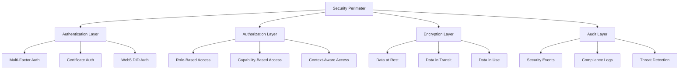

# Security Guidelines

Comprehensive security guidelines for developing, integrating, and deploying Anya Extensions. These guidelines ensure robust security across Bitcoin, Web5, and ML systems while maintaining usability and performance.

## Overview

Security is paramount in the Anya Extensions ecosystem, especially when handling Bitcoin transactions, Web5 identity data, and ML models. This document provides comprehensive security guidelines covering threat modeling, secure coding practices, cryptographic implementations, and operational security.

## Security Architecture



## Threat Modeling

### Security Domains

#### Bitcoin Security Threats
- **Private Key Compromise**: Unauthorized access to Bitcoin private keys
- **Transaction Malleability**: Manipulation of transaction data before confirmation
- **Double Spending**: Attempts to spend the same Bitcoin multiple times
- **Fee Manipulation**: Artificially inflating or deflating transaction fees
- **Node Isolation**: Isolating nodes from the Bitcoin network
- **51% Attacks**: Majority hash power attacking network consensus

#### Web5 Security Threats
- **Identity Theft**: Unauthorized use of decentralized identifiers
- **Credential Forgery**: Creation of false verifiable credentials
- **Data Sovereignty Violation**: Unauthorized access to user-controlled data
- **DID Resolution Poisoning**: Manipulating DID resolution responses
- **Replay Attacks**: Reusing valid authentication tokens
- **Man-in-the-Middle**: Intercepting Web5 protocol communications

#### ML Security Threats
- **Model Poisoning**: Malicious training data affecting model behavior
- **Adversarial Attacks**: Crafted inputs designed to fool ML models
- **Model Extraction**: Unauthorized copying of proprietary models
- **Data Poisoning**: Corrupting training or inference data
- **Privacy Leakage**: Extracting sensitive information from models
- **Bias Amplification**: Systematic discrimination in model outputs

### Threat Assessment Framework

```rust
use anya_extensions::security::{ThreatModel, RiskAssessment, SecurityControl};

#[derive(Debug, Clone)]
pub struct SecurityThreat {
    pub id: String,
    pub name: String,
    pub description: String,
    pub category: ThreatCategory,
    pub likelihood: RiskLevel,
    pub impact: RiskLevel,
    pub affected_assets: Vec<String>,
    pub attack_vectors: Vec<AttackVector>,
}

#[derive(Debug, Clone)]
pub enum ThreatCategory {
    Bitcoin,
    Web5,
    MachineLearning,
    Infrastructure,
    Application,
    Social,
}

#[derive(Debug, Clone)]
pub enum RiskLevel {
    Low,
    Medium,
    High,
    Critical,
}

impl SecurityThreat {
    pub fn risk_score(&self) -> f64 {
        let likelihood_score = match self.likelihood {
            RiskLevel::Low => 1.0,
            RiskLevel::Medium => 2.0,
            RiskLevel::High => 3.0,
            RiskLevel::Critical => 4.0,
        };
        
        let impact_score = match self.impact {
            RiskLevel::Low => 1.0,
            RiskLevel::Medium => 2.0,
            RiskLevel::High => 3.0,
            RiskLevel::Critical => 4.0,
        };
        
        likelihood_score * impact_score
    }
    
    pub fn required_controls(&self) -> Vec<SecurityControl> {
        match self.risk_score() {
            score if score >= 12.0 => vec![
                SecurityControl::MultiFactorAuth,
                SecurityControl::ContinuousMonitoring,
                SecurityControl::IncidentResponse,
                SecurityControl::PenetrationTesting,
            ],
            score if score >= 6.0 => vec![
                SecurityControl::AccessControl,
                SecurityControl::Encryption,
                SecurityControl::AuditLogging,
            ],
            _ => vec![
                SecurityControl::BasicAuth,
                SecurityControl::LoggingMonitoring,
            ],
        }
    }
}
```

## Secure Development Practices

### Secure Coding Standards

#### Rust Security Patterns
```rust
// 1. Use strong typing to prevent errors
#[derive(Debug, Clone)]
pub struct BitcoinAddress(String);

impl BitcoinAddress {
    pub fn new(address: String) -> Result<Self, ValidationError> {
        // Validate Bitcoin address format
        if !Self::is_valid_address(&address) {
            return Err(ValidationError::InvalidAddress);
        }
        Ok(BitcoinAddress(address))
    }
    
    fn is_valid_address(address: &str) -> bool {
        // Implement proper Bitcoin address validation
        bitcoin::Address::from_str(address).is_ok()
    }
    
    pub fn as_str(&self) -> &str {
        &self.0
    }
}

// 2. Secure memory handling for sensitive data
use zeroize::{Zeroize, ZeroizeOnDrop};

#[derive(Zeroize, ZeroizeOnDrop)]
pub struct PrivateKey {
    key_data: [u8; 32],
}

impl PrivateKey {
    pub fn generate() -> Result<Self, CryptoError> {
        let mut key_data = [0u8; 32];
        use rand::rngs::OsRng;
        use rand::RngCore;
        
        OsRng.fill_bytes(&mut key_data);
        
        Ok(PrivateKey { key_data })
    }
    
    pub fn sign(&self, message: &[u8]) -> Result<Signature, CryptoError> {
        // Implement secure signing
        use secp256k1::{Secp256k1, SecretKey, Message};
        
        let secp = Secp256k1::signing_only();
        let secret_key = SecretKey::from_slice(&self.key_data)?;
        let message = Message::from_slice(message)?;
        
        Ok(secp.sign_ecdsa(&message, &secret_key))
    }
}

// 3. Input validation and sanitization
pub fn validate_transaction_input(input: &TransactionInput) -> Result<(), ValidationError> {
    // Validate UTXO reference
    if input.previous_output.txid.len() != 32 {
        return Err(ValidationError::InvalidTxId);
    }
    
    // Validate script signature
    if input.script_sig.len() > MAX_SCRIPT_SIZE {
        return Err(ValidationError::ScriptTooLarge);
    }
    
    // Validate sequence number
    if input.sequence > MAX_SEQUENCE {
        return Err(ValidationError::InvalidSequence);
    }
    
    Ok(())
}

// 4. Safe error handling without information leakage
#[derive(Debug, thiserror::Error)]
pub enum SecurityError {
    #[error("Authentication failed")]
    AuthenticationFailed,
    
    #[error("Access denied")]
    AccessDenied,
    
    #[error("Invalid request")]
    InvalidRequest,
    
    #[error("Internal error")]
    InternalError, // Never expose internal error details
}

impl From<CryptoError> for SecurityError {
    fn from(_: CryptoError) -> Self {
        SecurityError::InternalError // Don't leak crypto implementation details
    }
}
```

### Code Review Security Checklist

#### Bitcoin-Specific Security Review
```markdown
## Bitcoin Security Review Checklist

### Private Key Management
- [ ] Private keys are never logged or exposed in debug output
- [ ] Private keys are zeroized after use
- [ ] Key generation uses cryptographically secure randomness
- [ ] No hardcoded private keys or seeds in code
- [ ] Proper key derivation following BIP-32/BIP-44

### Transaction Security
- [ ] All transaction inputs are validated
- [ ] Transaction outputs sum correctly (no overflow)
- [ ] Script validation is properly implemented
- [ ] RBF (Replace-By-Fee) handling is secure
- [ ] Fee calculation prevents fee sniping attacks

### Network Security
- [ ] P2P messages are properly validated
- [ ] DoS protection mechanisms are in place
- [ ] Connection limits are enforced
- [ ] Peer discovery is secure
- [ ] Block validation follows consensus rules

### Cryptographic Security
- [ ] Uses approved cryptographic libraries
- [ ] No custom cryptographic implementations
- [ ] Proper signature verification
- [ ] Hash functions are collision-resistant
- [ ] Random number generation is secure
```

#### Web5 Security Review
```markdown
## Web5 Security Review Checklist

### Identity Management
- [ ] DID documents are properly validated
- [ ] Key rotation mechanisms are secure
- [ ] Authentication methods are robust
- [ ] Identity proofs cannot be forged
- [ ] Privacy-preserving features are implemented

### Credential Security
- [ ] Verifiable credentials are properly signed
- [ ] Revocation mechanisms are in place
- [ ] Credential schemas are validated
- [ ] Privacy-preserving presentations
- [ ] Zero-knowledge proof implementations

### Data Sovereignty
- [ ] User consent mechanisms are implemented
- [ ] Data access controls are enforced
- [ ] Data portability is supported
- [ ] Encryption keys are user-controlled
- [ ] Data sharing policies are respected
```

#### ML Security Review
```markdown
## ML Security Review Checklist

### Model Security
- [ ] Training data is validated and sanitized
- [ ] Model outputs are bounded and validated
- [ ] Adversarial robustness is tested
- [ ] Model versioning and integrity checks
- [ ] Privacy-preserving inference techniques

### Data Security
- [ ] Sensitive data is properly anonymized
- [ ] Data pipelines are secure
- [ ] Feature extraction preserves privacy
- [ ] Data governance policies are enforced
- [ ] Compliance with data protection regulations

### Algorithmic Fairness
- [ ] Bias testing across demographics
- [ ] Fairness metrics are monitored
- [ ] Explainability features are implemented
- [ ] Algorithmic transparency is maintained
- [ ] Regular bias audits are conducted
```

## Cryptographic Guidelines

### Approved Cryptographic Algorithms

#### Symmetric Encryption
```rust
use aes_gcm::{Aes256Gcm, Key, Nonce, NewAead, Aead};

pub struct SecureStorage {
    cipher: Aes256Gcm,
}

impl SecureStorage {
    pub fn new(key: &[u8; 32]) -> Self {
        let key = Key::from_slice(key);
        let cipher = Aes256Gcm::new(key);
        
        Self { cipher }
    }
    
    pub fn encrypt(&self, plaintext: &[u8], nonce: &[u8; 12]) -> Result<Vec<u8>, CryptoError> {
        let nonce = Nonce::from_slice(nonce);
        self.cipher.encrypt(nonce, plaintext)
            .map_err(|_| CryptoError::EncryptionFailed)
    }
    
    pub fn decrypt(&self, ciphertext: &[u8], nonce: &[u8; 12]) -> Result<Vec<u8>, CryptoError> {
        let nonce = Nonce::from_slice(nonce);
        self.cipher.decrypt(nonce, ciphertext)
            .map_err(|_| CryptoError::DecryptionFailed)
    }
}
```

#### Asymmetric Encryption and Signing
```rust
use ed25519_dalek::{Keypair, PublicKey, SecretKey, Signature, Signer, Verifier};

pub struct Ed25519KeyPair {
    keypair: Keypair,
}

impl Ed25519KeyPair {
    pub fn generate() -> Self {
        let mut csprng = rand::rngs::OsRng;
        let keypair = Keypair::generate(&mut csprng);
        
        Self { keypair }
    }
    
    pub fn sign(&self, message: &[u8]) -> Signature {
        self.keypair.sign(message)
    }
    
    pub fn public_key(&self) -> PublicKey {
        self.keypair.public
    }
}

pub fn verify_signature(
    public_key: &PublicKey,
    message: &[u8],
    signature: &Signature,
) -> Result<(), CryptoError> {
    public_key.verify(message, signature)
        .map_err(|_| CryptoError::InvalidSignature)
}
```

#### Key Derivation
```rust
use argon2::{Argon2, password_hash::{PasswordHasher, SaltString}};
use hkdf::Hkdf;
use sha2::Sha256;

pub fn derive_key_from_password(
    password: &str,
    salt: &[u8],
) -> Result<[u8; 32], CryptoError> {
    let argon2 = Argon2::default();
    let salt = SaltString::encode_b64(salt)
        .map_err(|_| CryptoError::InvalidSalt)?;
    
    let password_hash = argon2.hash_password(password.as_bytes(), &salt)
        .map_err(|_| CryptoError::KeyDerivationFailed)?;
    
    let hash_bytes = password_hash.hash.unwrap().as_bytes();
    
    let mut key = [0u8; 32];
    key.copy_from_slice(&hash_bytes[..32]);
    
    Ok(key)
}

pub fn derive_keys_hkdf(
    input_key_material: &[u8],
    salt: Option<&[u8]>,
    info: &[u8],
    output_length: usize,
) -> Result<Vec<u8>, CryptoError> {
    let hk = Hkdf::<Sha256>::new(salt, input_key_material);
    let mut output = vec![0u8; output_length];
    
    hk.expand(info, &mut output)
        .map_err(|_| CryptoError::KeyDerivationFailed)?;
    
    Ok(output)
}
```

### Hardware Security Module (HSM) Integration

```rust
use anya_extensions::hsm::{HsmClient, HsmKeyHandle};

pub struct HsmSecurityProvider {
    client: HsmClient,
}

impl HsmSecurityProvider {
    pub async fn new(hsm_config: HsmConfig) -> Result<Self, SecurityError> {
        let client = HsmClient::connect(hsm_config).await?;
        
        Ok(Self { client })
    }
    
    pub async fn generate_key(&self, key_type: KeyType) -> Result<HsmKeyHandle, SecurityError> {
        let key_handle = self.client
            .generate_key(key_type)
            .await?;
        
        Ok(key_handle)
    }
    
    pub async fn sign_with_hsm(
        &self,
        key_handle: &HsmKeyHandle,
        data: &[u8],
    ) -> Result<Vec<u8>, SecurityError> {
        let signature = self.client
            .sign(key_handle, data)
            .await?;
        
        Ok(signature)
    }
    
    pub async fn encrypt_with_hsm(
        &self,
        key_handle: &HsmKeyHandle,
        plaintext: &[u8],
    ) -> Result<Vec<u8>, SecurityError> {
        let ciphertext = self.client
            .encrypt(key_handle, plaintext)
            .await?;
        
        Ok(ciphertext)
    }
}
```

## Authentication and Authorization

### Multi-Factor Authentication

#### TOTP Implementation
```rust
use totp_rs::{Algorithm, TOTP, Secret};

pub struct TotpAuthenticator {
    secret: Secret,
    totp: TOTP,
}

impl TotpAuthenticator {
    pub fn new(issuer: &str, account_name: &str) -> Result<Self, AuthError> {
        let secret = Secret::generate_secret();
        
        let totp = TOTP::new(
            Algorithm::SHA1,
            6, // digits
            1, // skew
            30, // step (seconds)
            secret.to_bytes().unwrap(),
            Some(issuer.to_string()),
            account_name.to_string(),
        )?;
        
        Ok(Self { secret, totp })
    }
    
    pub fn generate_qr_code(&self) -> Result<String, AuthError> {
        let qr_code_url = self.totp.get_qr()?;
        Ok(qr_code_url)
    }
    
    pub fn verify_token(&self, token: &str) -> bool {
        self.totp.check_current(token).unwrap_or(false)
    }
    
    pub fn generate_current_token(&self) -> Result<String, AuthError> {
        let token = self.totp.generate_current()?;
        Ok(token)
    }
}
```

#### WebAuthn Integration
```rust
use webauthn_rs::{Webauthn, WebauthnBuilder};

pub struct WebAuthnProvider {
    webauthn: Webauthn,
}

impl WebAuthnProvider {
    pub fn new(rp_id: &str, rp_origin: &str) -> Result<Self, AuthError> {
        let webauthn = WebauthnBuilder::new(rp_id, rp_origin)?
            .build()?;
        
        Ok(Self { webauthn })
    }
    
    pub async fn start_registration(
        &self,
        user_id: &str,
        user_name: &str,
        user_display_name: &str,
    ) -> Result<RegistrationChallenge, AuthError> {
        let (ccr, reg_state) = self.webauthn
            .start_passkey_registration(
                uuid::Uuid::parse_str(user_id)?,
                user_name,
                user_display_name,
                None,
            )?;
        
        Ok(RegistrationChallenge {
            challenge: ccr,
            state: reg_state,
        })
    }
    
    pub async fn finish_registration(
        &self,
        reg: &RegisterPublicKeyCredential,
        state: &PasskeyRegistration,
    ) -> Result<PasskeyCredential, AuthError> {
        let credential = self.webauthn
            .finish_passkey_registration(reg, state)?;
        
        Ok(credential)
    }
}
```

### Role-Based Access Control (RBAC)

```rust
use anya_extensions::auth::{Role, Permission, AccessControl};

#[derive(Debug, Clone)]
pub struct RbacSystem {
    roles: HashMap<String, Role>,
    user_roles: HashMap<String, Vec<String>>,
}

impl RbacSystem {
    pub fn new() -> Self {
        let mut system = Self {
            roles: HashMap::new(),
            user_roles: HashMap::new(),
        };
        
        // Define default roles
        system.define_role("bitcoin_viewer", vec![
            Permission::ReadBitcoinTransactions,
            Permission::ReadBitcoinAddresses,
        ]);
        
        system.define_role("bitcoin_trader", vec![
            Permission::ReadBitcoinTransactions,
            Permission::CreateBitcoinTransactions,
            Permission::ReadBitcoinAddresses,
            Permission::ManageBitcoinWallet,
        ]);
        
        system.define_role("web5_user", vec![
            Permission::ReadWeb5Identity,
            Permission::ManageWeb5Identity,
            Permission::IssueCredentials,
            Permission::VerifyCredentials,
        ]);
        
        system.define_role("ml_analyst", vec![
            Permission::ReadMlModels,
            Permission::RunMlInference,
            Permission::ViewMlMetrics,
        ]);
        
        system.define_role("admin", vec![
            Permission::All,
        ]);
        
        system
    }
    
    pub fn define_role(&mut self, role_name: &str, permissions: Vec<Permission>) {
        let role = Role {
            name: role_name.to_string(),
            permissions,
        };
        
        self.roles.insert(role_name.to_string(), role);
    }
    
    pub fn assign_role(&mut self, user_id: &str, role_name: &str) -> Result<(), AuthError> {
        if !self.roles.contains_key(role_name) {
            return Err(AuthError::RoleNotFound);
        }
        
        self.user_roles
            .entry(user_id.to_string())
            .or_insert_with(Vec::new)
            .push(role_name.to_string());
        
        Ok(())
    }
    
    pub fn check_permission(&self, user_id: &str, permission: &Permission) -> bool {
        let user_roles = match self.user_roles.get(user_id) {
            Some(roles) => roles,
            None => return false,
        };
        
        for role_name in user_roles {
            if let Some(role) = self.roles.get(role_name) {
                if role.permissions.contains(permission) || 
                   role.permissions.contains(&Permission::All) {
                    return true;
                }
            }
        }
        
        false
    }
}

#[derive(Debug, Clone, PartialEq)]
pub enum Permission {
    // Bitcoin permissions
    ReadBitcoinTransactions,
    CreateBitcoinTransactions,
    ReadBitcoinAddresses,
    ManageBitcoinWallet,
    
    // Web5 permissions
    ReadWeb5Identity,
    ManageWeb5Identity,
    IssueCredentials,
    VerifyCredentials,
    
    // ML permissions
    ReadMlModels,
    RunMlInference,
    ViewMlMetrics,
    ManageMlModels,
    
    // System permissions
    ReadLogs,
    ManageSystem,
    All,
}
```

## Secure Communication

### TLS Configuration

```rust
use rustls::{ClientConfig, ServerConfig, Certificate, PrivateKey};

pub struct TlsConfiguration {
    client_config: ClientConfig,
    server_config: Option<ServerConfig>,
}

impl TlsConfiguration {
    pub fn new_client_only() -> Result<Self, SecurityError> {
        let mut root_store = rustls::RootCertStore::empty();
        root_store.add_server_trust_anchors(
            webpki_roots::TLS_SERVER_ROOTS.0.iter().map(|ta| {
                rustls::OwnedTrustAnchor::from_subject_spki_name_constraints(
                    ta.subject,
                    ta.spki,
                    ta.name_constraints,
                )
            }),
        );
        
        let client_config = ClientConfig::builder()
            .with_safe_defaults()
            .with_root_certificates(root_store)
            .with_no_client_auth();
        
        Ok(Self {
            client_config,
            server_config: None,
        })
    }
    
    pub fn new_with_server(
        cert_chain: Vec<Certificate>,
        private_key: PrivateKey,
    ) -> Result<Self, SecurityError> {
        let client_config = Self::new_client_only()?.client_config;
        
        let server_config = ServerConfig::builder()
            .with_safe_defaults()
            .with_no_client_auth()
            .with_single_cert(cert_chain, private_key)
            .map_err(|_| SecurityError::TlsConfigurationError)?;
        
        Ok(Self {
            client_config,
            server_config: Some(server_config),
        })
    }
}
```

### Message Authentication

```rust
use hmac::{Hmac, Mac};
use sha2::Sha256;

type HmacSha256 = Hmac<Sha256>;

pub struct MessageAuthenticator {
    key: [u8; 32],
}

impl MessageAuthenticator {
    pub fn new(key: [u8; 32]) -> Self {
        Self { key }
    }
    
    pub fn authenticate(&self, message: &[u8]) -> Vec<u8> {
        let mut mac = HmacSha256::new_from_slice(&self.key)
            .expect("HMAC can take key of any size");
        
        mac.update(message);
        mac.finalize().into_bytes().to_vec()
    }
    
    pub fn verify(&self, message: &[u8], auth_tag: &[u8]) -> bool {
        let computed_tag = self.authenticate(message);
        
        use subtle::ConstantTimeEq;
        computed_tag.ct_eq(auth_tag).into()
    }
}
```

## Security Monitoring and Incident Response

### Security Event Logging

```rust
use anya_extensions::logging::{SecurityLogger, SecurityEvent, EventSeverity};

pub struct SecurityMonitor {
    logger: SecurityLogger,
    event_rules: Vec<SecurityRule>,
}

impl SecurityMonitor {
    pub fn new() -> Self {
        let logger = SecurityLogger::new();
        let event_rules = vec![
            SecurityRule {
                name: "Failed Login Attempts".to_string(),
                pattern: EventPattern::FailedAuthentication,
                threshold: 5,
                window: Duration::from_secs(300), // 5 minutes
                severity: EventSeverity::High,
                action: SecurityAction::BlockUser,
            },
            SecurityRule {
                name: "Large Bitcoin Transaction".to_string(),
                pattern: EventPattern::BitcoinTransaction,
                threshold: 1,
                value_threshold: Some(100_000_000), // 1 BTC in satoshis
                severity: EventSeverity::Medium,
                action: SecurityAction::RequireApproval,
            },
        ];
        
        Self {
            logger,
            event_rules,
        }
    }
    
    pub async fn log_security_event(&self, event: SecurityEvent) {
        // Log the event
        self.logger.log_event(&event).await;
        
        // Check against security rules
        for rule in &self.event_rules {
            if rule.matches(&event) {
                self.handle_rule_violation(rule, &event).await;
            }
        }
    }
    
    async fn handle_rule_violation(&self, rule: &SecurityRule, event: &SecurityEvent) {
        match rule.action {
            SecurityAction::BlockUser => {
                self.block_user(&event.user_id).await;
                self.notify_security_team(rule, event).await;
            }
            SecurityAction::RequireApproval => {
                self.require_approval(&event.transaction_id).await;
                self.notify_compliance_team(rule, event).await;
            }
            SecurityAction::Alert => {
                self.send_alert(rule, event).await;
            }
        }
    }
}

#[derive(Debug)]
pub struct SecurityEvent {
    pub event_id: String,
    pub timestamp: DateTime<Utc>,
    pub event_type: EventType,
    pub user_id: Option<String>,
    pub ip_address: Option<String>,
    pub user_agent: Option<String>,
    pub transaction_id: Option<String>,
    pub amount: Option<u64>,
    pub success: bool,
    pub error_message: Option<String>,
    pub metadata: HashMap<String, String>,
}

#[derive(Debug)]
pub enum EventType {
    Authentication,
    Authorization,
    BitcoinTransaction,
    Web5IdentityOperation,
    MlModelInference,
    SystemAccess,
    DataAccess,
}
```

### Incident Response Framework

```rust
use anya_extensions::incident::{IncidentManager, IncidentSeverity, IncidentStatus};

pub struct IncidentResponse {
    manager: IncidentManager,
    response_team: Vec<ResponderContact>,
}

impl IncidentResponse {
    pub async fn create_incident(
        &self,
        title: &str,
        description: &str,
        severity: IncidentSeverity,
        affected_systems: Vec<String>,
    ) -> Result<String, IncidentError> {
        let incident = Incident {
            id: uuid::Uuid::new_v4().to_string(),
            title: title.to_string(),
            description: description.to_string(),
            severity,
            status: IncidentStatus::Open,
            created_at: Utc::now(),
            affected_systems,
            timeline: vec![],
            responders: vec![],
        };
        
        let incident_id = self.manager.create_incident(incident).await?;
        
        // Auto-assign responders based on severity
        self.assign_responders(&incident_id, severity).await?;
        
        // Send notifications
        self.notify_stakeholders(&incident_id, severity).await?;
        
        Ok(incident_id)
    }
    
    pub async fn escalate_incident(
        &self,
        incident_id: &str,
        new_severity: IncidentSeverity,
        reason: &str,
    ) -> Result<(), IncidentError> {
        self.manager.escalate_incident(incident_id, new_severity, reason).await?;
        
        // Additional notifications for escalated incidents
        if matches!(new_severity, IncidentSeverity::Critical | IncidentSeverity::High) {
            self.notify_executive_team(incident_id).await?;
        }
        
        Ok(())
    }
}

#[derive(Debug)]
pub enum IncidentSeverity {
    Low,
    Medium,
    High,
    Critical,
}

#[derive(Debug)]
pub enum IncidentStatus {
    Open,
    InProgress,
    Resolved,
    Closed,
}
```

## Compliance and Regulatory Security

### GDPR Compliance

```rust
use anya_extensions::compliance::{GdprCompliance, DataSubject, ProcessingPurpose};

pub struct PrivacyManager {
    gdpr: GdprCompliance,
    data_inventory: DataInventory,
}

impl PrivacyManager {
    pub async fn process_data_subject_request(
        &self,
        request_type: DataSubjectRequestType,
        subject_id: &str,
        verification_token: &str,
    ) -> Result<DataSubjectResponse, ComplianceError> {
        // Verify the request
        if !self.verify_subject_identity(subject_id, verification_token).await? {
            return Err(ComplianceError::IdentityVerificationFailed);
        }
        
        match request_type {
            DataSubjectRequestType::Access => {
                self.handle_access_request(subject_id).await
            }
            DataSubjectRequestType::Rectification => {
                self.handle_rectification_request(subject_id).await
            }
            DataSubjectRequestType::Erasure => {
                self.handle_erasure_request(subject_id).await
            }
            DataSubjectRequestType::DataPortability => {
                self.handle_portability_request(subject_id).await
            }
        }
    }
    
    async fn handle_erasure_request(&self, subject_id: &str) -> Result<DataSubjectResponse, ComplianceError> {
        // Find all data related to the subject
        let personal_data = self.data_inventory
            .find_personal_data(subject_id)
            .await?;
        
        // Check for legal basis to retain data
        let mut erasable_data = vec![];
        let mut retained_data = vec![];
        
        for data_item in personal_data {
            if self.can_erase_data(&data_item).await? {
                erasable_data.push(data_item);
            } else {
                retained_data.push(data_item);
            }
        }
        
        // Perform erasure
        for data_item in &erasable_data {
            self.securely_erase_data(data_item).await?;
        }
        
        Ok(DataSubjectResponse::Erasure {
            erased_items: erasable_data.len(),
            retained_items: retained_data,
            completion_date: Utc::now(),
        })
    }
}
```

### Financial Services Compliance

```rust
use anya_extensions::compliance::{AmlCompliance, SanctionsScreening, TransactionMonitoring};

pub struct FinancialCompliance {
    aml: AmlCompliance,
    sanctions: SanctionsScreening,
    monitoring: TransactionMonitoring,
}

impl FinancialCompliance {
    pub async fn screen_transaction(
        &self,
        transaction: &BitcoinTransaction,
        sender_info: &CustomerInfo,
        recipient_info: &CustomerInfo,
    ) -> Result<ComplianceResult, ComplianceError> {
        // Screen against sanctions lists
        let sanctions_result = self.sanctions
            .screen_parties(vec![sender_info, recipient_info])
            .await?;
        
        if sanctions_result.has_matches() {
            return Ok(ComplianceResult::Blocked(
                "Sanctions screening match".to_string()
            ));
        }
        
        // AML risk assessment
        let aml_score = self.aml
            .assess_transaction_risk(transaction, sender_info, recipient_info)
            .await?;
        
        if aml_score > AML_HIGH_RISK_THRESHOLD {
            return Ok(ComplianceResult::RequiresReview(aml_score));
        }
        
        // Transaction monitoring
        let monitoring_alerts = self.monitoring
            .check_suspicious_patterns(transaction, sender_info)
            .await?;
        
        if !monitoring_alerts.is_empty() {
            return Ok(ComplianceResult::RequiresReview(aml_score));
        }
        
        Ok(ComplianceResult::Approved)
    }
}
```

## Security Testing and Validation

### Penetration Testing Framework

```rust
use anya_extensions::security::testing::{PenTestFramework, VulnerabilityScanner};

pub struct SecurityTesting {
    framework: PenTestFramework,
    scanners: Vec<Box<dyn VulnerabilityScanner>>,
}

impl SecurityTesting {
    pub async fn run_security_assessment(
        &self,
        target_extension: &str,
    ) -> Result<SecurityAssessmentReport, TestingError> {
        let mut report = SecurityAssessmentReport::new(target_extension);
        
        // Run automated vulnerability scans
        for scanner in &self.scanners {
            let scan_results = scanner.scan(target_extension).await?;
            report.add_scan_results(scan_results);
        }
        
        // Run penetration tests
        let pentest_results = self.framework
            .run_penetration_tests(target_extension)
            .await?;
        
        report.add_pentest_results(pentest_results);
        
        // Generate recommendations
        let recommendations = self.generate_security_recommendations(&report);
        report.set_recommendations(recommendations);
        
        Ok(report)
    }
}
```

*Last updated: May 30, 2025*
