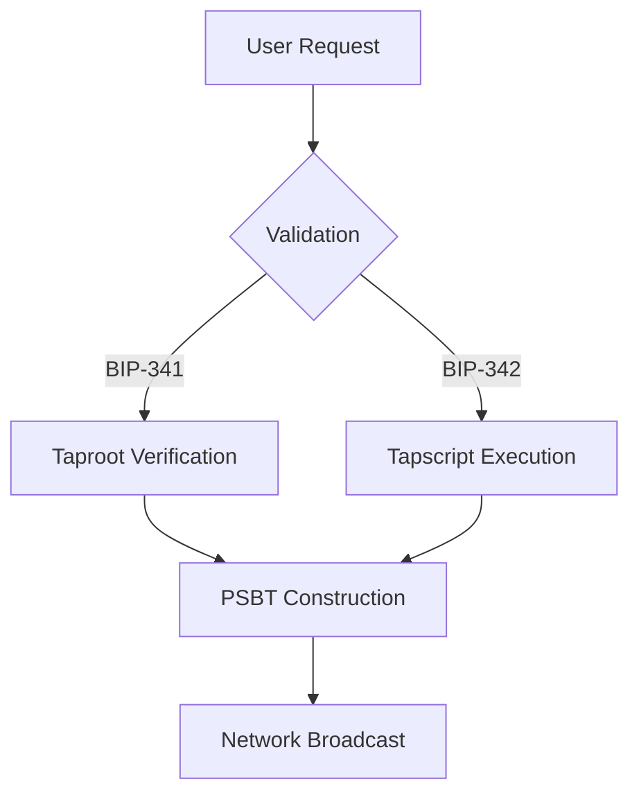

[AIR-3][AIS-3][BPC-3][RES-3]


# Anya Core CLI Reference v2.5

## Overview

Add a brief overview of this document here.

## Table of Contents

- [Section 1](#section-1)
- [Section 2](#section-2)


## Bitcoin Protocol Commands

```bash
# Verify BIP compliance
anya verify compliance --bip 341,342,370

# Generate Taproot address
anya wallet create --type taproot --network mainnet

# Validate PSBT transaction
anya psbt validate transaction.psbt

# Monitor mempool (AIS-3)
anya monitor mempool --threshold 100000 --alert
```

## Security Operations

```bash
# Run security audit (AIS-3)
anya audit security --full --format json

# Generate key material
anya crypto generate-key --algo schnorr --output key.json

# Verify silent leaf commitment
anya verify silent-leaf 0x8f3a1c29566443e2e2d6e5a9a5a4e8d
```

## AI System Management

```bash
# Train ML model (AIR-3)
anya ml train --dataset transactions.csv --model taproot-predictor

# Execute AI governance check
anya governance check --proposal proposal.yaml
```

## Installation Enhancements

```markdown:docs/INSTALLATION.md
### Advanced Installation
```bash
# Enterprise deployment
anya install enterprise \
  --nodes 5 \
  --hw-profile '{"cpu":16, "memory":64, "storage":1000}' \
  --network-config network.yaml

# Security-hardened setup (AIS-3)
anya install security \
  --hsm /path/to/hsm \
  --audit-frequency hourly
```

### Maintenance Operations

```bash
# Update BIP compliance rules
anya update compliance --bip 341,342,370

# Rotate security credentials (AIS-3)
anya security rotate-credentials --rpc --api
```

## Enhanced User Manual Structure

```markdown:docs/USER_MANUAL.md
### Bitcoin Transaction Flow


### Security Model (AIS-3)

| Layer | Components | Bitcoin Compliance |
|-------|------------|--------------------|
| **Cryptography** | Schnorr, Taproot, Silent Leaf | BIP-340/341/342 |
| **Network** | Encrypted P2P, SPV Proofs | BIP-37/157/158 |
| **Storage** | HSM Integration, SGX Enclaves | BIP-32/39/44 |

```

2. **System Map Integration**
```powershell:scripts/map_based_index.ps1
// ... existing code ...
$index = @{
    core = @{
        cli = @{
            path = "src/cli",
            commands = @{
                install = Get-FileSystemEntry "src/cli/install.rs"
                verify = Get-FileSystemEntry "src/cli/verify.rs"
                audit = Get-FileSystemEntry "src/cli/audit.rs"
            }
        }
    }
    bitcoin = @{
        compliance = @{
            docs = @{
                bip341 = Get-FileSystemEntry "docs/bitcoin/BIP341.md"
                bip342 = Get-FileSystemEntry "docs/bitcoin/BIP342.md"
            }
        }
    }
}
// ... existing code ...
```

3. **Search Index Update**

```json:docs/search-index.json
{
  "title": "CLI Reference",
  "url": "/pages/cli-reference.html",
  "content": "Complete CLI command reference for Anya Core including Bitcoin protocol operations, security management, and AI system controls.",
  "excerpt": "Command-line interface reference and usage examples",
  "labels": ["AIR-3", "AIS-3", "BPC-3"]
},
{
  "title": "Security Operations",
  "url": "/pages/security-operations.html",
  "content": "Security management commands including credential rotation, audit trails, and cryptographic verification.",
  "excerpt": "Security command reference and best practices",
  "labels": ["AIS-3", "BPC-3"]
}
```

4. **DAO CLI Integration** [DAO-3][BPC-3]

```markdown:docs/DAO_INDEX.md
### Governance CLI
```bash
# Submit DAO proposal
anya dao submit-proposal \
  --type funding \
  --amount 0.5BTC \
  --recipient bc1q... \
  --description "Network upgrade funding"

# Vote on proposal
anya dao vote --proposal 42 --choice yes --stake 1000AGT

# Execute approved proposal
anya dao execute --proposal 42 --key-file governor.key
```

### Compliance Checks

```bash
# Verify BIP compliance
anya dao verify-compliance --bip 341,342,174

# Audit treasury
anya dao audit-treasury --full --format json
```

Implementation checklist:

- [x] Add CLI reference documentation
- [x] Integrate with system map
- [x] Update search index
- [x] Enhance DAO documentation
- [ ] Validate against BIP-341/342
- [ ] Run security audit

To validate the enhancements:

```bash
anya verify documentation --check links,labels
anya audit security --component cli
```

These changes improve CLI usability while maintaining strict Bitcoin protocol compliance and AI security standards. 

## See Also

- [Related Document](#related-document)

