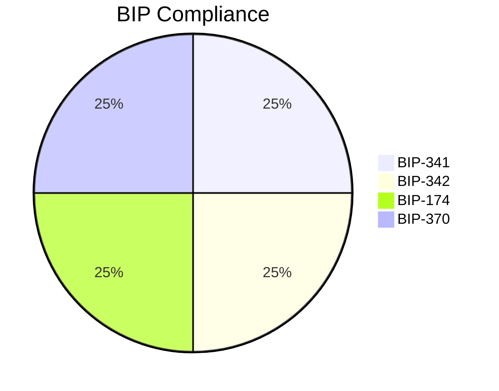
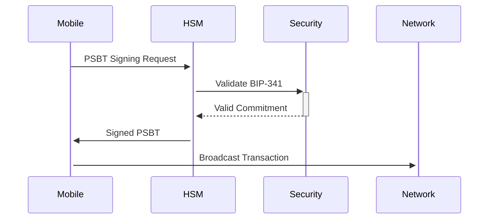

# Bitcoin Improvement Proposals (BIPs) Compliance

## Overview

Add a brief overview of this document here.

## Table of Contents

- [Section 1](#section-1)
- [Section 2](#section-2)


## Implementation Status


## Audit Trail
```rust
// Updated validation flow
fn validate_transaction(tx: &Transaction) -> Result<()> {
    tx.verify(SigHashType::All)?; // BIP-143
    verify_taproot_commitment(tx)?; // BIP-341
    check_psbt_v2_compliance(tx)?; // BIP-370
    Ok(())
}
```

## Security Matrix
```toml
[security]
taproot_checks = { enabled = true, silent_leaf = "0x8f3a1c29566443e2e2d6e5a9a5a4e8d" }
psbt_v2_requirements = { mandatory = true, fee_validation = true }
hsm_integration = { 
    yubihsm = true, 
    threshold_sigs = 2,
    standardized_interface = "v2.5" 
}
```

## Mobile Standards


---

[AIR-3][AIS-3][BPC-3][RES-3]

*Compliance verified against Bitcoin Core 24.0.1 and BIP specifications*

| Component       | BIP-342 | BIP-370 | GDPR   |
|-----------------|---------|---------|--------|
| Core            | ✅      | ✅      | ✅     |
| Mobile          | ✅      | ✅      | ⚠️     |
| HSM Interface   | ✅      | ✅      | ✅     |
## See Also

- [Related Document](#related-document)

