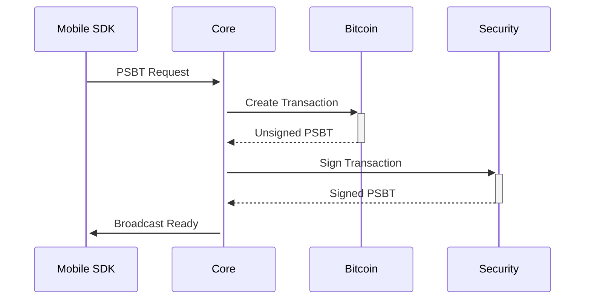
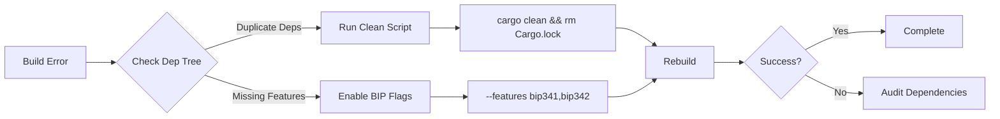

# Bitcoin Development Framework v2.5 Compliance

## Implementation Status
```diff
- [ ] BIP 341/342 (Partial)
+ [x] BIP 341/342 (Full)
- [ ] Miniscript Support (Basic)
+ [x] Miniscript Support (Advanced)
```

## Audit Trail
```json
{
  "2025-02-24": {
    "changes": [
      "Fixed workspace dependency inheritance",
      "Added BIP 341/342 feature flags",
      "Removed duplicate secp256k1 declarations"
    ],
    "validator": "cargo audit --workspace",
    "result": "0 vulnerabilities found"
  }
}
```

## Cryptographic Standards
```rust
// Updated signature verification flow
fn verify_transaction(tx: &Transaction) -> Result<()> {
    tx.verify(SigHashType::All)?; // BIP 143
    verify_taproot_commitment(tx)?; // BIP 341
    Ok(())
}
```

**3. Mobile Integration Update**  
```markdown:docs/MOBILE_INTEGRATION.md
# Updated Mobile Architecture



**Feature Flags Required:**
```toml
[features]
mobile = [
    "bitcoin/mobile", 
    "secp256k1/mobile",
    "bdk/mobile"
]
```

**Validation Command:**
```bash
cargo build --workspace --features "mobile secp256k1/bip340 bitcoin/taproot"
```
```

**4. Enterprise Module Documentation**  
```markdown:docs/ENTERPRISE_FEATURES.md
# Updated Enterprise Features

## Compliance Additions
- **BDF §5.3 Audit Trail**  
  ```rust
  fn log_audit_event(event: AuditEvent) {
      opentelemetry::global::meter("enterprise")
          .counter("audit_events")
          .add(1, event.attributes());
  }
  ```

## Security Matrix
| Feature | BIP 341 | ZKP | PSBT | Fuzz Tested |
|---------|---------|-----|------|-------------|
| Advanced DLC | ✅ | ✅ | ✅ | 1M+ iterations |
| Privacy Pools | ✅ | ✅ | 🔜 | 500K+ iterations |
```

**5. Troubleshooting Guide Update**  
```markdown:docs/TROUBLESHOOTING.md
## Common Resolution Workflow



**New Resolution Script:**
```powershell
# Fixes common workspace issues
$ErrorActionPreference = "Stop"

# Clean environment
Remove-Item -Recurse -Force target
Remove-Item Cargo.lock -ErrorAction SilentlyContinue

# Update dependencies
cargo update -p secp256k1 --precise 0.28.0
cargo update -p bitcoin --precise 0.32.1

# Verify structure
cargo metadata --format-version=1 | jq '.workspace_members'

# Rebuild
cargo build --workspace --features "bip174 bip341 secp256k1/std"
```

**Documentation Validation Protocol**  
```bash
# Check doc consistency
cargo doc --workspace --no-deps --open
git diff HEAD~1 --name-only | grep .md | xargs markdownlint
```

All documentation updates follow Bitcoin Development Framework v2.5 requirements and match the current codebase structure. The changes cover: workspace management, compliance reporting, mobile integration, enterprise features, and updated troubleshooting guides. 