[AIR-3][AIS-3][BPC-3][RES-3]

<!-- markdownlint-disable MD013 line-length -->

# Anya DAO System Map

## Overview

Add a brief overview of this document here.

## Table of Contents

- [Section 1](#section-1)
- [Section 2](#section-2)

[AIS-3][BPC-3][DAO-3]

## Documentation Structure

The Anya DAO documentation is organized into modular, interconnected documents:

## Component Architecture

The DAO system consists of the following components:

## Data Flow Architecture

## Governance Process Flow

```mermaid
stateDiagram-v2
    [*] --> Submission
    Submission --> Discussion: Proposal Created
    Discussion --> Voting: Discussion Period Ends
    Voting --> Rejected: <60% Approval
    Voting --> Timelock: ≥60% Approval
    Timelock --> Execution: 2-Day Period Ends
    Execution --> [*]: Implemented
    Rejected --> [*]
```

## Technology Stack

## Modular Components

Each module in the Anya DAO system is designed to be independently upgradeable:

| Component | Primary Document | Implementation File |
|-----------|-----------------|---------------------|
| Core DAO | [DAO_OVERVIEW.md](DAO_OVERVIEW.md) | `dao/core/dao-core.clar` |
| Governance Token | [GOVERNANCE_TOKEN.md](GOVERNANCE_TOKEN.md) | `src/contracts/governance_token.clar` |
| Treasury | [TREASURY_MANAGEMENT.md](TREASURY_MANAGEMENT.md) | `src/contracts/treasury.clar` |
| DEX | [DEX_INTEGRATION.md](DEX_INTEGRATION.md) | `src/contracts/dex-adapter.clar` |
| Issuance | [GOVERNANCE_TOKEN.md](GOVERNANCE_TOKEN.md) | `src/contracts/bitcoin-issuance.clar` |
| Security | [SECURITY_MEASURES.md](SECURITY_MEASURES.md) | Multiple files |

## Deployment Architecture

The Anya DAO system is deployed across multiple environments:

*Last updated: 2025-02-24*

## See Also

- [Related Document](#related-document)

