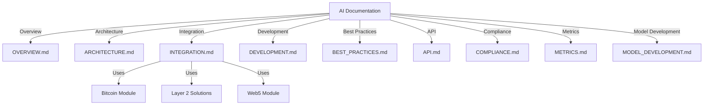
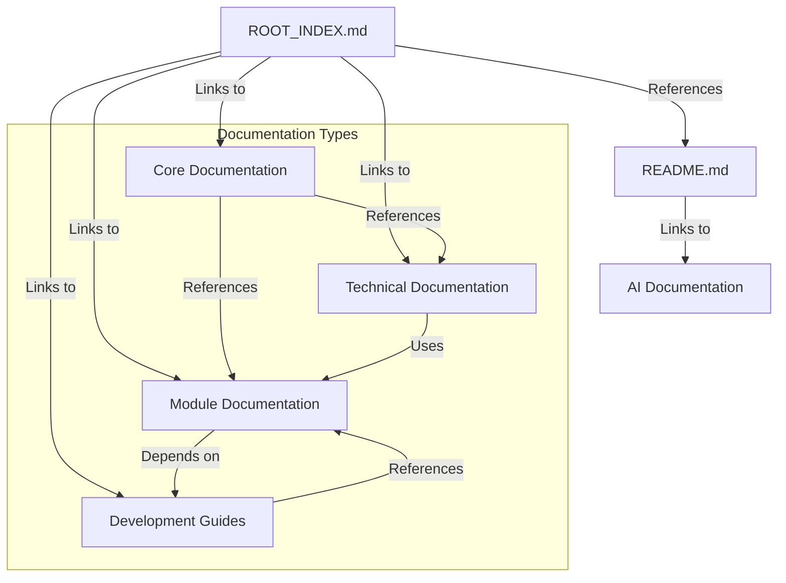

# Anya Core Documentation Map

This document provides a comprehensive map of all documentation in the Anya Core project, showing relationships between different components and identifying areas for improvement.

## Documentation Structure Overview

### Core Documentation

- `README.md` - Main project overview
- `ROOT_INDEX.md` - Master index of all documentation
- `INDEX.md` - Documentation index
- `CHANGELOG.md` - Version history
- `ROADMAP.md` - Future development plans
- `CONTRIBUTING.md` - Contribution guidelines
- `CODE_OF_CONDUCT.md` - Community standards
- `SECURITY.md` - Security policies
- `GOVERNANCE.md` - Project governance

### Technical Documentation

- `AGENT_ARCHITECTURE.md` - Agent system architecture
- `DEPLOYMENT.md` - Deployment procedures
- `TESTING.md` - Testing guidelines
- `MAINTENANCE.md` - Maintenance procedures
- `SYSTEM_MAP.md` - System component relationships

### Module Documentation

- `bitcoin/` - Bitcoin integration
- `dao/` - Decentralized Autonomous Organization
- `identity/` - Identity management
- `layer2/` - Layer 2 solutions
- `ai/` - AI/ML components and integration
  - `OVERVIEW.md` - High-level introduction to AI capabilities
  - `ARCHITECTURE.md` - Technical architecture and design decisions
  - `INTEGRATION.md` - Integration with other components
  - `DEVELOPMENT.md` - Development guide for AI components
  - `BEST_PRACTICES.md` - Guidelines for AI development
  - `API.md` - API reference
  - `COMPLIANCE.md` - Compliance and regulatory information
  - `METRICS.md` - Performance and monitoring metrics
  - `MODEL_DEVELOPMENT.md` - Guide for model development
- `ml/` - Machine learning (legacy, see `ai/`)
- `security/` - Security components
- `web5/` - Web5 integration
- `nostr/` - Nostr protocol

### Development Guides

- `development/` - Development setup
- `guides/` - How-to guides
- `tutorials/` - Step-by-step tutorials
- `api/` - API references
- `reference/` - Technical references

## AI Documentation Structure



## Documentation Relationships



## Documentation Health Check

### Well-Documented Areas

- Core project documentation
- Basic module structure
- Security guidelines
- Contribution processes

### Areas Needing Improvement

1. **Cross-References**
   - Many documents exist in isolation
   - Need better linking between related topics
   - Missing "See Also" sections

2. **Module Documentation**
   - Inconsistent depth across modules
   - Some modules lack detailed guides
   - Missing practical examples

3. **Tutorials and Guides**
   - Need more step-by-step tutorials
   - Real-world use cases needed
   - Integration examples required

## Documentation Structure

### AI/ML Documentation

The AI/ML documentation has been reorganized into a dedicated directory with the following structure:

```
docs/ai/
├── README.md          # Main entry point
├── OVERVIEW.md        # System overview
├── ARCHITECTURE.md    # Technical architecture
├── INTEGRATION.md     # Integration guide
├── METRICS.md        # Performance metrics
├── COMPLIANCE.md     # Compliance requirements
└── DEVELOPMENT.md    # Development guide
```

### Improvement Plan

#### Phase 1: Documentation Audit (Completed)

1. Reviewed all markdown files for accuracy
2. Identified and removed deprecated files
3. Consolidated AI/ML documentation
4. Created cross-references between documents

#### Phase 2: Structure Enhancement (In Progress)

1. Standardize document structure
2. Add consistent front matter
3. Improve navigation
4. Add breadcrumbs

### Phase 2: Structure Enhancement

1. Standardize document structure
2. Add consistent front matter
3. Improve navigation
4. Add breadcrumbs

### Phase 3: Content Enhancement

1. Add missing documentation
2. Expand on complex topics
3. Add more examples
4. Include diagrams and visual aids

### Phase 4: Quality Assurance

1. Peer review process
2. Link checking
3. Format validation
4. Version control

## Next Steps

1. Create a documentation style guide
2. Set up automated documentation testing
3. Implement documentation versioning
4. Schedule regular documentation reviews

## Maintenance

- Update this map when adding new documentation
- Review documentation structure quarterly
- Remove deprecated content
- Keep cross-references up to date
