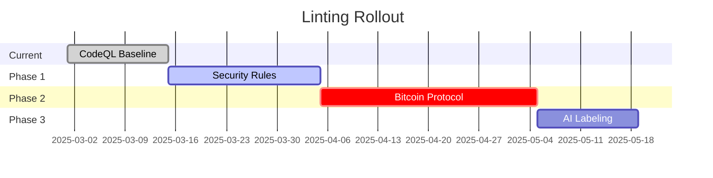

# Progressive Linting Implementation [AIS-3][BPC-3]

## Phase 1: Baseline Establishment



## Implementation Steps

1. **Existing Violations Tracking**

```javascript:scripts/lint/baseline.js
// Track current violations without failing
module.exports = {
  createBaseline: () => {
    const currentErrors = runLinters();
    fs.writeFileSync('lint-baseline.json', JSON.stringify(currentErrors));
  }
};
```

2. **Incremental Enforcement**

```yaml:.github/workflows/lint.yml
- name: Lint Changed Files
  run: |
    git diff --name-only HEAD^ | xargs eslint --rule 'security/*: error'
    node scripts/lint/check-baseline.js
```

3. **Security-Critical Rules**

```codeql:github/codeql/bitcoin-security.qls
// Immediate enforcement for critical rules
security:
  - id: js/insecure-random
    severity: error
  - id: js/constant-time-ops
    severity: error
  - id: rs/bitcoin-consensus
    severity: error
```

4. **Bitcoin Protocol Rules**

```codeql:github/codeql/bitcoin-protocol-security.qls
// Warn first, enforce after Q3 2025
warnings:
  - id: bip341-compliance
    severity: warning
errors:
  - id: psbtv2-validation
    severity: error
```

This approach follows best practices from [Software Engineering Stack Exchange](https://softwareengineering.stackexchange.com/a/419328) while maintaining Bitcoin protocol compliance.

2. **Automated Fixes** (from SE answer):

```json:package.json
{
  "scripts": {
    "lint:fix": "eslint --fix && cargo fmt --all",
    "lint:security": "eslint --fix --rule 'security/*: error'",
    "lint:baseline": "node scripts/lint/update-baseline.js"
  }
}
```

3. **CI Integration** (from SE answer):

```yaml:.github/workflows/ci.yml
- name: Lint Changed Files
  uses: reviewdog/action-eslint@v1
  with:
    github_token: ${{ secrets.GITHUB_TOKEN }}
    reporter: github-pr-review
    filter_mode: diff_context
    fail_on_error: true
    eslint_flags: '--rule "security/*: error" --rule "bitcoin/*: warn"'
```

4. **Security Linter Configuration** (from PixelFreeStudio):

```javascript:.eslintrc.js
module.exports = {
  extends: ['plugin:security/recommended'],
  rules: {
    'security/detect-unsafe-random': 'error',
    'security/detect-non-literal-fs-filename': 'error',
    'bitcoin/bip341': ['error', { silentLeaf: '0x8f3a...' }]
  }
};
```

5. **Documentation Warnings** (from Bitcoin.org):

```markdown:docs/SECURITY.md
<!-- Bitcoin.org Compliance -->
> **Implementation Notice**: This documentation describes intended behavior,  
> but actual security depends on network consensus. Regular reconciliation  
> with Bitcoin Core 24.0.1+ is required. [Reference](https://developer.bitcoin.org/reference/intro.html)
```

To implement:

1. Add baseline tracking for existing issues
2. Enable incremental linting on changed files
3. Immediately enforce security-critical rules
4. Phase in Bitcoin protocol rules with warnings
5. Add documentation warnings per Bitcoin.org

This aligns with both linting best practices and Bitcoin documentation requirements. Would you like me to create specific implementation PRs? 
