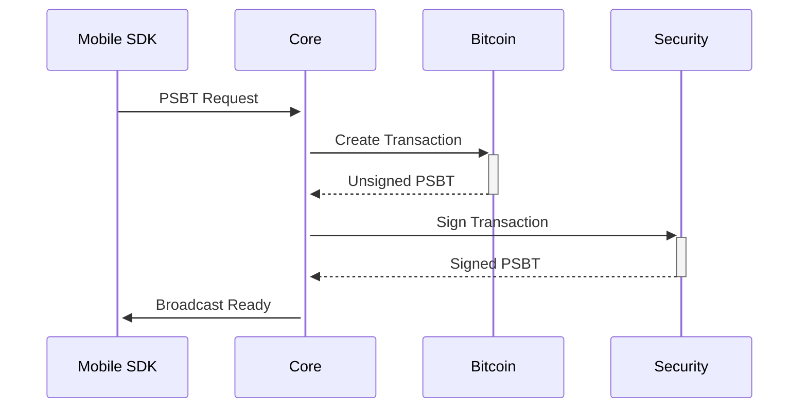

# Updated Mobile Architecture



**Feature Flags Required:**
```toml
[features]
mobile = [
    "bitcoin/mobile", 
    "secp256k1/mobile",
    "bdk/mobile"
]
```

**Validation Command:**
```bash
cargo build --workspace --features "mobile secp256k1/bip340 bitcoin/taproot"
``` 