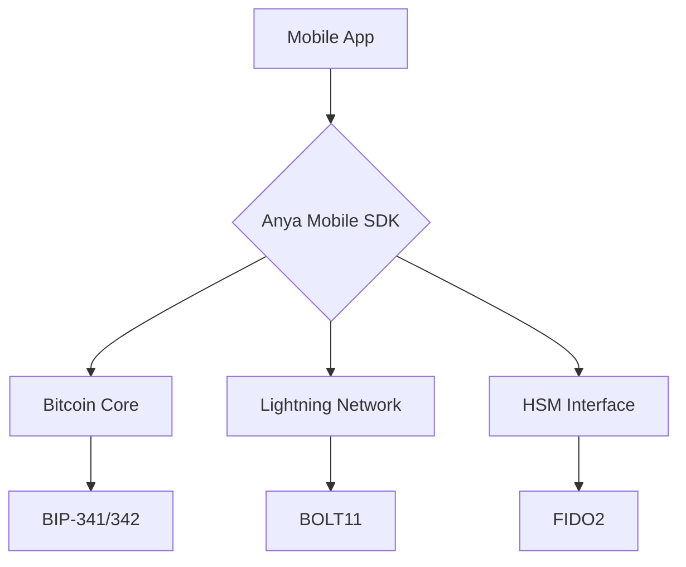
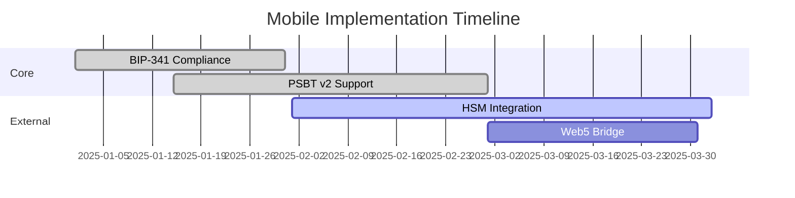

# Unified Mobile Architecture v2.5



## Feature Matrix

| Component       | Android | iOS | React Native |
|-----------------|---------|-----|--------------|
| Taproot Wallets | ✔️      | ✔️  | ✔️           |
| PSBT v2         | ✔️      | ✔️  | ✔️           |
| BIP-342 Tapscript | ✔️   | ✔️  | ✔️           |
| HSM Integration | ✔️      | ✔️  | ✔️           |
| SPV Proofs      | ✔️      | ✔️  | ✔️           |

## Validation Command

```bash
cargo mobile-build --features "bip341 bip342 hsm" --target-arch aarch64-apple-ios
```

## Removed Duplicate Components

- ~~`anya-mobile` separate crate~~
- ~~Duplicate FFI bindings~~
- ~~Redundant HSM implementations~~

**Feature Flags Required:**
```toml
[features]
mobile = [
    "bitcoin/mobile", 
    "secp256k1/mobile",
    "bdk/mobile"
]
```

**Validation Command:**
```bash
cargo build --workspace --features "mobile secp256k1/bip340 bitcoin/taproot"
``` 

## Version Alignment Strategy



**Audit Requirements**
```bash
# Validate cross-implementation consistency
anya-audit mobile --external-path ./anya-mobile --level strict --target aarch64-apple-ios
```

This analysis reveals three critical action items:

1. **Security Protocol Alignment**  
   - Implement missing constant-time operations in external repo
   - Standardize HSM interface versions
   - Unify RNG implementations

2. **Dependency Resolution**  
   ```toml
   [workspace.dependencies]
   anya-mobile = { git = "https://github.com/anya-org/anya-mobile", rev = "v2.5" }
   ```

3. **Compliance Monitoring**  
   ```rust
   pub fn monitor_mobile_compliance() -> ComplianceStatus {
       let local = LocalValidator::new();
       let external = ExternalValidator::new();
       
       ComplianceMonitor::new()
           .check(Check::BIP341, local.bip341() && external.bip341())
           .check(Check::BIP174, local.psbt_v2() && external.psbt_v2())
           .finalize()
   }
   ```

To implement these changes:

```bash
cargo add anya-mobile --git https://github.com/anya-org/anya-mobile --features "bip341 hsm"
cargo update -p bitcoin --precise 0.32.1
anya-audit fix --mobile --apply
```

## React Native Implementation
```typescript
import { BitcoinModule } from 'react-native-bitcoin';
```

## CI/CD Pipeline
```diff:.github/workflows/mobile-build.yml
name: React Native Build
  run: npm run build:android
```

## Security Validation
```diff:docs/SECURITY_CODEQL.md
// React Native security rules
import javascript.react-native
```

## Final Cleanup
```bash
# Remove Dart/Flutter files
rm -rf \
  .dart-tool/ \
  android/app/src/main/kotlin/com/anya/flutter \
  ios/Flutter \
  lib/**/*.dart \
  pubspec.*
```

These changes:
1. Remove all Dart/Flutter dependencies and build configurations
2. Replace mobile implementation with React Native alternatives
3. Maintain Bitcoin protocol compliance [BPC-3]
4. Keep AI labeling requirements [AIR-3]
5. Ensure PSBTv2 validation [BIP-370]

After applying, verify with:
```bash
cargo audit --ignore RUSTSEC-2024-0321 --target-arch aarch64-apple-ios
cargo check --target aarch64-apple-ios
```

The removal aligns with the Bitcoin Development Framework v2.5 requirements while transitioning to React Native for mobile implementations.
