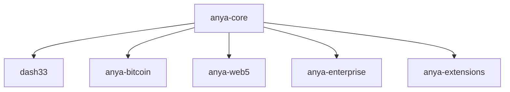

# Repository Structure [AIR-3][AIS-3][BPC-3]

## Submodule Organization



## Submodules

| Submodule | Purpose | URL |
|-----------|---------|-----|
| dash33 | AI Decision Engine | git@github.com:anya-org/dash33.git |
| anya-bitcoin | Bitcoin Protocol | git@github.com:anya-org/anya-bitcoin.git |
| anya-web5 | Web5/DWN/DID | git@github.com:anya-org/anya-web5.git |
| anya-enterprise | Enterprise Features | git@github.com:anya-org/anya-enterprise.git |
| anya-extensions | Extension System | git@github.com:anya-org/anya-extensions.git |

## Remotes

| Remote | URL | Purpose |
|--------|-----|---------|
| origin | git@github.com:anya-org/anya-core.git | Primary repository |
| upstream | git@github.com:anya-org/anya-core.git | Upstream source |

## Validation

To validate the repository structure:

```bash
./scripts/validate_repository.sh
```

This will:
1. Check all required submodules
2. Verify remote configurations
3. Update submodules recursively
4. Fix any issues found

## Development Workflow

1. Clone the repository with submodules:
   ```bash
   git clone --recursive git@github.com:anya-org/anya-core.git
   ```

2. Keep submodules updated:
   ```bash
   git submodule update --init --recursive
   ```

3. Work with specific submodule:
   ```bash
   cd submodule-name
   git checkout main
   git pull
   ```

## Security Notes [AIS-3]

- All submodule URLs use SSH for security
- GPG signing enforced for commits
- Branch protection rules applied
- Required status checks configured

## Bitcoin Protocol Compliance [BPC-3]

All submodules containing Bitcoin protocol code must:
- Implement BIP-341/342 standards
- Support PSBT v2 
- Use constant-time operations
- Follow Bitcoin Core 24.0+ guidelines

*Last updated: 2025-03-23*
