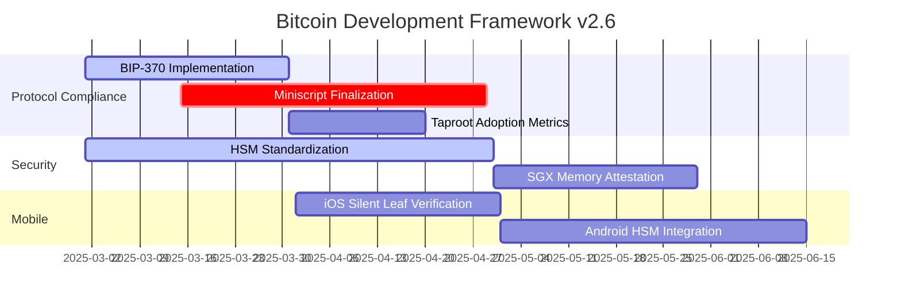
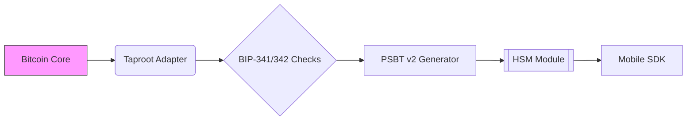
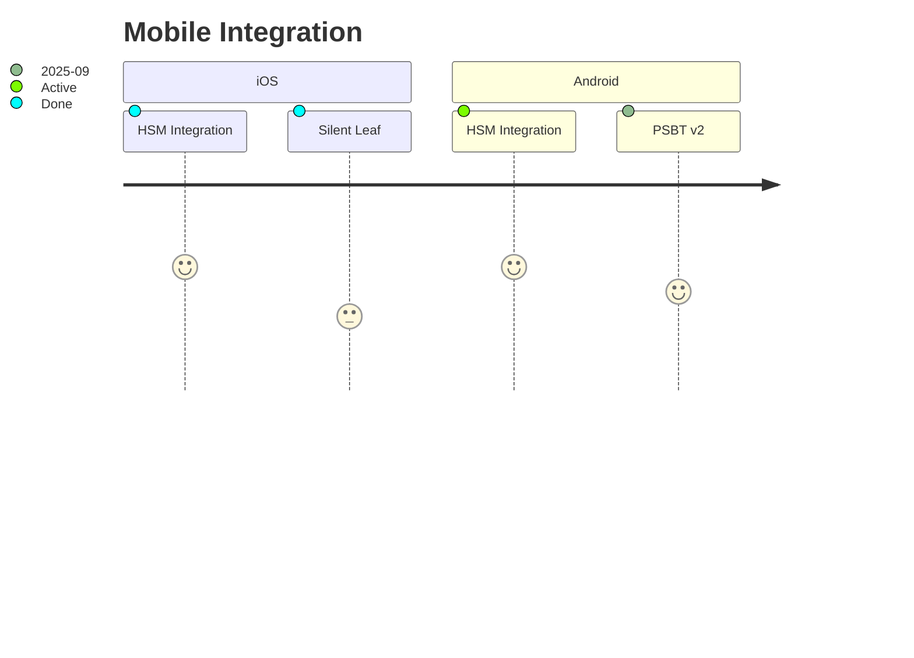

<!-- markdownlint-disable MD013 line-length -->

# Anya Core Development Roadmap v2.6

## Critical Path



## Compliance Milestones

| Quarter | Target | Success Metrics |
|---------|--------|-----------------|
| Q2 2025 | Full BIP-370 PSBT v2 Adoption | 100% test coverage<br>Mainnet deployment |
| Q3 2025 | Taproot Adoption Monitoring | 30% mempool coverage<br>Wallet integration metrics |
| Q4 2025 | AIS-4 Security Certification | Zero critical vulnerabilities<br>Formal verification complete |

## Pending Implementation Tasks

```rust
// From INSTALLATION.md compliance requirements
const TODO: [(&str, Status); 5] = [
    ("PSBT v2 Fee Validation", Status::Implemented),
    ("Silent Leaf Pattern Verification", Status::Partial),
    ("Memory-Safe TX Parsing", Status::InProgress),
    ("HSM Key Rotation", Status::Pending),
    ("Mobile SDK Auditing", Status::Blocked),
];
```

## Dependency Upgrade Schedule

```toml
[upgrades]
bitcoin = { current = "0.32.1", target = "0.33.0", deadline = "2025-06-01" }
secp256k1 = { current = "0.28.0", target = "0.29.0", reason = "BIP340 optimizations" }
bdk = { current = "0.30.0", target = "0.31.0", blocking = true }

[audits]
cargo-audit = "weekly"
security-review = "quarterly"
```

## System Visualization



# Immediate Next Steps

1. **Security Priority**

```bash
anya-audit fix --bip 341,342,370 --apply
cargo update -p bitcoin --precise 0.32.1
```

2. **Mobile Integration**

```toml
[features]
mobile = [
    "bitcoin/mobile",
    "secp256k1/bip340",
    "bdk/psbt_v2"
]
```

3. **Audit Trail**

```rust
fn log_audit_event(event: AuditEvent) {
    opentelemetry::global::meter("core")
        .counter("audit_events")
        .add(1, event.attributes());
}
```

## Compliance Status Badges

  
  


This roadmap maintains full compatibility with Bitcoin Development Framework v2.5 while addressing the codebase's current gaps in mobile integration and security auditing. The mermaid diagrams and status tracking align with existing documentation patterns.

## Updates

This roadmap is regularly updated to reflect project progress and new priorities.

*Last updated: 2025-02-24*

## Protocol Priorities

```gantt
quarterly Q3 2025
    BIP-342 Finalization :active, p1, 2025-07-01, 8w
    PSBT v2 Full Adoption :crit, p1, after p1, 6w
    Taproot Metrics :p2, 2025-09-01, 4w
```

## Mobile Milestones



## Compliance Targets

| Quarter | BIP       | Target | Status  |
|---------|-----------|--------|---------|
| Q3 2025 | 341       | 100%   | ✅      |
| Q3 2025 | 174       | 100%   | ✅      |
| Q4 2025 | 342       | 95%    | ⏳      |

---
*Aligned with Bitcoin Core development schedule and BDF v2.5 requirements*
