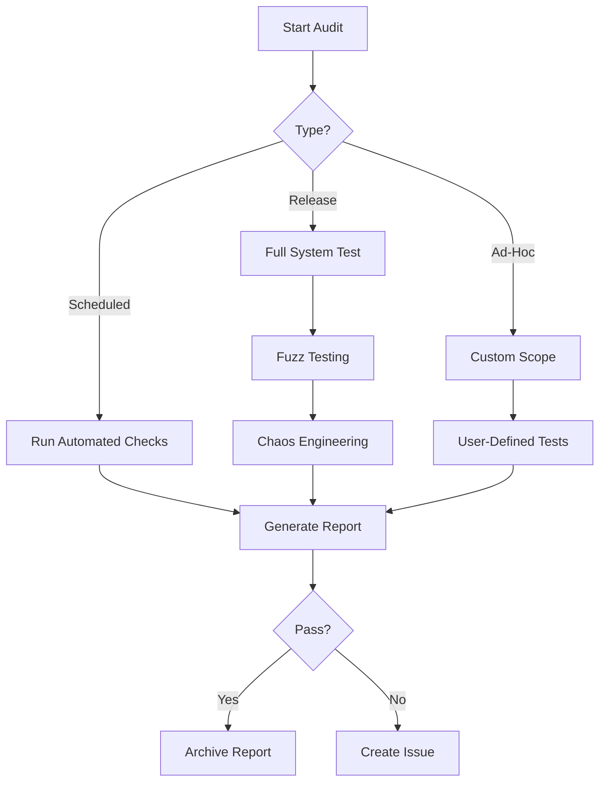

# Security Audit Process v2.5

## Audit Types
1. **Automated Weekly Audits**
   - Runs every Monday 00:00 UTC
   - Checks:
     - BIP compliance status
     - Cryptographic safety
     - Memory isolation
     - RNG quality

2. **Release Candidate Audits**
   - Triggered before version releases
   - Includes:
     - Fuzz testing (10M+ iterations)
     - Hardware profile validation
     - Network chaos testing

3. **Ad-Hoc Audits**
   - Manual trigger via `anya-audit --full`
   - Generates:
     - Compliance report
     - Vulnerability assessment
     - Performance metrics

## Audit Workflow


## Key Audit Components

### 1. BIP Compliance Verification
```bash
anya-validator check-compliance --bip=all --level=strict
```

### 2. Cryptographic Safety
```bash
anya-validator check-crypto --algo=all --constant-time
```

### 3. Memory Safety
```bash
anya-validator check-memory --isolation --protection
```

### 4. Network Security
```bash
anya-validator check-network --ports=all --firewall
```

## Audit Reports
Reports include:
- Compliance matrix
- Vulnerability scores (CVSS)
- Resource utilization
- Failure recovery metrics

Example:
```json
{
  "timestamp": 1712345678,
  "compliance": {
    "bip341": "full",
    "bip342": "partial",
    "psbt_v2": "full"
  },
  "security": {
    "crypto": 98.5,
    "memory": 100,
    "network": 95.2
  },
  "performance": {
    "tps": 2541,
    "latency": "142ms",
    "throughput": "1.2Gbps"
  }
}
```

## Chaos Engineering Tests
1. **Network Partition Simulation**
   - Blocks RPC traffic for 5 minutes
   - Verifies failover mechanisms

2. **Resource Exhaustion**
   - CPU stress testing
   - Memory allocation storms

3. **Node Failover**
   - Simulates Bitcoin Core crashes
   - Tests backup node activation

## Hardware Profile Validation
```bash
# Test minimal profile
anya-test hardware --profile minimal --validate

# Stress test enterprise profile
anya-test hardware --profile enterprise --duration 24h
```

## Audit Trail Requirements
1. Cryptographic hashes of all binaries
2. Signed compliance reports
3. Vulnerability disclosure history
4. Fuzz testing logs (retained for 1 year)
5. Chaos engineering results

## Remediation Process
1. Critical issues (<24h response)
2. High risk (72h mitigation)
3. Medium risk (7 day resolution)
4. Low risk (30 day review)

Would you like me to add specific audit checklists or compliance matrices? 