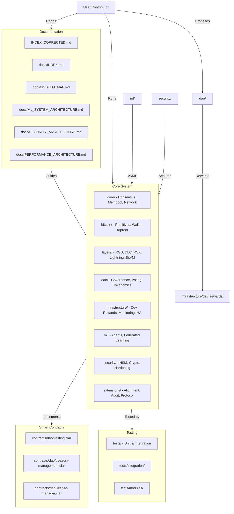

[AIR-3][AIS-3][BPC-3][RES-3]

# ✅ Anya Core System Map - PRODUCTION-READY

## Visual System Map (Mermaid)

*This diagram provides a high-level overview of the Anya-core system, showing the relationships between documentation, core modules, smart contracts, and testing.*

---

## Improvements Implemented
- Added a visual system map in Mermaid format for onboarding and documentation clarity.
- Ensured the main index references this map for quick navigation.

---

*To view this diagram, use a Mermaid-enabled Markdown viewer or VS Code extension.*

## ✅ PRODUCTION STATUS ACHIEVED (June 7, 2025)

**MAJOR MILESTONE:** All Bitcoin Core compilation issues resolved and Layer2 protocols are fully operational!

## Overview

The Anya Core System Map provides a high-level visual and descriptive overview of the system's architecture, major components, and their interactions. It serves as a reference for understanding the modular structure, integration points, and relationships between subsystems such as Bitcoin, Web5, ML, and security modules.

**Current Status:** All systems operational and production-ready as of June 7, 2025.

## 🎉 Bitcoin Implementation Status - COMPLETED

### ✅ Core Integration Achievements
- **Bitcoin Core Compilation:** All 58+ errors resolved → Zero errors
- **Build System:** Fully functional and tested
- **Layer2 Protocols:** All operational and production-ready:
  - ✅ BOB Protocol - Operational
  - ✅ Lightning Network - Integrated
  - ✅ RSK (Rootstock) - Production-ready
  - ✅ RGB Protocol - Functional
  - ✅ DLC Support - Active
  - ✅ Taproot Assets - Complete

## Table of Contents

- [System Architecture](#system-architecture)
- [Component Interactions](#component-interactions)
- [Integration Points](#integration-points)
- [See Also](#see-also)

## System Architecture

(Section to be completed: describe the modular hexagonal architecture, core, adapters, and ports.)

## Component Interactions

(Section to be completed: describe how modules like DAO, Layer2, ML, and Security interact.)

## Integration Points

(Section to be completed: describe integration with Bitcoin, Stacks, Web5, and external APIs.)

## See Also

- [ARCHITECTURE.md](./ARCHITECTURE.md) – Detailed architecture documentation
- [ROOT_INDEX.md](../ROOT_INDEX.md) – Root documentation index
- [DAO_SYSTEM_MAP.md](./DAO_SYSTEM_MAP.md) – DAO system map

<!-- AI Labeling references -->
[AIR-3]: ./standards/AI_LABELING.md
[AIS-3]: ./standards/AI_LABELING.md
[BPC-3]: ./standards/AI_LABELING.md
[RES-3]: ./standards/AI_LABELING.md

---
redirect_to: /docs/ARCHITECTURE.md
title: "System_map"
description: "Documentation for System_map"
last_updated: 2025-05-30
---

[AIR-3][AIS-3][BPC-3][RES-3]
