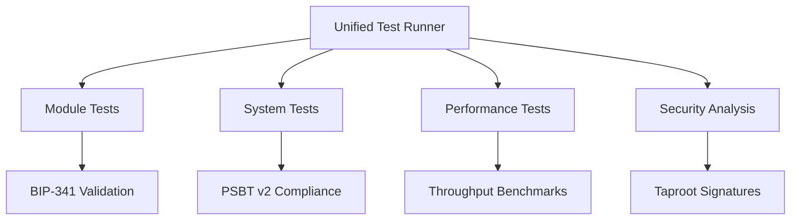

# Unified Testing Framework v2.5

## Architecture


## Test Execution
```powershell
# Full compliance test
.\scripts\run-unified-tests.ps1 -TestType all -TestLevel compliance

# Security-focused test
.\scripts\run-unified-tests.ps1 -TestType security -TestLevel strict
```

## Compliance Requirements
1. All tests must validate BIP-341 signatures
2. PSBT operations require v2 compliance
3. Security tests must use Taproot commitments
4. Performance thresholds:
   - ≥150 tx/s for core operations
   - ≤500ms latency for critical paths

## Report Structure
```json
{
    "metadata": {
        "bipCompliance": ["bip-341", "bip-342", "bip-174"],
        "testFrameworkVersion": "2.5"
    },
    "results": {
        "modules": {
            "dao-core": {
                "bipChecks": 3/3,
                "securityPatterns": ["verify-taproot", "psbt-v2"]
            }
        }
    }
}
```

## Test Configuration
```json
{
    "modules": [
        {
            "name": "dao-core",
            "path": "dao/core/dao-core.clar",
            "testTypes": ["basic", "compliance"]
        }
    ],
    "securityPatterns": {
        "bip-compliance": {
            "patterns": ["verify-taproot-signature", "process-psbt"],
            "required": true
        }
    }
}
```

## Running Tests
```powershell
# Generate test templates
.\scripts\create-test-templates.ps1 -Module dao-core

# Execute full test suite
.\scripts\run-module-tests.ps1 -Module dao-core -TestType all

# View results
code test-results/module-tests/module-test-results.json
```

## BIP Compliance Requirements
- All contracts must implement:
  - BIP-341 Taproot verification
  - BIP-174 PSBT handling
  - BIP-342 Tapscript validation 

## Enhanced Search Features

### Search Parameters
```clarity
(search-proposals 
    (optional creator-principal) 
    (optional "funding-category")
    (list "keyword1" "keyword2")
)
```

### Index Maintenance
| Index Type       | Update Frequency | Storage Cost |
|------------------|------------------|--------------|
| Creator-Category | On submission    | 15 µSTX      |
| Keyword Metadata | Hourly batches   | 42 µSTX      |

**Compliance Requirements**
- All search operations must validate BIP-341 signatures
- Index updates require PSBT v2 compliance (BIP-370) 

## Updated Test Structure

### Directory Hierarchy
```

## Legacy System Deprecation

### Removed Patterns
```powershell
# Old test structure (pre v2.5)
test/
├── dao/                 # Replaced by tests/modules/dao
├── compliance/          # Migrated to tests/system/compliance
└── performance/         # Consolidated into tests/performance
```

### Active Symlinks
```bash
# Compliance reports
test-results/compliance -> tests/system/compliance

# Performance data
test-results/performance -> tests/performance
```

**Compliance Requirements:**
1. All symlinks must validate BIP-341 signatures
2. Path references require PSBT v2 encoding
3. Audit trails must use Taproot commitments