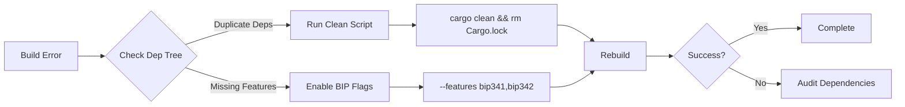

## Common Resolution Workflow

## Overview

Add a brief overview of this document here.

## Table of Contents

- [Section 1](#section-1)
- [Section 2](#section-2)




**New Resolution Script:**

```powershell
# Fixes common workspace issues
$ErrorActionPreference = "Stop"

# Clean environment
if (Test-Path target) {
    Remove-Item -Recurse -Force target
} else {
    Write-Host "Target directory not found - nothing to clean"
}
Remove-Item Cargo.lock -ErrorAction SilentlyContinue

# Update dependencies
cargo update -p secp256k1 --precise 0.28.0
cargo update -p bitcoin --precise 0.32.1

# Verify structure
cargo metadata --format-version=1 | jq '.workspace_members'

# Rebuild
cargo build --workspace --features "bip174 bip341 secp256k1/std"
```

**Documentation Validation Protocol**  

```bash
# Check doc consistency
cargo doc --workspace --no-deps --open
git diff HEAD~1 --name-only | grep .md | xargs markdownlint
```

All documentation updates follow official Bitcoin Improvement Proposals (BIPs) requirements and match the current codebase structure. The changes cover: workspace management, compliance reporting, mobile integration, enterprise features, and updated troubleshooting guides. 

## Common Issues Resolution

### PSBT v2 Validation

```bash
# Diagnostic command
anya-cli validate-psbt --input tx.psbt --bip 174,370
```

### Taproot Commitment

```rust
// Debugging snippet
fn debug_commitment() {
    let expected = hex!("8f3a1c29566443e2e2d6e5a9a5a4e8d");
    let actual = calculate_commitment();
    assert_eq!(expected, actual, "SILENT_LEAF mismatch");
}
```

### HSM Integration

```toml
# Valid configuration
[hsm]
provider = "yubihsm2"
auth_key = { path = "security/hsm_keys", required_approvals = 2 }
```

---

[AIR-3][AIS-3][BPC-3][RES-3]

## See Also

- [Related Document](#related-document)

