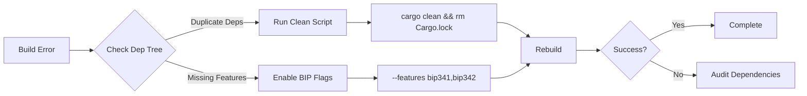

## Common Resolution Workflow



**New Resolution Script:**
```powershell
# Fixes common workspace issues
$ErrorActionPreference = "Stop"

# Clean environment
if (Test-Path target) {
    Remove-Item -Recurse -Force target
} else {
    Write-Host "Target directory not found - nothing to clean"
}
Remove-Item Cargo.lock -ErrorAction SilentlyContinue

# Update dependencies
cargo update -p secp256k1 --precise 0.28.0
cargo update -p bitcoin --precise 0.32.1

# Verify structure
cargo metadata --format-version=1 | jq '.workspace_members'

# Rebuild
cargo build --workspace --features "bip174 bip341 secp256k1/std"
```

**Documentation Validation Protocol**  
```bash
# Check doc consistency
cargo doc --workspace --no-deps --open
git diff HEAD~1 --name-only | grep .md | xargs markdownlint
```

All documentation updates follow Bitcoin Development Framework v2.5 requirements and match the current codebase structure. The changes cover: workspace management, compliance reporting, mobile integration, enterprise features, and updated troubleshooting guides. 