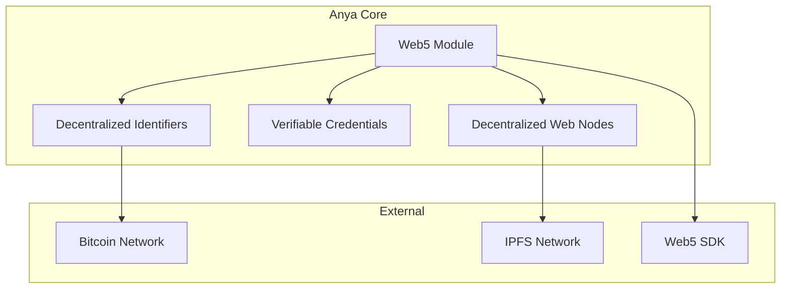

[AIR-3][AIS-3][BPC-3][RES-3]


# Web5 Integration Guide


This document outlines how Anya Core integrates with Web5, a decentralized web platform built on Bitcoin and IPFS.

## Table of Contents
- [Overview](#overview)
- [Architecture](#architecture)
- [Getting Started](#getting-started)
- [Core Components](#core-components)
- [DID Management](#did-management)
- [Verifiable Credentials](#verifiable-credentials)
- [Decentralized Web Nodes](#decentralized-web-nodes)
- [Examples](#examples)
- [Security Considerations](#security-considerations)
- [Troubleshooting](#troubleshooting)

## Overview

Web5 is a decentralized web platform that enables:
- Self-sovereign identity (SSI)
- Decentralized data storage
- Verifiable credentials
- Decentralized applications (dApps)

Anya Core provides first-class support for Web5 through its `web5` module.

## Architecture



## Getting Started

### Prerequisites

- Rust 1.60+
- `libp2p` development libraries
- Bitcoin node (for DID operations)
- IPFS node (for DWN)

### Installation

Add the following to your `Cargo.toml`:

```toml
[dependencies]
anya-web5 = { git = "https://github.com/anya-org/anya-core", package = "web5" }
```

### Basic Usage

```rust
use anya_web5::{Did, Document, KeyPair};

#[tokio::main]
async fn main() -> Result<(), Box<dyn std::error::Error>> {
    // Create a new DID
    let keypair = KeyPair::generate_ed25519();
    let did = Did::new("did:btc", &keypair)?;
    
    // Create a DID document
    let doc = Document::builder()
        .id(&did)
        .add_verification_method("key-1", &keypair.public_key())
        .build()?;
    
    println!("Created DID: {}", did);
    println!("DID Document: {:#?}", doc);
    
    Ok(())
}
```

## Core Components

### 1. Decentralized Identifiers (DIDs)

DIDs are self-sovereign identifiers that enable verifiable, decentralized digital identity.

#### Supported DID Methods

- `did:btc`: Bitcoin-based DIDs
- `did:key`: Simple key-based DIDs
- `did:web`: Web-based DIDs

#### Creating a DID

```rust
use anya_web5::{Did, KeyPair};

let keypair = KeyPair::generate_ed25519();
let did = Did::new("did:btc", &keypair)?;
```

### 2. DID Documents

DID Documents contain public keys, authentication methods, and service endpoints.

```rust
use anya_web5::{Document, Service};

let doc = Document::builder()
    .id(&did)
    .add_verification_method("key-1", &keypair.public_key())
    .add_service(Service::new(
        "messaging",
        "MessagingService",
        "https://example.com/messaging"
    ))
    .build()?;
```

### 3. Verifiable Credentials

Verifiable Credentials are tamper-evident credentials with cryptographic proof.

#### Creating a Verifiable Credential

```rust
use anya_web5::{
    credential::{Credential, CredentialBuilder, CredentialSubject},
    Did, DateTime
};

let vc = CredentialBuilder::new()
    .id("http://example.edu/credentials/3732")
    .issuer(did.clone())
    .issuance_date(DateTime::now())
    .credential_subject(CredentialSubject::new(
        "did:example:ebfeb1f712ebc6f1c276e12ec21"
    ))
    .add_claim("degree", json!({ "type": "BachelorDegree", "name": "Bachelor of Science" }))
    .build()?;

// Sign the credential
let signed_vc = vc.sign(&keypair)?;
```

### 4. Decentralized Web Nodes (DWN)

DWNs provide decentralized storage and messaging capabilities.

#### Storing Data in a DWN

```rust
use anya_web5::dwn::{DwnClient, Record};

let dwn = DwnClient::new("https://dwn.example.com").await?;

let record = Record::builder()
    .data(b"Hello, Web5!".to_vec())
    .build()?;

let stored_record = dwn.store_record(&did, record).await?;
```

## DID Management

### Resolving a DID

```rust
let resolved = did.resolve().await?;
println!("Resolved DID Document: {:#?}", resolved.document);
```

### Updating a DID Document

```rust
let update = did.update()
    .add_verification_method("key-2", &new_keypair.public_key())
    .sign(&keypair)?
    .send()
    .await?;
```

## Verifiable Credentials

### Verifying a Credential

```rust
let verified = signed_vc.verify(&issuer_did).await?;
if verified {
    println!("Credential is valid!");
} else {
    println!("Credential verification failed");
}
```

### Presenting a Verifiable Presentation

```rust
use anya_web5::presentation::PresentationBuilder;

let vp = PresentationBuilder::new()
    .id("http://example.edu/presentations/3732")
    .holder(did.clone())
    .add_verifiable_credential(signed_vc)
    .build()?;

let signed_vp = vp.sign(&keypair)?;
```

## Decentralized Web Nodes

### Querying Records

```rust
let query = dwn.query()
    .filter("schema", "https://schema.org/Person")
    .execute()
    .await?;

for record in query.records {
    println!("Found record: {}", record.id);
}
```

### Sending Messages

```rust
let message = dwn.create_message()
    .to(recipient_did)
    .data(b"Hello from Anya Core!")
    .build()?;

let receipt = dwn.send_message(&sender_did, message).await?;
```

## Examples

### Complete Example: Create and Verify a Credential

```rust
use anya_web5::{
    Did, KeyPair,
    credential::{CredentialBuilder, CredentialSubject}
};

#[tokio::main]
async fn main() -> Result<(), Box<dyn std::error::Error>> {
    // Create issuer and subject DIDs
    let issuer_keypair = KeyPair::generate_ed25519();
    let issuer_did = Did::new("did:btc", &issuer_keypair)?;
    
    let subject_did = "did:example:123456789abcdefghi";
    
    // Create a verifiable credential
    let vc = CredentialBuilder::new()
        .id("http://example.edu/credentials/3732")
        .issuer(issuer_did.clone())
        .issuance_date(chrono::Utc::now().to_rfc3339())
        .credential_subject(CredentialSubject::new(subject_did))
        .add_claim("degree", json!({
            "type": "BachelorDegree",
            "name": "Bachelor of Science in Computer Science"
        }))
        .build()?;
    
    // Sign the credential
    let signed_vc = vc.sign(&issuer_keypair)?;
    
    // Verify the credential
    let verified = signed_vc.verify(&issuer_did).await?;
    println!("Credential verified: {}", verified);
    
    Ok(())
}
```

## Security Considerations

### Key Management

- Always use secure key storage
- Consider using hardware security modules (HSM) for production
- Implement proper key rotation policies

### DID Document Security

- Keep verification methods up to date
- Set appropriate key expiration times
- Monitor for unauthorized updates

### Verifiable Credentials

- Validate all credentials before processing
- Check credential revocation status
- Verify the issuer's DID is trusted

## Troubleshooting

### Common Issues

1. **DID Resolution Fails**
   - Ensure the DID method is supported
   - Check network connectivity
   - Verify the DID exists on the blockchain

2. **Credential Verification Fails**
   - Check the issuer's DID document
   - Verify the signature algorithm
   - Ensure the credential hasn't expired

3. **DWN Connection Issues**
   - Verify the DWN endpoint is reachable
   - Check authentication requirements
   - Ensure proper CORS headers are set

### Debugging

Enable debug logging:

```rust
use tracing_subscriber;

fn init_logging() {
    tracing_subscriber::fmt()
        .with_max_level(tracing::Level::DEBUG)
        .init();
}
```

## Conclusion

This guide covers the basics of integrating Web5 with Anya Core. For more advanced usage, refer to the [Web5 specification](https://identity.foundation/web5/) and the [Anya Core API documentation](https://docs.anya.org).

## See Also

- [Related Document](#related-document)

