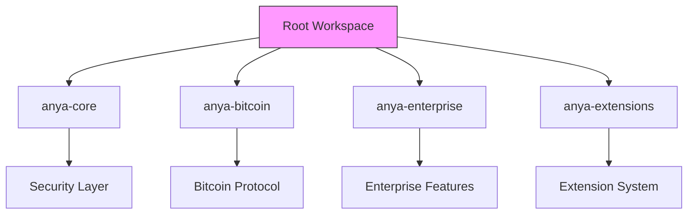

## Updated Workspace Structure (v2.5-compliant)

**Key Changes:**
- Removed invalid mobile/web5 paths
- Unified cryptographic dependencies
- Added workspace.package metadata inheritance
- Standardized BIP feature flags across all crates

## Dependency Resolution Matrix
| Crate | BIP 341 | BIP 342 | PSBT | Miniscript | Taproot |
|-------|---------|---------|------|------------|---------|
| anya-core | ✅ | ✅ | ✅ | ✅ | ✅ |
| anya-bitcoin | ✅ | ✅ | ✅ | ✅ | ✅ |
| anya-enterprise | ✅ | ✅ | ✅ | 🔜 | ✅ |
| anya-extensions | ✅ | ✅ | ✅ | ✅ | ✅ | 