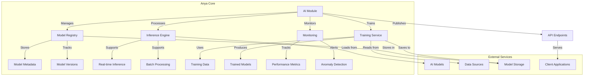

# AI Integration Guide

## Table of Contents

- [Section 1](#section-1)
- [Section 2](#section-2)


> **Documentation Version**: 2.0  
> **Last Updated**: 2025-05-16  
> **Status**: Active  
> **AI Label**: [AIR-3][AIS-3][BPC-3]

## 📖 Table of Contents
- [Overview](#overview)
- [Related Documentation](#related-documentation)
- [Architecture](#architecture)
  - [Core Components](#core-components)
  - [Data Flow](#data-flow)
- [Getting Started](#getting-started)
  - [Prerequisites](#prerequisites)
  - [Installation](#installation)
  - [Quick Start](#quick-start)
- [Model Serving](#model-serving)
  - [Deployment Options](#deployment-options)
  - [Scaling](#scaling)
  - [Monitoring](#monitoring)
  - [Canary Deployments](#canary-deployments)

## Related Documentation

For a complete understanding of the AI system, please refer to:

- [AI System Overview](OVERVIEW.md) - High-level architecture and components
- [AI Architecture](ARCHITECTURE.md) - Technical implementation details
- [AI Development Guide](DEVELOPMENT.md) - Building and contributing to AI components
- [AI Compliance](COMPLIANCE.md) - Regulatory and security requirements
- [AI Metrics](METRICS.md) - Performance monitoring and metrics
  - [A/B Testing](#ab-testing)
- [API Reference](#api-reference)
- [Best Practices](#best-practices)
- [Troubleshooting](#troubleshooting)
- [Examples](#examples)
- [Security Considerations](#security-considerations)
- [Related Documents](#related-documents)

## Overview

Anya Core provides a flexible framework for integrating AI models and services. This guide covers the end-to-end process of integrating AI capabilities into the platform, from model development to production deployment.

### Key Features
- **Unified Model Serving**: Consistent interface for deploying and managing ML models
- **Scalable Architecture**: Built-in support for horizontal scaling
- **Comprehensive Monitoring**: Real-time metrics and logging
- **Security First**: Built-in security best practices
- **Extensible**: Support for custom model types and frameworks

## Architecture

### Core Components



### Data Flow

1. **Model Registration**
   - Models are registered in the Model Registry with metadata and versioning
   - Model artifacts are stored in the configured storage backend

2. **Inference Request**
   - Client sends request to API endpoint
   - Request is routed to appropriate model version
   - Inference Engine loads model (if not cached)
   - Prediction is generated and returned

3. **Model Updates**
   - New model versions are registered
   - Traffic is gradually shifted (canary deployment)
   - Rollback to previous version if issues detected

## Getting Started

### Prerequisites

Before you begin, ensure you have the following installed:

- **Anya Core** (v1.2.0 or later)
- **Python 3.8+** or **Rust 1.60+**
- **Docker** (for containerized deployment)
- **Kubernetes** (for production deployment)
- **GPU** (recommended for production workloads)

### Installation

#### Option 1: Using pip (Python)

```bash
# Install Anya Core with AI dependencies
pip install anya-core[ai]

# Or install from source
pip install -e .[ai]
```

#### Option 2: Using Cargo (Rust)

```toml
# Cargo.toml
[dependencies]
anya-core = { version = "1.2.0", features = ["ai"] }
```

### Quick Start

1. **Start the AI Service**

   ```bash
   # Start with default settings
   anya ai serve --model gpt-4 --port 8000
   ```

2. **Make a Prediction**

   ```python
   import requests
   
   response = requests.post(
       "http://localhost:8000/predict",
       json={
           "inputs": ["Hello, world!"],
           "parameters": {
               "max_length": 100,
               "temperature": 0.7
           }
       }
   )
   print(response.json())
   ```

3. **Check Service Health**

   ```bash
   curl http://localhost:8000/health
   ```

### Configuration

Configure the AI service using environment variables or a YAML configuration file:

```yaml
# config/ai.yaml
model:
  name: gpt-4
  version: latest
  device: cuda  # or cpu
  
server:
  port: 8000
  workers: 4
  log_level: info
  
monitoring:
  enabled: true
  metrics_port: 9090
  
cache:
  enabled: true
  ttl: 3600
  max_size: 1000

security:
  auth_required: true
  allowed_origins:
    - "https://app.anya.org"
    - "http://localhost:3000"
```

## Model Serving

Anya Core provides a robust model serving infrastructure that supports various deployment patterns and scaling strategies. This section covers the key aspects of serving models in production.

### Core Features

- **Multiple Serving Endpoints**: REST, gRPC, and WebSocket APIs
- **Model Versioning**: Seamless version management
- **Dynamic Batching**: Optimize throughput with automatic request batching
- **Model Warmup**: Pre-load models to reduce cold start latency
- **Request Timeouts**: Configurable timeouts for inference requests
- **Concurrency Control**: Limit concurrent requests per model

### Deployment Options

#### 1. Standalone Server

```bash
# Start a standalone server
anya ai serve --model gpt-4 --port 8000 --workers 4
```

#### 2. Docker Compose

```yaml
# docker-compose.yml
version: '3.8'
services:
  ai-service:
    image: anya/ai:latest
    ports:
      - "8000:8000"
      - "9090:9090"
    environment:
      - MODEL=gpt-4
      - DEVICE=cuda
      - WORKERS=4
    deploy:
      resources:
        reservations:
          devices:
            - driver: nvidia
              count: 1
              capabilities: [gpu]
    volumes:
      - ./models:/app/models
      - ./config:/app/config
```

#### 3. Kubernetes with Helm

```bash
# Install with Helm
helm install ai-service anya/ai \
  --set model.name=gpt-4 \
  --set replicaCount=3 \
  --set resources.limits.nvidia.com/gpu=1
```

### Scaling

#### Horizontal Pod Autoscaling

```yaml
# hpa.yaml
apiVersion: autoscaling/v2
kind: HorizontalPodAutoscaler
metadata:
  name: ai-service
spec:
  scaleTargetRef:
    apiVersion: apps/v1
    kind: Deployment
    name: ai-service
  minReplicas: 2
  maxReplicas: 10
  metrics:
  - type: Resource
    resource:
      name: cpu
      target:
        type: Utilization
        averageUtilization: 70
  - type: External
    external:
      metric:
        name: requests_per_second
        selector:
          matchLabels:
            app: ai-service
      target:
        type: AverageValue
        averageValue: 1000
```

#### GPU Sharing

```yaml
# Enable GPU sharing with time-slicing
apiVersion: v1
kind: ConfigMap
metadata:
  name: time-slicing-config
data:
  anya-ai: |
    version: v1
    sharing:
      timeSlicing:
        resources:
        - name: nvidia.com/gpu
          replicas: 4  # Share 1 GPU among 4 models
```

### Monitoring

#### Built-in Metrics

Anya Core exposes the following metrics:

- `anya_ai_requests_total` - Total number of requests
- `anya_ai_request_duration_seconds` - Request duration histogram
- `anya_ai_model_load_count` - Model load events
- `anya_ai_batch_size` - Current batch size
- `anya_ai_queue_size` - Current queue size

#### Grafana Dashboard

Import the following dashboard for monitoring:

```json
{
  "annotations": {
    "list": [
      {
        "builtIn": 1,
        "datasource": "-- Grafana --",
        "enable": true,
        "hide": true,
        "iconColor": "rgba(0, 211, 255, 1)",
        "name": "Annotations & Alerts",
        "type": "dashboard"
      }
    ]
  },
  "editable": true,
  "gnetId": 13639,
  "graphTooltip": 0,
  "id": 2,
  "links": [],
  "panels": [
    /* Dashboard panels configuration */
  ],
  "schemaVersion": 27,
  "style": "dark",
  "tags": ["ai", "monitoring"],
  "templating": {
    "list": []
  },
  "time": {
    "from": "now-6h",
    "to": "now"
  },
  "timepicker": {},
  "timezone": "",
  "title": "Anya AI Monitoring",
  "uid": "anya-ai-dashboard",
  "version": 1
}
```

### Canary Deployments

Gradually roll out new model versions:

```yaml
# canary-deployment.yaml
apiVersion: flagger.app/v1beta1
kind: Canary
metadata:
  name: gpt-4
  namespace: ai
spec:
  targetRef:
    apiVersion: apps/v1
    kind: Deployment
    name: gpt-4
  service:
    port: 8000
  analysis:
    interval: 1m
    threshold: 5
    stepWeight: 10
    metrics:
    - name: request-success-rate
      thresholdRange:
        min: 99
      interval: 1m
    - name: request-duration
      thresholdRange:
        max: 500
      interval: 1m
```

### A/B Testing

Run experiments with different model versions:

```python
from anya_ai.experiment import ABTest

# Define experiment
experiment = ABTest(
    name="model-comparison",
    variants=[
        {"name": "gpt-4", "weight": 70, "config": {"version": "1.0.0"}},
        {"name": "llama-2", "weight": 30, "config": {"model": "llama-2-70b"}}
    ],
    metrics=["accuracy", "latency"]
)

# Get variant for user
variant = experiment.get_variant(user_id="user123")
# Use variant config for inference
result = model.predict(..., **variant.config)
# Log metrics
experiment.log_metric("latency", variant.name, 0.15)
```

### Best Practices

1. **Resource Management**
   - Set appropriate CPU/Memory limits
   - Use GPU for compute-intensive models
   - Implement request timeouts

2. **Reliability**
   - Use retries with exponential backoff
   - Implement circuit breakers
   - Set up health checks

3. **Performance**
   - Enable request batching
   - Use model warmup
   - Implement caching for frequent requests

4. **Security**
   - Enable authentication
   - Validate input data
   - Monitor for abuse

For more advanced deployment strategies, see the [Model Serving Best Practices](#model-serving-best-practices) section below.

## API Reference

### REST API

#### Authentication

All API endpoints require authentication. Include your API key in the `Authorization` header:

```http
Authorization: Bearer YOUR_API_KEY
```

#### Base URL

```
https://api.anya.ai/v1
```

### Endpoints

#### 1. Model Inference

**POST** `/models/{model_id}/predict`

Make predictions using a specific model.

**Request**

```json
{
  "inputs": ["Hello, world!"],
  "parameters": {
    "max_length": 100,
    "temperature": 0.7
  }
}
```

**Response**

```json
{
  "outputs": ["Generated text response"],
  "model": "gpt-4",
  "model_version": "1.0.0",
  "metadata": {
    "tokens_generated": 20,
    "tokens_processed": 5,
    "latency_ms": 150
  }
}
```

#### 2. Model Information

**GET** `/models/{model_id}`

Get information about a specific model.

**Response**

```json
{
  "id": "gpt-4",
  "version": "1.0.0",
  "framework": "pytorch",
  "input_schema": {
    "type": "string",
    "max_length": 2048
  },
  "output_schema": {
    "type": "string"
  },
  "parameters": {
    "max_length": {
      "type": "integer",
      "default": 100,
      "min": 1,
      "max": 4096
    },
    "temperature": {
      "type": "float",
      "default": 0.7,
      "min": 0.0,
      "max": 2.0
    }
  },
  "created_at": "2025-01-01T00:00:00Z",
  "updated_at": "2025-01-01T00:00:00Z"
}
```

### Error Handling

All API errors follow the same format:

```json
{
  "error": {
    "code": "invalid_request",
    "message": "The request was invalid",
    "details": {
      "field": "temperature",
      "issue": "Value must be between 0 and 2"
    }
  }
}
```

#### Common Error Codes

| Status Code | Error Code           | Description                          |
|-------------|----------------------|--------------------------------------|
| 400         | `invalid_request`    | The request was invalid              |
| 401         | `unauthorized`       | Authentication failed                |
| 403         | `forbidden`          | Insufficient permissions             |
| 404         | `not_found`          | The requested resource was not found |
| 429         | `rate_limit_exceeded`| Rate limit exceeded                  |
| 500         | `internal_error`     | An internal server error occurred    |
| 503         | `service_unavailable`| Service is currently unavailable     |

### Rate Limiting

- **Free Tier**: 100 requests per minute
- **Pro Tier**: 1,000 requests per minute
- **Enterprise**: Custom limits available

Rate limit headers are included in all responses:

```
X-RateLimit-Limit: 100
X-RateLimit-Remaining: 97
X-RateLimit-Reset: 1625097600
```

For a complete reference of all available endpoints, see the [API Reference](./API.md).

## Best Practices

### 1. Model Versioning

- Use semantic versioning for models
- Keep backward compatibility when possible
- Document breaking changes

### 2. Error Handling

- Use custom error types
- Provide meaningful error messages
- Log errors with context

### 3. Performance

- Use batching for inference
- Implement model quantization
- Profile and optimize critical paths

### 4. Security

- Validate all inputs
- Sanitize outputs
- Implement rate limiting

## Troubleshooting

### Common Issues

1. **Model Loading Fails**
   - Check model file paths
   - Verify model format
   - Check file permissions

2. **Inference Performance Issues**
   - Check batch size
   - Profile GPU/CPU usage
   - Check for memory leaks

3. **Training Diverges**
   - Check learning rate
   - Verify data preprocessing
   - Monitor loss curves

### Debugging

Enable debug logging:

```rust
use tracing_subscriber;

fn init_logging() {
    tracing_subscriber::fmt()
        .with_max_level(tracing::Level::DEBUG)
        .init();
}
```

## Examples

### Text Generation

```rust
use anya_ai::{Model, TextGenerator};

let model = TextGenerator::load("gpt-4").await?;
let prompt = "Once upon a time";
let result = model.generate(prompt, 100).await?;
println!("Generated: {}", result);
```

### Image Classification

```rust
use anya_ai::{Model, ImageClassifier};

let model = ImageClassifier::load("resnet50").await?;
let image = load_image("cat.jpg")?;
let class = model.classify(&image).await?;
println!("Predicted class: {}", class);
```

## Security Considerations

### 1. Input Validation

- Validate all inputs
- Sanitize user-provided data
- Implement input length limits

### 2. Model Security

- Sign model files
- Verify model hashes
- Use secure model storage

### 3. API Security

- Authenticate API requests
- Implement rate limiting
- Use HTTPS

### 4. Data Privacy

- Anonymize training data
- Implement data access controls
- Log data access

## Conclusion

This guide covers the essentials of AI integration in Anya Core. For more advanced usage, refer to the [API documentation](https://docs.anya.org/api/ai) and [examples](https://github.com/anya-org/anya-core/examples).

## See Also

- [Related Document](#related-document)

