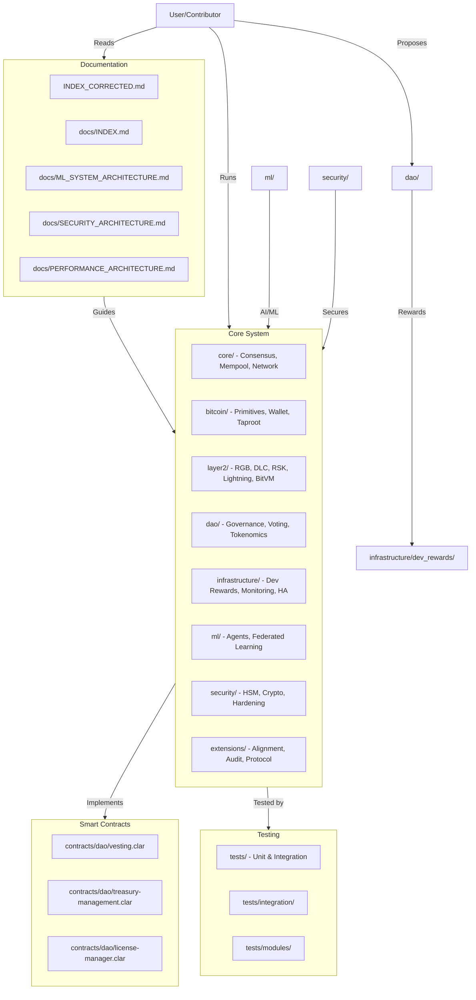
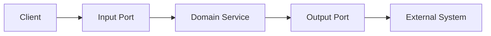
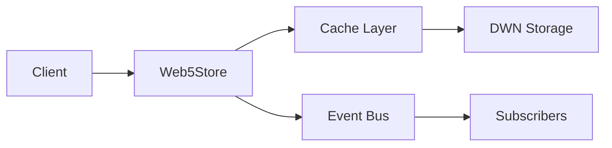
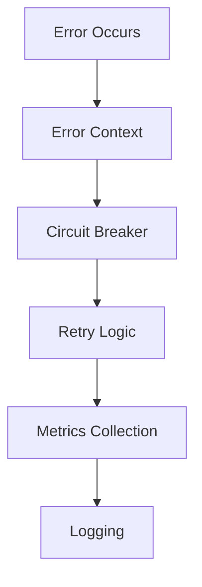
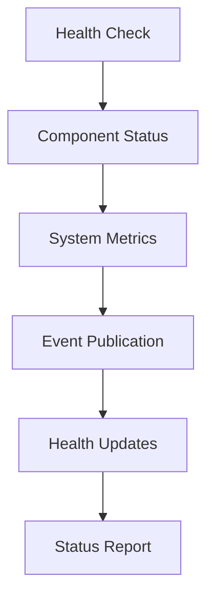

[AIR-3][AIS-3][BPC-3][RES-3]


<!-- markdownlint-disable MD013 line-length -->

# Anya Core Architecture

## Table of Contents

- [Section 1](#section-1)
- [Section 2](#section-2)


## Overview

Anya Core is built on a hexagonal architecture (ports and adapters) pattern, emphasizing clean separation of concerns, domain-driven design, and modularity. The system is designed with security, privacy, and decentralization as core tenets.


## Core Components

### 1. Domain Layer (Core)

- Business logic and rules
- Domain entities and value objects
- Use cases and domain services
- Domain events and handlers
- Error types and handling

### 2. Application Layer (Ports)

#### Input Ports (Primary/Driving)

- Command handlers
- Query handlers
- Event handlers
- API interfaces
- RPC interfaces

#### Output Ports (Secondary/Driven)

- Repository interfaces
- External service interfaces
- Messaging interfaces
- Cache interfaces
- Storage interfaces

### 3. Infrastructure Layer (Adapters)

#### Input Adapters

- REST API controllers
- gRPC handlers
- CLI commands
- WebSocket handlers
- Message consumers

#### Output Adapters

- Database repositories
- External service clients
- Message publishers
- Cache implementations
- File system adapters

## System Architecture

### Visual System Map



### 1. Web5 Integration

- Decentralized identity (DID) management
- Web5 protocol implementation
- Schema validation
- Decentralized data storage
- Event-driven architecture
- Caching and batch operations

### 2. Bitcoin Integration

- Core Bitcoin functionality with RPC client
- Transaction validation and processing
- Network management and monitoring
- Advanced script validation
- Lightning Network integration
- Multi-signature support

### 3. Error Handling System

```rust
// Comprehensive error handling with context
pub struct ErrorContext {
    error: HexagonalError,
    severity: ErrorSeverity,
    trace_id: Option<String>,
    retry_count: u32,
    metrics: ErrorMetrics
}

// Circuit breaker pattern
pub struct CircuitBreaker {
    state: CircuitState,
    failure_threshold: u32,
    reset_timeout: Duration
}
```

### 4. Event System

```rust
// Event types and metadata
pub struct Event {
    id: String,
    event_type: EventType,
    timestamp: DateTime<Utc>,
    data: Value,
    metadata: EventMetadata
}

// Event bus with pub/sub pattern
pub struct EventBus {
    tx: broadcast::Sender<Event>
}

// Event filtering and routing
pub struct EventSubscriber {
    rx: Receiver<Event>,
    filters: Vec<Box<dyn Fn(&Event) -> bool>>
}
```

### 5. Health Monitoring

- Component-level health tracking
- System metrics collection
- Real-time health status
- Performance monitoring
- Resource utilization tracking
- Event-driven health updates

### 6. Caching System

```rust
// LRU cache with TTL support
pub struct Web5Cache {
    cache: Arc<RwLock<LruCache>>,
    config: CacheConfig
}

// Cache operations and events
pub trait Cache {
    async fn get<T>(&self, key: &str) -> Result<Option<T>>;
    async fn set<T>(&self, key: &str, value: T) -> Result<()>;
    async fn delete(&self, key: &str) -> bool;
}
```

### 7. Batch Operations

```rust
// Batch processing with rate limiting
pub struct BatchProcessor<S: DataStore> {
    store: S,
    options: BatchOptions
}

// Batch operation types
pub enum BatchOperationType {
    Create,
    Update,
    Delete
}
```

### 8. Metrics & Monitoring

- Real-time performance metrics
- Custom business metrics
- Error and failure metrics
- Resource utilization tracking
- Health check system
- Circuit breaker monitoring

### 9. Security Layer

- Multi-factor authentication
- Role-based access control
- Audit logging
- Encryption at rest
- Secure communication
- HSM integration

### 10. Machine Learning System

- Federated learning
- Model optimization
- Privacy-preserving ML
- Anomaly detection
- Predictive analytics
- Risk assessment

### 7. Layer 2 Integrations

Anya Core includes comprehensive support for Bitcoin Layer 2 solutions, with a primary focus on BOB (Bitcoin Optimistic Blockchain) hybrid L2.

#### BOB Hybrid L2 Architecture

BOB integration follows our hexagonal architecture pattern with clearly defined ports and adapters:

**Domain Layer (Core)**

- L2 transaction models and validation rules
- BitVM verification logic
- Cross-layer state management
- Smart contract execution environment

**Application Layer (Ports)**

- Input Ports:
  - L2 transaction submission
  - Smart contract execution
  - Relay monitoring
  - Fraud proof submission

- Output Ports:
  - Bitcoin relay interaction
  - Smart contract state access
  - L2 state querying
  - Cross-layer synchronization

**Infrastructure Layer (Adapters)**

- Input Adapters:
  - BOB RPC client
  - EVM contract caller
  - Relay monitoring service
  - BitVM verification adapter

- Output Adapters:
  - Bitcoin relay client
  - L2 state repository
  - Smart contract state repository
  - Cross-layer transaction processor

**Integration Architecture:**

```
┌───────────────────────────────────────────────────────────────────┐
│                        Anya Core System                           │
│                                                                   │
│  ┌───────────────┐    ┌───────────────┐    ┌───────────────┐     │
│  │               │    │               │    │               │     │
│  │  Bitcoin      │    │  BOB Layer 2  │    │  EVM Contract │     │
│  │  Integration  │◄──►│  Integration  │◄──►│  Integration  │     │
│  │               │    │               │    │               │     │
│  └───────┬───────┘    └───────┬───────┘    └───────┬───────┘     │
│          │                    │                    │             │
│  ┌───────▼───────────────────▼────────────────────▼───────┐     │
│  │                                                         │     │
│  │                 Hexagonal Architecture                  │     │
│  │                Core Domain Services                     │     │
│  │                                                         │     │
│  └─────────────────────────────┬───────────────────────────┘     │
│                                │                                 │
│                      ┌─────────▼──────────┐                      │
│                      │                    │                      │
│                      │  Security, ML,     │                      │
│                      │  Performance       │                      │
│                      │                    │                      │
│                      └────────────────────┘                      │
│                                                                   │
└───────────────────────────────────────────────────────────────────┘
```

#### BOB Integration Components

1. **Bitcoin Relay Monitor**
   - Tracks the status of the BOB Bitcoin relay
   - Validates relay state against Bitcoin L1
   - Monitors relay performance metrics
   - Alerts on relay inconsistencies

2. **EVM Compatibility Layer**
   - Provides EVM execution environment
   - Supports Solidity smart contracts
   - Maps Bitcoin addresses to EVM addresses
   - Handles gas and fee management

3. **BitVM Integration**
   - Implements BitVM verification logic
   - Processes optimistic rollup state transitions
   - Handles fraud proof verification
   - Manages dispute resolution

4. **Cross-Layer Transaction Manager**
   - Coordinates transactions spanning Bitcoin L1 and BOB L2
   - Ensures atomic transaction execution
   - Manages cross-layer state consistency
   - Optimizes cross-layer transaction fees

5. **Hybrid Analytics Engine**
   - Collects metrics from both L1 and L2
   - Analyzes cross-layer transaction patterns
   - Provides insights on system performance
   - Identifies optimization opportunities

#### Layer 2 Protocol Integrations

Anya Core provides comprehensive Layer2 support through a unified architecture:

1. **Lightning Network**
   - Payment channel management
   - Multi-hop routing
   - Invoice generation and processing
   - Channel monitoring and safety

2. **State Channels**
   - Generic state transition support
   - Off-chain execution environment
   - On-chain settlement and dispute resolution
   - State channel monitoring

3. **RGB Assets**
   - Client-side validation protocol
   - Asset issuance and transfers
   - Privacy-preserving transactions
   - Bitcoin UTXO-based implementation

4. **Discrete Log Contracts (DLC)**
   - Oracle-based smart contracts
   - Non-interactive setup
   - Privacy-preserving outcomes
   - Bitcoin-native implementation

5. **BOB (Build on Bitcoin)**
   - EVM-compatible smart contracts
   - Bitcoin security model
   - Cross-chain bridging
   - Hybrid transaction support

6. **Liquid Network**
   - Confidential transactions
   - Asset issuance platform
   - Federation consensus
   - Two-way peg with Bitcoin

7. **RSK (Rootstock)**
   - Smart contracts secured by Bitcoin mining
   - EVM compatibility
   - Merged mining support
   - DeFi ecosystem

8. **Stacks**
   - Clarity smart contracts
   - Proof of Transfer (PoX)
   - Bitcoin finality
   - STX stacking rewards

9. **Taproot Assets**
   - Bitcoin-native asset protocol
   - Taproot optimization
   - Lightning Network compatible
   - Scalable asset transfers

**Unified Interface**: All protocols implement the common `Layer2Protocol` trait for consistent integration and management.

### 8. Consensus Mechanisms

```rust
// Comprehensive error handling with context
pub struct ErrorContext {
    error: HexagonalError,
    severity: ErrorSeverity,
    trace_id: Option<String>,
    retry_count: u32,
    metrics: ErrorMetrics
}

// Circuit breaker pattern
pub struct CircuitBreaker {
    state: CircuitState,
    failure_threshold: u32,
    reset_timeout: Duration
}
```

## Component Interaction

### 1. Request Flow



### 2. Web5 Data Flow



### 3. Error Handling Flow



### 4. Health Monitoring Flow



## Implementation Details

### 1. Domain Layer

```rust
// Core domain types
pub trait DomainService {
    async fn execute(&self, command: Command) -> DomainResult;
}

// Domain events
pub trait DomainEvent {
    fn event_type(&self) -> &str;
    fn occurred_at(&self) -> DateTime<Utc>;
}
```

### 2. Application Layer

```rust
// Input ports
#[async_trait]
pub trait CommandHandler<T> {
    async fn handle(&self, command: T) -> ApplicationResult<()>;
}

// Output ports
#[async_trait]
pub trait Repository<T> {
    async fn save(&self, entity: T) -> RepositoryResult<()>;
    async fn find_by_id(&self, id: &str) -> RepositoryResult<Option<T>>;
}
```

### 3. Infrastructure Layer

```rust
// Input adapter
pub struct RestController {
    command_handler: Arc<dyn CommandHandler>,
    metrics: MetricsCollector
}

// Output adapter
pub struct PostgresRepository {
    pool: PgPool,
    circuit_breaker: CircuitBreaker
}
```

### 4. Web5 Layer

```rust
// Web5 store with caching and events
pub struct Web5Store {
    cache: Web5Cache,
    batch_processor: BatchProcessor,
    event_publisher: EventPublisher,
    health_monitor: HealthMonitor
}

// Health monitoring
pub struct HealthStatus {
    status: SystemStatus,
    components: HashMap<String, ComponentHealth>,
    metrics: SystemMetrics
}
```

## Error Handling Strategy

### 1. Error Classification

- Domain Errors
- Application Errors
- Infrastructure Errors
- Integration Errors
- Security Errors

### 2. Error Recovery

- Retry Mechanisms
- Circuit Breaker
- Fallback Strategies
- Compensation Actions

### 3. Error Monitoring

- Error Metrics
- Error Patterns
- Recovery Success Rate
- System Health Impact

## Monitoring and Metrics

### 1. System Health

- Component health status
- Service availability
- Performance metrics
- Resource utilization
- Error rates and patterns

### 2. Operational Metrics

- Cache hit rates
- Batch operation throughput
- Event processing latency
- Storage operation times
- DID resolution performance

### 3. Core Metrics

- Transaction throughput
- Error rates and types
- Response times
- Resource utilization
- Cache hit rates

### 4. Business Metrics

- Transaction volumes
- User activity
- Feature usage
- Success rates
- Business KPIs

### 5. ML Metrics

- Model accuracy
- Training performance
- Prediction latency
- Feature importance
- Drift detection

## Security Considerations

### 1. Authentication

- Multi-factor authentication
- Token management
- Session handling
- Identity verification

### 2. Authorization

- Role-based access control
- Permission management
- Policy enforcement
- Access auditing

### 3. Data Protection

- Encryption at rest
- Secure communication
- Key management
- Data anonymization

## Development Guidelines

### 1. Code Organization

- Domain-driven structure
- Clean architecture principles
- SOLID principles
- Dependency injection

### 2. Testing Strategy

- Unit tests
- Integration tests
- Property-based tests
- Performance tests
- Security tests

### 3. Documentation

- API documentation
- Architecture diagrams
- Component interaction
- Error handling
- Security guidelines

## ML Agent System

### Auto-Adjustment System (`src/ml/auto_adjust.rs`)

The auto-adjustment system provides dynamic resource management and system optimization:

```rust
AutoAdjustSystem {
    config: AutoAdjustConfig,      // System-wide configuration
    metrics: MetricsCollector,     // Performance metrics
    agent_coordinator: AgentCoordinator,  // Agent management
    health_status: HealthStatus    // System health tracking
}
```

Key features:

- Dynamic resource scaling
- Health-based adjustments
- Emergency handling
- Performance optimization
- Configuration management

### Agent Coordinator (`src/ml/agents/coordinator.rs`)

Manages agent interactions and resource allocation:

```rust
AgentCoordinator {
    agents: Vec<MLAgent>,          // Managed agents
    max_concurrent_actions: usize, // Concurrency control
    observation_interval: Duration, // Monitoring frequency
    metrics: MetricsCollector     // Performance tracking
}
```

Capabilities:

- Resource management
- Dynamic scaling
- Performance monitoring
- Health tracking
- Emergency procedures

### ML Agent Interface (`src/ml/agents/mod.rs`)

Defines the core agent capabilities:

```rust
trait MLAgent {
    // Core operations
    async fn act(&mut self) -> Result<()>;
    async fn observe(&self) -> Result<Vec<Observation>>;
    
    // Resource management
    async fn optimize_resources(&mut self) -> Result<()>;
    async fn clear_cache(&mut self) -> Result<()>;
    
    // Health and metrics
    async fn get_health_metrics(&self) -> Result<AgentHealthMetrics>;
    async fn get_resource_usage(&self) -> Result<AgentResourceUsage>;
}
```

## Web5 Integration

### Web5Store (`src/storage/web5_store.rs`)

Provides decentralized data storage with:

- DID-based authentication
- Schema validation
- Event notifications
- Cache management
- Batch operations

### Batch Processing (`src/web5/batch.rs`)

Handles bulk operations with:

- Rate limiting
- Concurrent processing
- Error handling
- Transaction management

### Caching System (`src/web5/cache.rs`)

Optimizes data access through:

- LRU caching
- TTL support
- Event notifications
- Thread-safe access

## System Interactions

### Auto-Adjustment Flow

1. **Monitoring**

   ```
   [System Metrics] -> [Health Monitor] -> [Auto-Adjust System]
                                      -> [Metrics Collection]
   ```

2. **Resource Management**

   ```
   [Auto-Adjust System] -> [Resource Scaling]
                       -> [Configuration Updates]
                       -> [Emergency Procedures]
   ```

3. **Agent Coordination**

   ```
   [Agent Coordinator] -> [Resource Allocation]
                      -> [Concurrency Control]
                      -> [Health Monitoring]
   ```

### Health Management

The system maintains health through multiple layers:

1. **Component Level**
   - Individual agent health tracking
   - Resource usage monitoring
   - Performance metrics

2. **System Level**
   - Overall system health status
   - Resource availability
   - Performance indicators

3. **Recovery Procedures**
   - Automatic scaling
   - Resource reallocation
   - Emergency protocols

## Performance Optimization

### Resource Management

1. **Memory Optimization**
   - Dynamic cache sizing
   - Batch size adjustment
   - Resource pooling

2. **CPU Utilization**
   - Concurrent operation control
   - Task scheduling
   - Load balancing

3. **Network Efficiency**
   - Request batching
   - Connection pooling
   - Rate limiting

### Metrics and Monitoring

1. **Performance Metrics**
   - Response times
   - Throughput
   - Error rates
   - Resource usage

2. **Health Indicators**
   - Component status
   - System stability
   - Resource availability

3. **Adaptation Metrics**
   - Scaling effectiveness
   - Recovery success rates
   - Optimization impact

## Security Architecture

### Authentication and Authorization

1. **DID-based Authentication**
   - Decentralized identity management
   - Key management
   - Access control

2. **Authorization**
   - Role-based access
   - Permission management
   - Resource restrictions

### Data Protection

1. **Encryption**
   - Data at rest
   - Data in transit
   - Key management

2. **Validation**
   - Schema validation
   - Input sanitization
   - Output encoding

## Error Handling

### Error Management

1. **Error Types**
   - System errors
   - Resource errors
   - Network errors
   - Application errors

2. **Recovery Procedures**
   - Automatic retry
   - Fallback mechanisms
   - Circuit breaking

3. **Logging and Monitoring**
   - Error tracking
   - Performance impact
   - Recovery metrics

## Development Guidelines

### Best Practices

1. **Code Organization**
   - Modular design
   - Clear separation of concerns
   - Consistent error handling

2. **Testing**
   - Unit tests
   - Integration tests
   - Performance tests

3. **Documentation**
   - Code documentation
   - API documentation
   - Architecture documentation

### Performance Considerations

1. **Resource Usage**
   - Memory management
   - CPU utilization
   - Network efficiency

2. **Optimization**
   - Caching strategies
   - Batch processing
   - Concurrent operations

3. **Monitoring**
   - Performance metrics
   - Resource tracking
   - Health monitoring

## Anya - Web5 Decentralized ML Agent Architecture

## System Overview

Anya is a decentralized ML agent system built on Web5 technology, featuring:

- Adaptive ML agents for various domains
- Decentralized data storage and processing
- Comprehensive business and market analysis
- Auto-tuning capabilities
- Resource optimization

## Core Components

### 1. ML Agent System

#### Market Agent

- Real-time market analysis
- Dynamic pricing strategy
- Trend detection
- Risk assessment
- Auto-tuning parameters

#### Business Agent

- Revenue optimization
- Cost management
- Profit margin analysis
- Growth projection
- Strategy adaptation

#### Agent Coordinator

- Agent lifecycle management
- Resource allocation
- Performance monitoring
- State synchronization
- Cross-agent optimization

### 2. Auto-Adjustment System

- Resource usage optimization
- Performance monitoring
- Health checks
- Dynamic scaling
- Emergency procedures

### 3. Business Logic

- Revenue distribution (40% DAO, 30% Developer Pool, 30% Operations)
- Tiered service pricing
- Usage-based billing
- Volume discounts
- Performance incentives

### 4. DAO Integration

- Proposal management
- Treasury control
- Voting system
- Emergency procedures
- Revenue distribution

## Technical Architecture

### 1. Core Technologies

- Rust async/await
- Tokio runtime
- Web5 DID system
- Decentralized storage
- ML frameworks

### 2. Data Flow

```
[Market Data] → Market Agent → Agent Coordinator
                                     ↓
[Business Data] → Business Agent → Strategy Optimization
                                     ↓
[System Metrics] → Auto-Adjust → Resource Management
```

### 3. Security Features

- DID-based authentication
- Encrypted communication
- Secure state management
- Access control
- Audit logging

### 4. Performance Optimization

- Adaptive batch sizing
- Dynamic concurrency
- Resource pooling
- Cache optimization
- Load balancing

## Implementation Details

### 1. Agent Implementation

- Trait-based design
- Async operations
- State management
- Error handling
- Metrics collection

### 2. Business Logic

- Revenue tracking
- Cost analysis
- Profit optimization
- Growth strategies
- Risk management

### 3. System Management

- Health monitoring
- Resource tracking
- Performance tuning
- Error recovery
- State synchronization

## Future Enhancements

1. Advanced ML Models
   - Deep learning integration
   - Reinforcement learning
   - Transfer learning
   - Federated learning

2. Enhanced Analytics
   - Predictive analytics
   - Risk assessment
   - Pattern detection
   - Anomaly detection

3. System Improvements
   - Scalability enhancements
   - Performance optimization
   - Security hardening
   - Integration expansion

*Last updated: 2025-06-02*

# Mobile SDK Architecture v2.5

## Core Components

- **BIP-341/342**: Taproot commitment verification
- **BIP-174**: PSBT v2 transaction handling
- **BIP-370**: Fee rate validation
- **HSM Integration**: Hardware Security Module support (Validated)

```rust:src/security/hsm/mod.rs
// ... existing code ...

#[cfg(test)]
mod tests {
    use super::*;
    use crate::crypto::mock_hsm::MockHsmProvider;

    #[tokio::test]
    async fn test_hsm_connection() {
        let mut hsm = HsmBridge::default();
        let config = HsmConfig {
            provider_type: "mock".into(),
            connection_string: "test://hsm".into(),
        };
        
        hsm.connect(config).await.unwrap();
        assert!(hsm.connected);
    }

    #[test]
    fn test_gpu_resistant_derivation() {
        let sm = SecurityManager::new();
        let key = sm.gpu_resistant_derive("test mnemonic").unwrap();
        assert_eq!(key.depth, 0);
    }
}
```

```typescript:mobile/src/BitcoinSDK.tsx
/**
 * Bitcoin Mobile SDK React Native Interface
 * 
 * Implements BIP-341/342/174/370 compliant operations
 * 
 * @example
 * ```typescript
 * const sdk = NativeModules.BitcoinSDK;
 * await sdk.createWallet(mnemonic);
 * const txid = await sdk.sendTransaction(address, amount);
 * ```
 */
interface MobileSDK {
  createWallet(mnemonic: string): Promise<void>;
  sendTransaction(recipient: string, amount: number): Promise<string>;
  // ... other methods ...
}
```

## See Also

- [Agent Architecture](AGENT_ARCHITECTURE.md)
- [System Map](../../src/system_map.md)
- [Master Implementation Plan](MASTER_IMPLEMENTATION_PLAN_CANONICAL.md)
- [Git Workflow](GIT_WORKFLOW.md)
- [Security Architecture](SECURITY_ARCHITECTURE.md)
- [Performance Architecture](PERFORMANCE_ARCHITECTURE.md)
- [Hexagonal Architecture](../bitcoin/docs/architecture/HEXAGONAL.md)

