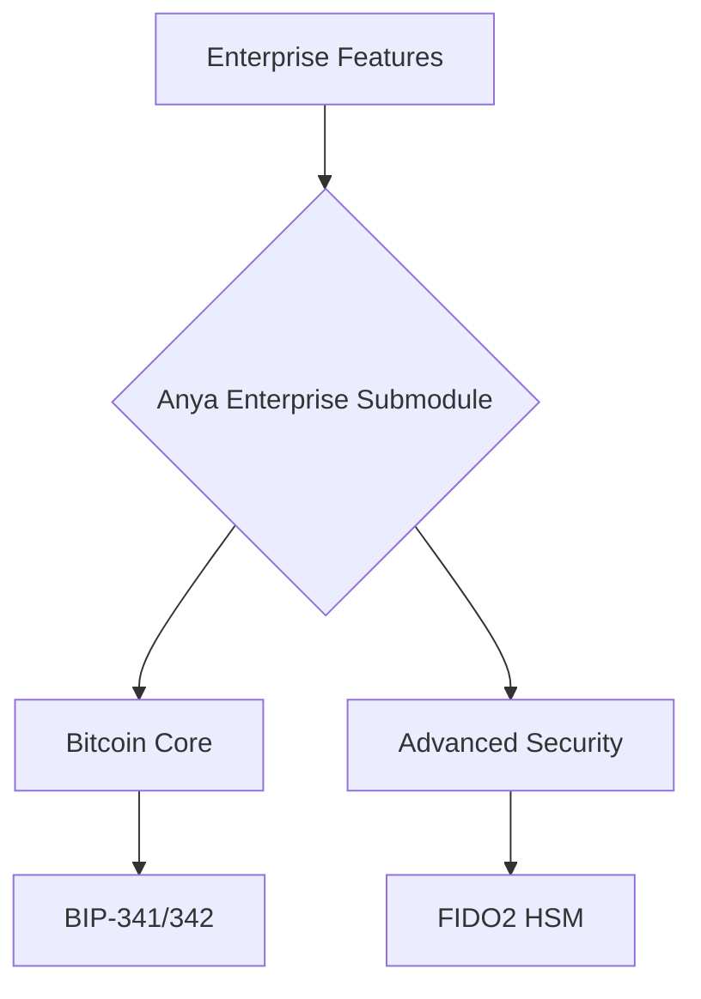

[AIR-3][AIS-3][BPC-3][RES-3]

## Architecture

## Overview

Add a brief overview of this document here.

## Table of Contents

- [Section 1](#section-1)
- [Section 2](#section-2)

## See Also

- [Related Document](#related-document)

