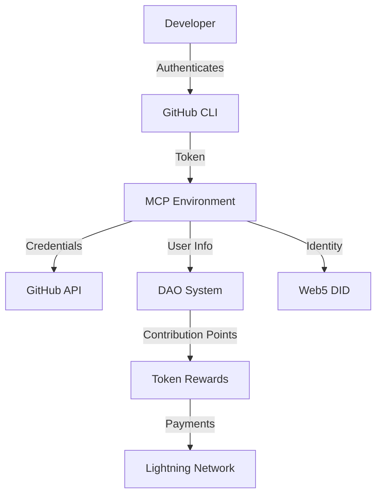

# GitHub CLI Authentication Integration Guide

## Overview

This document describes how GitHub CLI (gh) is used consistently for authentication across the Anya-Core project, enabling proper DAO contribution tracking and alignment with Web5 and Lightning authentication flows.

## Authentication Flow



## Key Components

### 1. GitHub CLI Authentication Modules

- **JavaScript Module**: `scripts/common/github-auth.js`
  - Provides functions for GitHub CLI authentication
  - Used by Node.js scripts and servers

- **Shell Script Module**: `scripts/common/github-auth.sh`
  - Provides functions for GitHub CLI authentication in shell scripts
  - Used by shell scripts and CI/CD pipelines

- **PowerShell Module**: `scripts/common/GitHub-Auth.psm1`
  - Provides functions for GitHub CLI authentication in PowerShell
  - Used by Windows developers and scripts

### 2. DAO Contribution Tracking

- **Contribution Tracker**: `dao/tools/contribution-tracker.js`
  - Tracks GitHub activity using GitHub CLI authentication
  - Maps activity to contribution points in the DAO system
  - Integrates with the DAO token economics
  - Supports full history tracking and different time periods

- **Contribution Config**: `dao/config/contribution_points.json`
  - Configures point values for different contribution types
  - Customizable by DAO governance

### 3. Integration with Web5 and Lightning

- **Web5 Integration**: Uses GitHub identity as a foundation for Web5 DID
- **Lightning Integration**: Connects GitHub identity to Lightning payment channels

## Usage

### Setting Up GitHub CLI Authentication

1. Install GitHub CLI:

   ```bash
   # Linux
   sudo apt install gh
   
   # macOS
   brew install gh
   
   # Windows
   choco install gh
   ```

2. Authenticate with GitHub:

   ```bash
   gh auth login
   ```

3. Verify authentication:

   ```bash
   gh auth status
   ```

### Automation Flags

All authentication scripts and tools support two automation flags for CI/CD pipelines and headless operations:

- `--auto-run`: Attempts to automatically login if not authenticated
- `--yes-all`: Uses default options for all prompts (non-interactive mode)

Example with automation flags:

```bash
# Automatically authenticate and use default options
./dao/tools/track-contributions.sh --auto-run --yes-all
```

```javascript
// Using auto-run in JavaScript
const githubAuth = require('./scripts/common/github-auth');
const env = githubAuth.setupMcpEnvironment({
  autoRun: true,
  yesAll: true
});
```

```powershell
# Using auto-run in PowerShell
Import-Module ./scripts/common/GitHub-Auth.psm1
Set-MCPEnvironment -AutoRun $true -YesAll $true
```

### Tracking DAO Contributions

1. Authenticate with GitHub CLI as described above

2. Run the contribution tracker:

   ```bash
   # Default tracks last 30 days
   ./dao/tools/track-contributions.sh
   
   # Track different time periods
   ./dao/tools/track-contributions.sh --period=week    # Last 7 days
   ./dao/tools/track-contributions.sh --period=month   # Last 30 days (default)
   ./dao/tools/track-contributions.sh --period=quarter # Last 91 days
   ./dao/tools/track-contributions.sh --period=year    # Last 365 days
   ./dao/tools/track-contributions.sh --period=all-time # Full project history
   
   # Force a full history scan (happens automatically on first run)
   ./dao/tools/track-contributions.sh --full-history
   
   # Combine with automation flags
   ./dao/tools/track-contributions.sh --period=quarter --auto-run --yes-all
   ```

3. View your contribution points:

   ```bash
   # View current period data
   cat dao/data/contribution_tracking.json | jq '.contributors.<your-username>'
   
   # View full history data
   cat dao/data/contribution_history.json | jq '.contributors.<your-username>'
   ```

### Contribution Metrics

The contribution tracker measures:

1. **Commits**: Direct code contributions
2. **Pull Requests**: Proposed code changes
3. **Reviews**: Code reviews performed on PRs
4. **Issues & Comments**: (Coming soon) Tracking for issues and comments

Each activity type has configurable point values in `dao/config/contribution_points.json`.

### Time Period Options

The contribution tracker supports the following time periods:

- `all-time`: Full project history (automatically run on first execution)
- `year`: Last 365 days of contributions
- `quarter`: Last 91 days (approximately 3 months)
- `month`: Last 30 days (default)
- `week`: Last 7 days

Data tracking follows these best practices:

1. Full history scan on first run to capture all contributions
2. Period-based tracking for routine DAO rewards and metrics
3. Quarterly contribution reviews aligned with token rewards
4. Web verification of all contribution data through GitHub API

## Security Considerations

1. **No Hardcoded Credentials**
   - All authentication is done via GitHub CLI
   - Token is retrieved securely and never stored in code

2. **Least Privilege**
   - Uses GitHub CLI's built-in token scoping
   - Only requests necessary permissions

3. **Token Handling**
   - Tokens are stored securely by GitHub CLI
   - Tokens are never logged or exposed

4. **Automation Safeguards**
   - Auto-run only attempts GitHub CLI login, never stores or manages credentials
   - Web authentication is preferred for automated login for security
   - Sensitive operations still require interactive confirmation unless --yes-all is specified

## Integration with CI/CD

For automated environments, use the `--auto-run` and `--yes-all` flags to enable non-interactive authentication:

```bash
# GitHub Actions example
- name: Track Contributions
  run: |
    gh auth login --with-token <<< "${{ secrets.GITHUB_TOKEN }}"
    ./dao/tools/track-contributions.sh --period=quarter --auto-run --yes-all
```

## Troubleshooting

If you encounter authentication issues:

1. Verify GitHub CLI is installed: `gh --version`
2. Check authentication status: `gh auth status`
3. Re-authenticate if needed: `gh auth login`
4. For CI/CD issues, ensure proper token scopes are provided
5. For automation issues, try running without `--auto-run` first to debug

## Future Enhancements

1. **Web5 DID Integration**
   - Map GitHub identity to Web5 DID for decentralized identity
   - Enable credential verification across platforms

2. **Lightning Network Integration**
   - Connect GitHub identity to Lightning wallet for automatic rewards
   - Enable token payments based on contribution points

3. **Enhanced Contribution Metrics**
   - Track issue and comment contributions
   - Weight contributions by complexity and impact
   - Integrate with code quality metrics
