[AIR-3][AIS-3][BPC-3][RES-3]

# Anya-Core Workspace Management Guide

## Overview

This document provides comprehensive guidance for managing the Anya-core workspace structure, documentation organization, and development workflow. The workspace follows Bitcoin protocol standards and enterprise-grade organization principles across four main modules with extensive documentation coverage.

## Table of Contents

- [Workspace Architecture](#workspace-architecture)
- [Module Structure](#module-structure)
- [Documentation Organization](#documentation-organization)
- [File Management Strategy](#file-management-strategy)
- [Development Workflow](#development-workflow)
- [Standards Compliance](#standards-compliance)
- [Maintenance Guidelines](#maintenance-guidelines)
- [Cleanup Recommendations](#cleanup-recommendations)


## Workspace Architecture

The Anya-core workspace follows a modular architecture with clear separation of concerns:

```mermaid
graph TD
    A[Root Workspace] --> B[anya-core]
    A --> C[anya-bitcoin]
    A --> D[anya-enterprise]
    A --> E[anya-extensions]
    A --> F[docs/]
    A --> G[scripts/]
    A --> H[.github/]
    
    B --> B1[Security Layer]
    B --> B2[Core APIs]
    B --> B3[Base Infrastructure]
    
    C --> C1[Bitcoin Protocol]
    C --> C2[Taproot Implementation]
    C --> C3[Layer 2 Support]
    
    D --> D1[Enterprise Features]
    D --> D2[High Volume Trading]
    D --> D3[Advanced Analytics]
    
    E --> E1[Extension System]
    E --> E2[Plugin Architecture]
    E --> E3[Third-party Integrations]
    
    F --> F1[35+ Doc Categories]
    F --> F2[API Documentation]
    F --> F3[Guides & Tutorials]
    
    style A fill:#f9f,stroke:#333,stroke-width:3px
    style F fill:#e1f5fe,stroke:#01579b
```



## Module Structure

### Core Modules

#### 1. anya-core/

**Purpose**: Base infrastructure and shared components

- **Location**: `/anya-core/`
- **Dependencies**: Foundation for all other modules
- **Key Features**: Security layer, core APIs, base infrastructure
- **Documentation**: Core system documentation, API references

#### 2. anya-bitcoin/

**Purpose**: Bitcoin protocol implementation and Layer 2 support

- **Location**: `/anya-bitcoin/`
- **Dependencies**: anya-core
- **Key Features**: Taproot, Lightning Network, DLCs, RGB protocol
- **Documentation**: Bitcoin compliance, BIP implementations

#### 3. anya-enterprise/

**Purpose**: Enterprise-grade features for commercial applications

- **Location**: `/anya-enterprise/`
- **Dependencies**: anya-core, anya-bitcoin
- **Key Features**: High-volume trading, advanced analytics, enterprise security
- **Documentation**: Enterprise guides, scaling documentation

#### 4. anya-extensions/

**Purpose**: Extensibility system for third-party integrations

- **Location**: `/anya-extensions/`
- **Dependencies**: anya-core
- **Key Features**: Plugin architecture, extension APIs
- **Documentation**: Extension development guides

## Documentation Organization

The documentation is organized into 35+ specialized categories:

### Documentation Categories

| Category | Purpose | Key Files | Status |
|----------|---------|-----------|--------|
| **Architecture** | System design and structure | `ARCHITECTURE.md`, `HEXAGONAL.md` | ✅ Complete |
| **Bitcoin** | Bitcoin protocol implementation | `BITCOIN_COMPLIANCE.md`, `BIP_COMPLIANCE.md` | ✅ Complete |
| **Security** | Security measures and audits | `SECURITY_*.md`, `HSM_*.md` | ✅ Complete |
| **API** | API documentation and references | `API.md`, `CLI_REFERENCE.md` | ✅ Complete |
| **Implementation** | Implementation guides and status | `IMPLEMENTATION_*.md` | ✅ Complete |
| **Testing** | Testing strategies and procedures | `TESTING_*.md` | ✅ Complete |
| **Deployment** | Deployment and installation | `DEPLOYMENT.md`, `./INSTALLATION.md` | ✅ Complete |
| **Enterprise** | Enterprise features and guides | `ENTERPRISE_*.md` | ✅ Complete |
| **Web5** | Web5 integration documentation | `WEB5_*.md` | ✅ Complete |
| **DAO** | DAO system documentation | `DAO_*.md`, `GOVERNANCE_*.md` | ✅ Complete |
| **Workspace** | Workspace management | `WORKSPACE_MANAGEMENT.md` | 🔄 In Progress |

### Documentation Standards

All documentation follows these standards:

- **AI Labeling**: `[AIR-3][AIS-3][BPC-3][RES-3]` tags
- **Frontmatter**: YAML metadata with title, description, last_updated
- **Structure**: Consistent table of contents and section organization
- **Bitcoin Compliance**: Alignment with official BIP standards
- **Professional Quality**: Enterprise-grade documentation standards

## File Management Strategy

### Complete Files (Do Not Modify)

These files have undergone comprehensive QA and are production-ready:

**Core Documentation**:

- `DOCUMENTATION_QA_COMPLETE.md` - QA completion report
- `BITCOIN_COMPLIANCE.md` - BIP compliance documentation
- `SECURITY_*.md` files - Security documentation suite
- `IMPLEMENTATION_*.md` files - Implementation documentation

**Architecture Documentation**:

- `ARCHITECTURE.md` - System architecture
- `HEXAGONAL.md` - Hexagonal architecture implementation
- `SYSTEM_MAP.md` - System mapping documentation

### Files Needing Completion

**High Priority**:

- `WORKSPACE_MANAGEMENT.md` - This file (in progress)
- Files with line notations (partial completion indicators)

**Medium Priority**:

- Template files that need customization
- Placeholder documentation requiring content

### Duplicate Files for Cleanup

| Original | Duplicate | Action |
|----------|-----------|--------|
| `ARCHITECTURE.md` | `architecture.md` | Remove lowercase version |
| `CONTRIBUTING.md` | `contributing.md` | Merge and standardize |
| `WEB5_INTEGRATION.md` | `web5_integration.md` | Remove underscore version |
| `TROUBLESHOOTING.md` | `TROUBLESHOOTING.md (lines 23-25)` | Remove partial file |

## Development Workflow

### Directory Navigation

**Primary Navigation Structure**:

```
/docs/
├── Core Documentation (Root level)
├── _layouts/ (Jekyll templates)
├── ai/ (AI and ML documentation)
├── api/ (API documentation)
├── architecture/ (Architecture diagrams and docs)
├── bitcoin/ (Bitcoin-specific documentation)
├── dao/ (DAO system documentation)
├── security/ (Security documentation)
├── testing/ (Testing documentation)
└── [28 more specialized directories]
```

### Working with Documentation

**Before Making Changes**:

1. Check `DOCUMENTATION_QA_COMPLETE.md` for completion status
2. Verify file is not in "Complete Files" list
3. Follow established template structure
4. Ensure AI labeling compliance

**File Creation Process**:

1. Copy `.template.md` as starting point
2. Update frontmatter with appropriate metadata
3. Add required AI labeling tags
4. Follow established section structure
5. Add to appropriate directory category

## Standards Compliance

### Bitcoin Protocol Compliance (BPC-3)

| Component | BIP Standard | Implementation Status |
|-----------|--------------|----------------------|
| Taproot | BIP-341 | ✅ Fully Implemented |
| Tapscript | BIP-342 | ✅ Fully Implemented |
| PSBT v2 | BIP-174/370 | ✅ Fully Implemented |
| Miniscript | - | ✅ Fully Implemented |

### AI Integration Standards (AIS-3)

All documentation includes:

- `[AIR-3]` - AI Reasoning level 3
- `[AIS-3]` - AI Security level 3  
- `[BPC-3]` - Bitcoin Protocol Compliance level 3
- `[RES-3]` - Resource management level 3

## Maintenance Guidelines

### Regular Maintenance Tasks

**Weekly**:

- Check for new files requiring AI labeling
- Update `last_updated` dates in modified files
- Verify documentation links functionality

**Monthly**:

- Check for duplicate files
- Update dependency matrices
- Verify BIP compliance status

**Quarterly**:

- Comprehensive documentation audit
- Update workspace structure diagrams
- Review and optimize directory organization

### Quality Assurance Checklist

Before committing documentation changes:

- [ ] AI labeling tags present
- [ ] Frontmatter properly formatted
- [ ] Table of contents updated
- [ ] Internal links verified
- [ ] Code examples tested
- [ ] Grammar and formatting checked

## Cleanup Recommendations

### Immediate Actions Required

1. **Remove Duplicate Files**:

   ```bash
   # Remove lowercase duplicates
   rm docs/architecture.md
   rm docs/contributing.md
   rm docs/web5_integration.md
   
   # Remove partial/broken files
   rm "docs/TROUBLESHOOTING.md (lines 23-25)"
   ```

2. **Complete Incomplete Files**:
   - Complete any files marked as templates
   - Fill in placeholder content

3. **Organize Directory Structure**:
   - Ensure all files are in appropriate subdirectories
   - Consolidate related documentation
   - Update navigation indices

### Long-term Optimization

1. **Documentation Consolidation**:
   - Merge related files where appropriate
   - Create comprehensive guides from scattered information
   - Establish clear documentation hierarchies

2. **Automation Implementation**:
   - Automated link checking
   - AI labeling verification
   - Documentation freshness monitoring

3. **Standards Enforcement**:
   - Pre-commit hooks for documentation standards
   - Automated frontmatter validation
   - Consistency checking tools

## See Also

- [Documentation QA Complete Report](DOCUMENTATION_QA_COMPLETE.md)
- [Bitcoin Compliance Documentation](../protocol/BITCOIN_COMPLIANCE.md)
- [System Architecture Overview](../ai/ARCHITECTURE.md)
- [Security Framework Documentation](../maintenance/SECURITY.md)
- [Development Setup Guide](../dev_setup.md)

