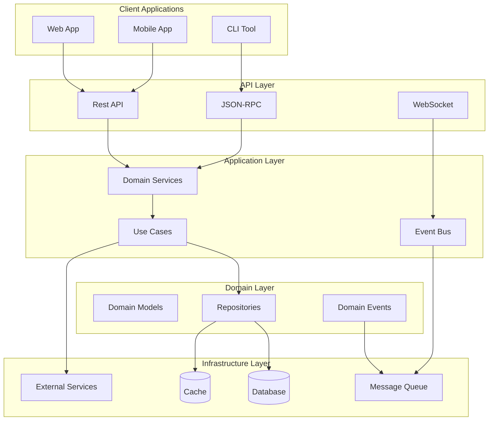
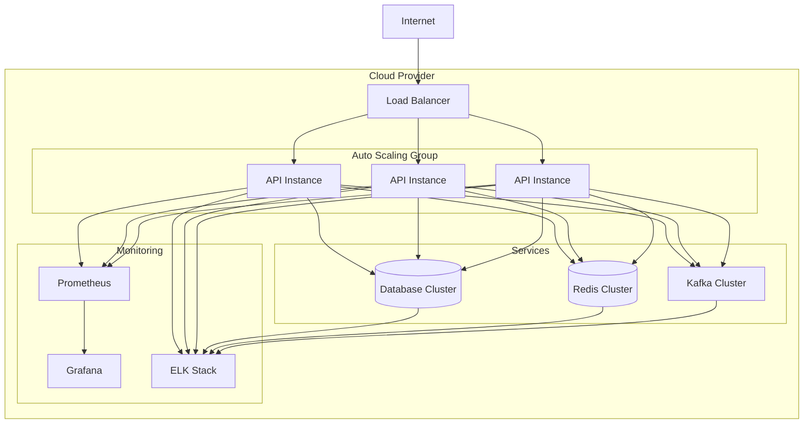

[AIR-3][AIS-3][BPC-3][RES-3]

# Anya Core Architecture

## Overview

Add a brief overview of this document here.

## Table of Contents

- [Section 1](#section-1)
- [Section 2](#section-2)

This document describes the high-level architecture of Anya Core.

## System Overview

## Component Descriptions

### Client Applications

- **Web App**: Browser-based user interface
- **Mobile App**: Native mobile applications
- **CLI Tool**: Command-line interface for developers

### API Layer

- **REST API**: HTTP/HTTPS endpoints for web and mobile clients
- **JSON-RPC**: Remote procedure calls for CLI and system integration
- **WebSocket**: Real-time event streaming

### Application Layer

- **Domain Services**: Core business logic
- **Use Cases**: Application-specific workflows
- **Event Bus**: Handles domain events and integration events

### Domain Layer

- **Domain Models**: Core business entities and value objects
- **Repositories**: Data access interfaces
- **Domain Events**: Events that represent state changes in the domain

### Infrastructure Layer

- **Database**: Persistent data storage
- **Cache**: High-speed data access layer
- **Message Queue**: Asynchronous message processing
- **External Services**: Third-party integrations

## Data Flow

1. Client applications send requests through the API layer
2. The application layer processes requests using domain services
3. Domain services coordinate between domain models and repositories
4. Repositories interact with the infrastructure layer for data persistence
5. Domain events are published and processed asynchronously
6. Responses are returned to clients through the API layer

## Deployment Architecture

## Security Architecture

### Authentication

- JWT-based authentication
- OAuth 2.0 / OpenID Connect
- API key authentication for services

### Authorization

- Role-based access control (RBAC)
- Attribute-based access control (ABAC)
- Policy-based access control (PBAC)

### Data Protection

- Encryption at rest (AES-256)
- Encryption in transit (TLS 1.3)
- Field-level encryption for sensitive data

## Performance Considerations

### Caching Strategy

- Multi-level caching (in-memory, distributed, CDN)
- Cache invalidation policies
- Stale-while-revalidate pattern

### Database Optimization

- Read replicas for scaling reads
- Sharding for horizontal scaling
- Connection pooling

### Asynchronous Processing

- Event-driven architecture
- Background job processing
- Batch processing for heavy operations

## Monitoring and Observability

### Metrics

- System metrics (CPU, memory, disk, network)
- Application metrics (request rate, error rate, latency)
- Business metrics (transactions, active users)

### Logging

- Structured logging with correlation IDs
- Log aggregation and analysis
- Log retention policies

### Tracing

- Distributed tracing across services
- Performance analysis
- Dependency mapping

## See Also

- [Related Document](#related-document)

