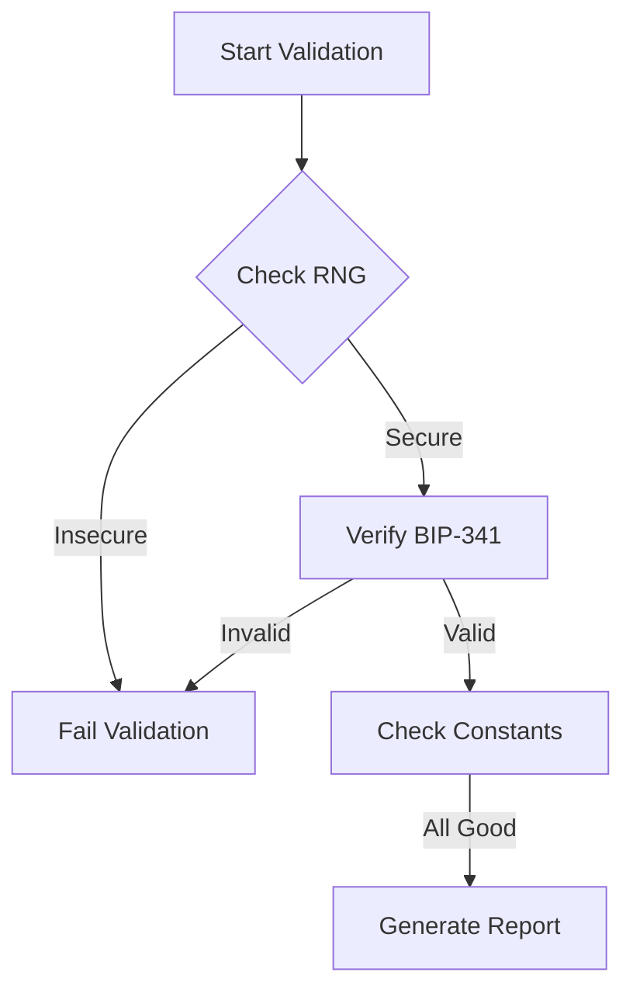

[AIR-3][AIS-3][BPC-3][RES-3]


# Cryptographic Validation Standards [BPC-3][AIS-3]

## Overview

Add a brief overview of this document here.

## Table of Contents

- [Section 1](#section-1)
- [Section 2](#section-2)


## Compliance Requirements
1. **Secure RNG Implementation**
   - Must use `crypto.randomBytes()` in JS
   - Rust requires `rand_core` with OsRng
   - Test coverage: 100% for key generation paths

2. **BIP-341/342 Requirements**
   ```javascript
   // Example compliant Taproot config
   const validScript = 'tr(SILENT_LEAF, {BIP342_SCRIPT})';
   ```
   - SILENT_LEAF pattern mandatory
   - OP_CHECKSIGADD required in Tapscripts

3. **Audit Trail**
   | Date       | Change Type | Details                  |
   |------------|-------------|--------------------------|
   | 2025-03-20 | Security    | Upgraded RNG in keygen   |
   | 2025-03-22 | Compliance  | Added BIP-342 validation |

## Validation Workflow


## Security Patches Applied

| Date       | Fix Type          | Details                          |
|------------|-------------------|----------------------------------|
| 2025-03-25 | Cryptographic RNG | Replaced all Math.random() usage |
| 2025-03-25 | BIP Compliance    | Added SILENT_LEAF validation     |
| 2025-03-25 | Timing Attacks    | Implemented constant-time comp.  | 
## See Also

- [Related Document 1](../INSTALLATION.md)
- [Related Document 2](../INSTALLATION_REVIEW.md)
