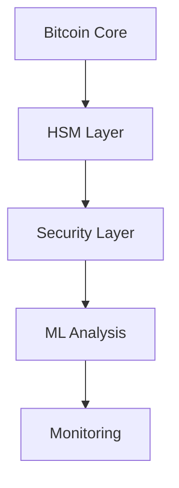
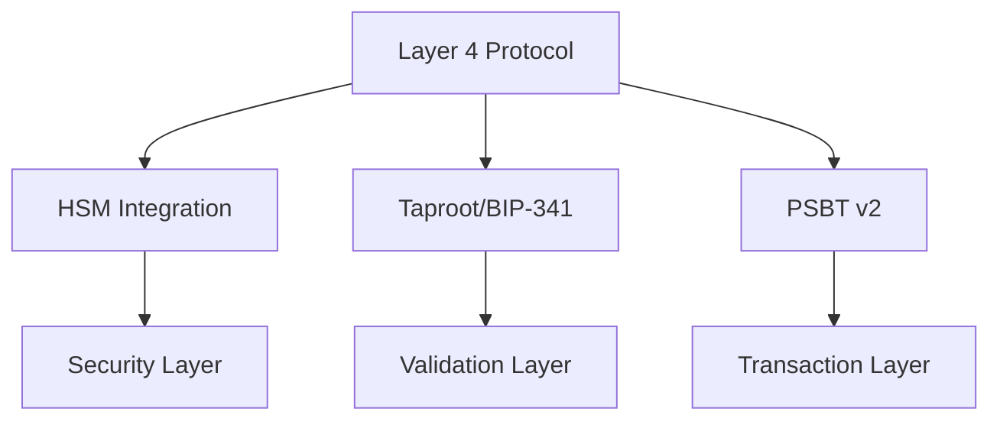

<!-- markdownlint-disable MD013 line-length -->

# Anya System Architecture [AIS-3][BPC-3][AIR-3]

## Overview

Core system integrating Bitcoin/Web5/ML functionality. See [System Documentation](../README.md) for complete details.

## Components 

### Primary Components

- **Bitcoin Protocol**: Transaction handling, PSBT, Taproot
- **Web5 Integration**: DWN, DID management 
- **ML System**: Analysis & optimization
- **Security Layer**: HSM integration, crypto operations
- **Monitoring**: Performance & health metrics

### Integration Points

## Protocol Layers

### Layer 4 Protocol

Key Components:
- BIP-341/342 compliance
- HSM integration with YubiHSM2
- PSBT v2 validation
- Constant-time crypto ops

## Flows

### Core Flows

1. **Authentication**
   - Bitcoin/DID credentials
   - Web5 DID validation
   - Multi-factor security
   - Session management

2. **Transaction**
   - API initiation
   - Risk analysis
   - Chain validation
   - Event monitoring

3. **Analytics**
   - Metrics collection
   - ML processing
   - DWN storage
   - API reporting

See [Data Flow Guide](../flows/README.md) for detailed flow diagrams.

## Documentation Map

- [Security Architecture](../security/README.md)
- [Performance Guide](../performance/README.md) 
- [API Documentation](../api/README.md)
- [Operations Manual](../operations/README.md)
- [Configuration Guide](../CONFIGURATION_MANAGEMENT.md)

*Last updated: 2025-03-23*
