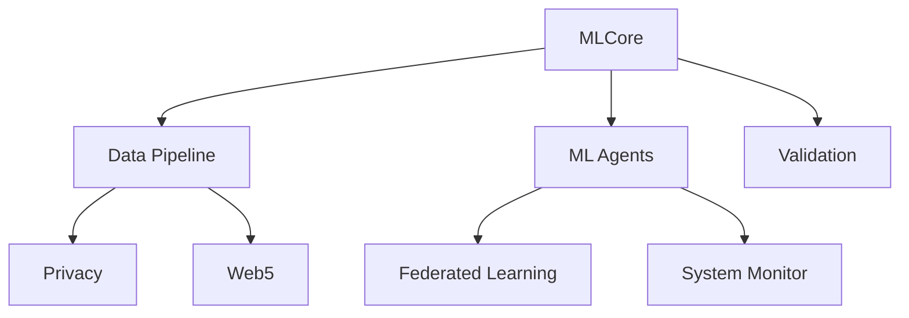
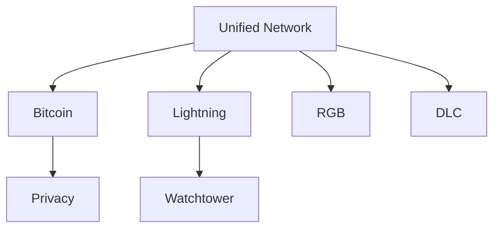
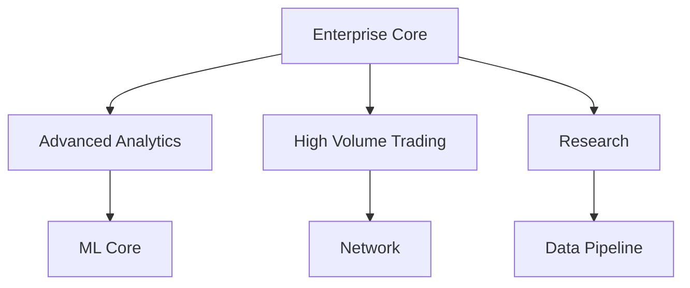

[AIR-3][AIS-3][BPC-3][RES-3]

<!-- markdownlint-disable MD013 line-length -->

// docs/DEPENDENCIES.md

# System Dependencies

## Overview

Add a brief overview of this document here.

## Table of Contents

 Section 1
 Section 2

## ML System Dependencies

## Network Dependencies

## Enterprise Dependencies

*Last updated: 2025-06-02*

## See Also

- [Related Document](#related-document)

