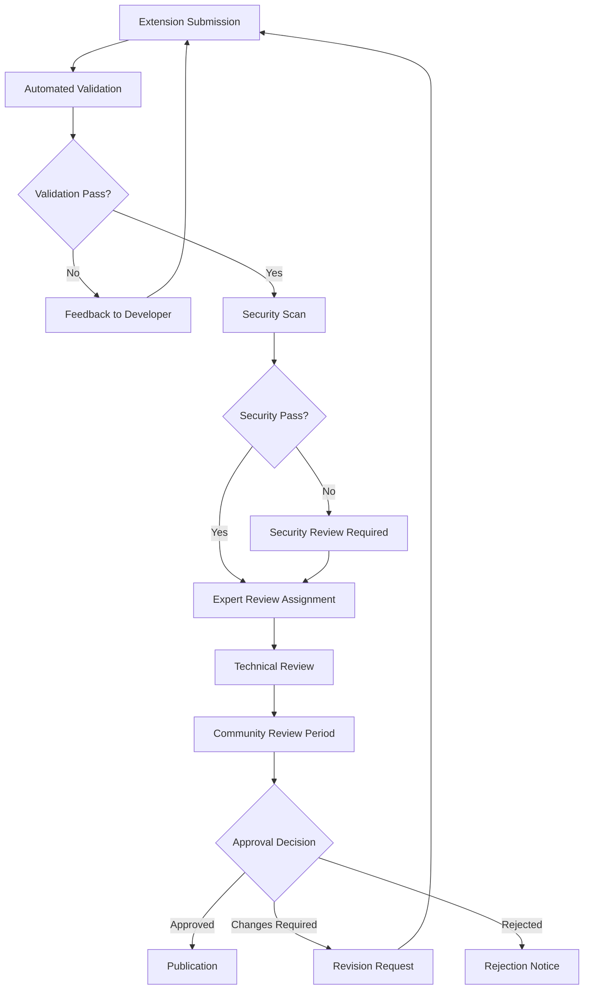

# Review Process

Comprehensive review process for Anya Extensions ensuring quality, security, and compliance with Bitcoin, Web5, and ML standards. Our multi-tiered review system balances thorough evaluation with efficient processing.

## Overview

The Anya Extensions review process is designed to maintain the highest standards of quality, security, and reliability while fostering innovation in the Bitcoin, Web5, and ML ecosystem. Our process combines automated validation, expert human review, and community feedback.

## Review Workflow



## Review Stages

### Stage 1: Automated Validation

Immediate automated checks that all submissions must pass before human review.

#### Code Quality Checks

```yaml
# .anya-ci.yml configuration
validation:
  rust:
    format: true           # rustfmt compliance
    lint: true            # clippy warnings as errors
    test_coverage: 80     # minimum test coverage
    
  security:
    audit: true           # cargo audit for vulnerabilities
    ban_unsafe: false     # allow unsafe blocks with justification
    crypto_review: true   # cryptographic code validation
    
  documentation:
    api_docs: true        # rustdoc for all public APIs
    readme: true          # comprehensive README
    examples: true        # working code examples
```

#### Structure Validation

- **Directory Structure**: Compliance with extension layout standards
- **Cargo.toml**: Proper metadata and dependency management
- **License**: Valid and compatible open source license
- **Documentation**: Required documentation files present

#### Automated Test Suite

```rust
// Example automated validation tests
#[test]
fn validate_extension_structure() {
    assert!(Path::new("src/lib.rs").exists());
    assert!(Path::new("Cargo.toml").exists());
    assert!(Path::new("README.md").exists());
    assert!(Path::new("LICENSE").exists());
}

#[test]
fn validate_api_documentation() {
    let output = Command::new("cargo")
        .args(&["doc", "--no-deps"])
        .output()
        .expect("Failed to generate docs");
    
    assert!(output.status.success());
}

#[test]
fn validate_test_coverage() {
    let coverage = run_coverage_analysis();
    assert!(coverage >= 80.0, "Test coverage below 80%: {}", coverage);
}
```

### Stage 2: Security Screening

Comprehensive security analysis focusing on cryptographic implementations, key management, and vulnerability assessment.

#### Automated Security Scans

- **Dependency Audit**: Check for known vulnerabilities in dependencies
- **Static Analysis**: Code analysis for common security anti-patterns
- **Cryptographic Review**: Validation of cryptographic implementations
- **Secrets Detection**: Scan for accidentally committed secrets or keys

#### Security Categories

```rust
// Security classification system
#[derive(Debug, Clone)]
pub enum SecurityLevel {
    Low,        // Basic extensions with minimal security impact
    Medium,     // Extensions handling user data or network operations
    High,       // Extensions managing keys or financial operations
    Critical,   // Extensions with custody or significant financial impact
}

// Review requirements by security level
impl SecurityLevel {
    fn review_requirements(&self) -> ReviewRequirements {
        match self {
            SecurityLevel::Low => ReviewRequirements {
                automated_scan: true,
                manual_review: false,
                security_expert: false,
                penetration_test: false,
            },
            SecurityLevel::Medium => ReviewRequirements {
                automated_scan: true,
                manual_review: true,
                security_expert: false,
                penetration_test: false,
            },
            SecurityLevel::High => ReviewRequirements {
                automated_scan: true,
                manual_review: true,
                security_expert: true,
                penetration_test: false,
            },
            SecurityLevel::Critical => ReviewRequirements {
                automated_scan: true,
                manual_review: true,
                security_expert: true,
                penetration_test: true,
            },
        }
    }
}
```

### Stage 3: Expert Technical Review

Domain experts review extensions for technical correctness, architecture, and ecosystem integration.

#### Review Team Structure

- **Bitcoin Experts**: BIP compliance, Bitcoin Core integration, Lightning Network
- **Web5 Specialists**: DID standards, decentralized protocols, identity management
- **ML Engineers**: Model validation, algorithmic fairness, performance optimization
- **Security Auditors**: Cryptographic implementations, vulnerability assessment
- **Integration Specialists**: API design, ecosystem compatibility, performance

#### Review Criteria

##### Bitcoin Extensions

```markdown
## Bitcoin Review Checklist

### BIP Compliance
- [ ] Correctly implements relevant BIPs
- [ ] Maintains compatibility with Bitcoin Core
- [ ] Follows established Bitcoin development patterns
- [ ] Proper handling of different network types (mainnet/testnet/signet)

### Transaction Handling
- [ ] Secure transaction construction and validation
- [ ] Proper fee estimation and RBF handling
- [ ] Script validation and execution safety
- [ ] UTXO management and coin selection

### Network Integration
- [ ] P2P protocol compliance where applicable
- [ ] Proper handling of network messages
- [ ] Resilient connection management
- [ ] DoS protection mechanisms

### Cryptographic Security
- [ ] Secure key generation and management
- [ ] Proper signature creation and verification
- [ ] Protection against timing attacks
- [ ] Secure random number generation
```

##### Web5 Extensions

```markdown
## Web5 Review Checklist

### DID Compliance
- [ ] W3C DID specification compliance
- [ ] Proper DID method implementation
- [ ] Secure key management for DID operations
- [ ] Privacy-preserving identity operations

### Data Sovereignty
- [ ] User-controlled data storage
- [ ] Proper access control mechanisms
- [ ] Data portability and interoperability
- [ ] Privacy by design implementation

### Protocol Integration
- [ ] Correct Web5 protocol implementation
- [ ] Secure communication patterns
- [ ] Proper error handling and recovery
- [ ] Performance optimization
```

##### ML Extensions

```markdown
## ML Review Checklist

### Model Validation
- [ ] Comprehensive model testing and validation
- [ ] Performance metrics and benchmarks
- [ ] Bias detection and mitigation strategies
- [ ] Model interpretability and explainability

### Data Handling
- [ ] Privacy-preserving data processing
- [ ] Secure data storage and transmission
- [ ] Data quality and validation
- [ ] Compliance with data protection regulations

### Algorithmic Fairness
- [ ] Bias testing across different demographics
- [ ] Fairness metrics and monitoring
- [ ] Transparent decision-making processes
- [ ] Ethical AI considerations
```

### Stage 4: Community Review

Public review period allowing community feedback and participation in the evaluation process.

#### Community Review Process

1. **Public Announcement**: Extension details published for community review
2. **Review Period**: 14-day minimum review period for community feedback
3. **Expert Response**: Review team responds to community concerns
4. **Revision Period**: Opportunity for developers to address feedback
5. **Final Evaluation**: Comprehensive evaluation including community input

#### Community Participation

```markdown
## Community Review Guidelines

### How to Participate
1. Visit the community review board
2. Select extensions under review
3. Provide constructive technical feedback
4. Focus on security, usability, and ecosystem fit

### Review Focus Areas
- **Usability**: Is the extension easy to understand and use?
- **Documentation**: Is the documentation clear and comprehensive?
- **Integration**: How well does it integrate with existing tools?
- **Innovation**: Does it provide valuable new functionality?
- **Stability**: Is the implementation robust and reliable?

### Feedback Format
Please structure feedback as:
- **Issue Description**: Clear description of the concern
- **Impact Assessment**: Potential impact on users and ecosystem
- **Suggested Resolution**: Constructive suggestions for improvement
- **Priority Level**: Critical, High, Medium, or Low priority
```

## Review Timeline

### Standard Review Process

```
Day 0:   Submission received, automated validation begins
Day 1:   Automated validation complete, security scan initiated
Day 3:   Security scan complete, expert review assignment
Day 5:   Technical review begins
Day 10:  Initial technical review complete
Day 11:  Community review period begins
Day 25:  Community review period ends
Day 27:  Final evaluation and decision
Day 30:  Publication or revision request
```

### Expedited Review (Critical Security Updates)

```
Day 0:   Emergency submission received
Day 1:   Automated validation and security scan
Day 2:   Expert review prioritized
Day 3:   Abbreviated community review (48 hours)
Day 5:   Final evaluation and decision
Day 6:   Publication or rejection
```

## Reviewer Guidelines

### Technical Review Standards

- **Thorough Analysis**: Comprehensive examination of code, architecture, and documentation
- **Constructive Feedback**: Specific, actionable feedback for improvements
- **Standard Compliance**: Verification of compliance with relevant standards and BIPs
- **Security Focus**: Special attention to security implications and best practices

### Review Documentation

```rust
// Example review report structure
#[derive(Debug, Serialize)]
pub struct ReviewReport {
    pub extension_id: String,
    pub reviewer_id: String,
    pub review_date: DateTime<Utc>,
    pub category: ExtensionCategory,
    pub security_level: SecurityLevel,
    pub findings: Vec<ReviewFinding>,
    pub recommendation: ReviewRecommendation,
    pub additional_notes: Option<String>,
}

#[derive(Debug, Serialize)]
pub struct ReviewFinding {
    pub severity: FindingSeverity,
    pub category: FindingCategory,
    pub description: String,
    pub location: Option<String>,
    pub suggestion: Option<String>,
}

#[derive(Debug, Serialize)]
pub enum ReviewRecommendation {
    Approve,
    ApproveWithConditions(Vec<String>),
    RequestRevisions(Vec<String>),
    Reject(String),
}
```

## Appeals Process

### Revision Requests

If revisions are requested:

1. **Detailed Feedback**: Specific issues and suggested improvements provided
2. **Revision Period**: 30 days to address feedback and resubmit
3. **Re-review**: Focused review of changes and issue resolution
4. **Final Decision**: Approval, additional revisions, or rejection

### Appeal Process

For rejected submissions:

1. **Appeal Request**: Formal appeal with justification for reconsideration
2. **Independent Review**: Review by different expert panel
3. **Community Input**: Additional community feedback period
4. **Final Determination**: Binding decision on appeal

## Quality Assurance

### Reviewer Qualification

- **Domain Expertise**: Proven expertise in relevant technology areas
- **Community Standing**: Positive reputation within the community
- **Review Training**: Completion of reviewer training and certification
- **Ongoing Education**: Continuous learning and skill development

### Review Quality Metrics

```rust
// Review quality tracking
#[derive(Debug)]
pub struct ReviewMetrics {
    pub average_review_time: Duration,
    pub approval_rate: f64,
    pub revision_rate: f64,
    pub community_satisfaction: f64,
    pub post_publication_issues: u32,
}

impl ReviewMetrics {
    pub fn calculate_reviewer_score(&self) -> f64 {
        // Weighted scoring system for reviewer performance
        let time_score = self.time_efficiency_score();
        let quality_score = self.quality_effectiveness_score();
        let community_score = self.community_satisfaction;
        
        (time_score * 0.3 + quality_score * 0.5 + community_score * 0.2)
    }
}
```

## Continuous Improvement

### Process Evolution

- **Regular Review**: Quarterly review of process effectiveness
- **Community Feedback**: Ongoing feedback collection from developers and users
- **Metric Analysis**: Analysis of review metrics and outcomes
- **Process Updates**: Continuous improvement based on data and feedback

### Tool Development

- **Automation Enhancement**: Improved automated validation and testing
- **Review Tools**: Better tools for reviewers and community participants
- **Integration Improvements**: Streamlined integration with development workflows
- **Performance Optimization**: Faster review processing without compromising quality

## Support and Resources

### Developer Support

- **Review Preparation**: Guidelines and tools for preparing successful submissions
- **Feedback Understanding**: Help interpreting review feedback and requirements
- **Revision Assistance**: Support for addressing review comments and issues
- **Best Practices**: Ongoing education about development and submission best practices

### Reviewer Resources

- **Training Materials**: Comprehensive training for new reviewers
- **Review Tools**: Advanced tools for efficient and thorough review
- **Expert Consultation**: Access to specialized expertise for complex reviews
- **Community Coordination**: Tools for coordinating with community reviewers

*Last updated: June 7, 2025*
