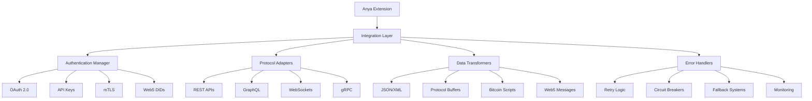

# Third-Party Integration

Comprehensive guide for integrating Anya Extensions with external services, platforms, and systems. This document covers Bitcoin exchanges, Web5 services, ML platforms, cloud providers, and enterprise systems.

## Overview

Third-party integration enables Anya Extensions to interact with external systems while maintaining security, reliability, and compliance. Our integration framework supports various protocols, authentication methods, and data formats across the Bitcoin, Web5, and ML ecosystems.

## Integration Architecture



## Bitcoin Exchange Integration

### Exchange API Patterns

#### REST API Integration

```rust
use anya_extensions::integrations::bitcoin::{ExchangeClient, ExchangeConfig};
use serde::{Deserialize, Serialize};

#[derive(Debug, Deserialize)]
pub struct ExchangeRate {
    pub pair: String,
    pub price: f64,
    pub volume: f64,
    pub timestamp: i64,
}

#[derive(Debug, Serialize)]
pub struct OrderRequest {
    pub symbol: String,
    pub side: String,      // "buy" or "sell"
    pub amount: f64,
    pub price: Option<f64>, // None for market orders
    pub order_type: String, // "market", "limit", "stop"
}

// Exchange client implementation
pub struct BitcoinExchangeIntegration {
    client: ExchangeClient,
    api_credentials: ApiCredentials,
}

impl BitcoinExchangeIntegration {
    pub fn new(config: ExchangeConfig) -> Result<Self, IntegrationError> {
        let client = ExchangeClient::new(config.base_url)
            .timeout(Duration::from_secs(30))
            .rate_limit(config.rate_limit)
            .build()?;
            
        Ok(Self {
            client,
            api_credentials: config.credentials,
        })
    }
    
    pub async fn get_ticker(&self, symbol: &str) -> Result<ExchangeRate, IntegrationError> {
        let url = format!("/api/v1/ticker/{}", symbol);
        
        let response = self.client
            .get(&url)
            .auth(&self.api_credentials)
            .send()
            .await?;
            
        let rate: ExchangeRate = response.json().await?;
        Ok(rate)
    }
    
    pub async fn place_order(&self, order: OrderRequest) -> Result<OrderResponse, IntegrationError> {
        let url = "/api/v1/orders";
        
        let response = self.client
            .post(url)
            .auth(&self.api_credentials)
            .json(&order)
            .send()
            .await?;
            
        if !response.status().is_success() {
            return Err(IntegrationError::ExchangeError(
                response.text().await?
            ));
        }
        
        let order_response: OrderResponse = response.json().await?;
        Ok(order_response)
    }
}
```

#### WebSocket Integration for Real-time Data

```rust
use tokio_tungstenite::{connect_async, tungstenite::Message};
use futures_util::{SinkExt, StreamExt};

pub struct ExchangeWebSocket {
    stream: WebSocketStream<MaybeTlsStream<TcpStream>>,
}

impl ExchangeWebSocket {
    pub async fn connect(url: &str) -> Result<Self, IntegrationError> {
        let (ws_stream, _) = connect_async(url).await?;
        
        Ok(Self {
            stream: ws_stream,
        })
    }
    
    pub async fn subscribe_to_ticker(&mut self, symbol: &str) -> Result<(), IntegrationError> {
        let subscription = json!({
            "method": "SUBSCRIBE",
            "params": [format!("{}@ticker", symbol.to_lowercase())],
            "id": 1
        });
        
        self.stream
            .send(Message::Text(subscription.to_string()))
            .await?;
            
        Ok(())
    }
    
    pub async fn listen_for_updates(&mut self) -> Result<ExchangeUpdate, IntegrationError> {
        while let Some(message) = self.stream.next().await {
            match message? {
                Message::Text(text) => {
                    let update: ExchangeUpdate = serde_json::from_str(&text)?;
                    return Ok(update);
                }
                Message::Ping(data) => {
                    self.stream.send(Message::Pong(data)).await?;
                }
                _ => continue,
            }
        }
        
        Err(IntegrationError::ConnectionClosed)
    }
}
```

### Lightning Network Integration

#### Lightning Service Providers

```rust
use anya_extensions::lightning::{LightningClient, Invoice, Payment};

pub struct LightningServiceIntegration {
    client: LightningClient,
    node_credentials: NodeCredentials,
}

impl LightningServiceIntegration {
    pub async fn create_invoice(
        &self,
        amount_msats: u64,
        description: &str,
        expiry: Duration,
    ) -> Result<Invoice, IntegrationError> {
        let invoice_request = InvoiceRequest {
            amount_msats: Some(amount_msats),
            description: description.to_string(),
            expiry_secs: expiry.as_secs(),
            private: false,
        };
        
        let response = self.client
            .post("/v1/invoices")
            .bearer_auth(&self.node_credentials.macaroon)
            .json(&invoice_request)
            .send()
            .await?;
            
        let invoice: Invoice = response.json().await?;
        Ok(invoice)
    }
    
    pub async fn pay_invoice(&self, payment_request: &str) -> Result<Payment, IntegrationError> {
        let payment_req = PaymentRequest {
            payment_request: payment_request.to_string(),
            timeout_secs: 60,
            fee_limit_msat: Some(1000), // 1 sat fee limit
        };
        
        let response = self.client
            .post("/v1/payments")
            .bearer_auth(&self.node_credentials.macaroon)
            .json(&payment_req)
            .send()
            .await?;
            
        let payment: Payment = response.json().await?;
        Ok(payment)
    }
    
    pub async fn get_channel_balance(&self) -> Result<ChannelBalance, IntegrationError> {
        let response = self.client
            .get("/v1/balance/channels")
            .bearer_auth(&self.node_credentials.macaroon)
            .send()
            .await?;
            
        let balance: ChannelBalance = response.json().await?;
        Ok(balance)
    }
}
```

## Web5 Service Integration

### Decentralized Web Node (DWN) Integration

#### DWN Client Implementation

```rust
use anya_extensions::web5::{DwnClient, DidDocument, VerifiableCredential};

pub struct DwnIntegration {
    client: DwnClient,
    did_document: DidDocument,
}

impl DwnIntegration {
    pub async fn new(did: &str, private_key: &str) -> Result<Self, IntegrationError> {
        let did_document = DidDocument::resolve(did).await?;
        let client = DwnClient::new(&did_document.service_endpoints[0].endpoint)?;
        
        Ok(Self {
            client,
            did_document,
        })
    }
    
    pub async fn store_data(
        &self,
        data: Vec<u8>,
        content_type: &str,
        schema: Option<&str>,
    ) -> Result<String, IntegrationError> {
        let record_request = RecordCreateRequest {
            data,
            message: RecordMessage {
                descriptor: RecordDescriptor {
                    interface: "Records".to_string(),
                    method: "Write".to_string(),
                    protocol: schema.map(|s| s.to_string()),
                    schema: schema.map(|s| s.to_string()),
                    data_format: content_type.to_string(),
                },
                authorization: self.create_authorization().await?,
            },
        };
        
        let response = self.client
            .post("/records")
            .json(&record_request)
            .send()
            .await?;
            
        let record_response: RecordResponse = response.json().await?;
        Ok(record_response.record_id)
    }
    
    pub async fn query_records(
        &self,
        filter: RecordFilter,
    ) -> Result<Vec<Record>, IntegrationError> {
        let query_request = RecordsQueryRequest {
            message: QueryMessage {
                descriptor: QueryDescriptor {
                    interface: "Records".to_string(),
                    method: "Query".to_string(),
                    filter,
                },
                authorization: self.create_authorization().await?,
            },
        };
        
        let response = self.client
            .post("/records/query")
            .json(&query_request)
            .send()
            .await?;
            
        let query_response: QueryResponse = response.json().await?;
        Ok(query_response.entries)
    }
}
```

### Verifiable Credential Services

#### Credential Registry Integration

```rust
use anya_extensions::web5::credentials::{CredentialRegistry, CredentialSchema};

pub struct CredentialServiceIntegration {
    registry: CredentialRegistry,
    issuer_did: String,
}

impl CredentialServiceIntegration {
    pub async fn issue_credential(
        &self,
        subject_did: &str,
        credential_type: &str,
        claims: serde_json::Value,
    ) -> Result<VerifiableCredential, IntegrationError> {
        let credential = VerifiableCredential::builder()
            .issuer(&self.issuer_did)
            .subject(subject_did)
            .credential_type(credential_type)
            .claims(claims)
            .expiration_date(Utc::now() + Duration::days(365))
            .build()?;
            
        let signed_credential = credential
            .sign(&self.issuer_private_key)
            .await?;
            
        // Register with credential registry
        self.registry
            .register_credential(&signed_credential)
            .await?;
            
        Ok(signed_credential)
    }
    
    pub async fn verify_credential(
        &self,
        credential: &VerifiableCredential,
    ) -> Result<VerificationResult, IntegrationError> {
        // Verify signature
        let signature_valid = credential
            .verify_signature()
            .await?;
            
        if !signature_valid {
            return Ok(VerificationResult::Invalid("Invalid signature".to_string()));
        }
        
        // Check expiration
        if credential.is_expired() {
            return Ok(VerificationResult::Invalid("Credential expired".to_string()));
        }
        
        // Check revocation status
        let revocation_status = self.registry
            .check_revocation_status(&credential.id)
            .await?;
            
        if revocation_status.is_revoked {
            return Ok(VerificationResult::Invalid("Credential revoked".to_string()));
        }
        
        Ok(VerificationResult::Valid)
    }
}
```

## Machine Learning Platform Integration

### ML Model Hosting Services

#### TensorFlow Serving Integration

```rust
use anya_extensions::ml::tensorflow::{TensorFlowClient, PredictionRequest};

pub struct TensorFlowServingIntegration {
    client: TensorFlowClient,
    model_name: String,
    model_version: Option<String>,
}

impl TensorFlowServingIntegration {
    pub fn new(endpoint: &str, model_name: &str) -> Result<Self, IntegrationError> {
        let client = TensorFlowClient::new(endpoint)?;
        
        Ok(Self {
            client,
            model_name: model_name.to_string(),
            model_version: None,
        })
    }
    
    pub async fn predict(
        &self,
        inputs: serde_json::Value,
    ) -> Result<PredictionResponse, IntegrationError> {
        let request = PredictionRequest {
            model_spec: ModelSpec {
                name: self.model_name.clone(),
                version: self.model_version.clone(),
                signature_name: Some("serving_default".to_string()),
            },
            inputs,
        };
        
        let url = format!(
            "/v1/models/{}{}:predict",
            self.model_name,
            self.model_version
                .as_ref()
                .map(|v| format!("/versions/{}", v))
                .unwrap_or_default()
        );
        
        let response = self.client
            .post(&url)
            .json(&request)
            .send()
            .await?;
            
        if !response.status().is_success() {
            return Err(IntegrationError::ModelError(
                response.text().await?
            ));
        }
        
        let prediction: PredictionResponse = response.json().await?;
        Ok(prediction)
    }
    
    pub async fn get_model_metadata(&self) -> Result<ModelMetadata, IntegrationError> {
        let url = format!(
            "/v1/models/{}{}",
            self.model_name,
            self.model_version
                .as_ref()
                .map(|v| format!("/versions/{}", v))
                .unwrap_or_default()
        );
        
        let response = self.client
            .get(&url)
            .send()
            .await?;
            
        let metadata: ModelMetadata = response.json().await?;
        Ok(metadata)
    }
}
```

#### Hugging Face Model Hub Integration

```rust
use anya_extensions::ml::huggingface::{HuggingFaceClient, ModelConfig};

pub struct HuggingFaceIntegration {
    client: HuggingFaceClient,
    api_token: String,
}

impl HuggingFaceIntegration {
    pub fn new(api_token: String) -> Self {
        let client = HuggingFaceClient::new("https://api-inference.huggingface.co");
        
        Self {
            client,
            api_token,
        }
    }
    
    pub async fn text_generation(
        &self,
        model: &str,
        input_text: &str,
        parameters: Option<GenerationParameters>,
    ) -> Result<GenerationResponse, IntegrationError> {
        let request = GenerationRequest {
            inputs: input_text.to_string(),
            parameters: parameters.unwrap_or_default(),
        };
        
        let response = self.client
            .post(&format!("/models/{}", model))
            .bearer_auth(&self.api_token)
            .json(&request)
            .send()
            .await?;
            
        let generation: GenerationResponse = response.json().await?;
        Ok(generation)
    }
    
    pub async fn sentiment_analysis(
        &self,
        text: &str,
    ) -> Result<SentimentResult, IntegrationError> {
        let request = json!({
            "inputs": text
        });
        
        let response = self.client
            .post("/models/cardiffnlp/twitter-roberta-base-sentiment-latest")
            .bearer_auth(&self.api_token)
            .json(&request)
            .send()
            .await?;
            
        let results: Vec<SentimentScore> = response.json().await?;
        
        let sentiment = results
            .into_iter()
            .max_by(|a, b| a.score.partial_cmp(&b.score).unwrap())
            .ok_or(IntegrationError::EmptyResponse)?;
            
        Ok(SentimentResult {
            label: sentiment.label,
            confidence: sentiment.score,
        })
    }
}
```

## Cloud Provider Integration

### AWS Integration

#### AWS S3 for Data Storage

```rust
use aws_sdk_s3::{Client as S3Client, Config as S3Config};
use anya_extensions::cloud::aws::S3Integration;

pub struct AWSIntegration {
    s3_client: S3Client,
    bucket_name: String,
}

impl AWSIntegration {
    pub async fn new(
        bucket_name: String,
        region: &str,
        credentials: Option<AwsCredentials>,
    ) -> Result<Self, IntegrationError> {
        let config = S3Config::builder()
            .region(Region::new(region.to_string()))
            .credentials_provider(credentials.unwrap_or_default())
            .build();
            
        let s3_client = S3Client::from_conf(config);
        
        Ok(Self {
            s3_client,
            bucket_name,
        })
    }
    
    pub async fn upload_extension_data(
        &self,
        key: &str,
        data: Vec<u8>,
        content_type: &str,
    ) -> Result<String, IntegrationError> {
        let put_object_request = self.s3_client
            .put_object()
            .bucket(&self.bucket_name)
            .key(key)
            .body(ByteStream::from(data))
            .content_type(content_type);
            
        let result = put_object_request.send().await?;
        
        let url = format!(
            "https://{}.s3.amazonaws.com/{}",
            self.bucket_name,
            key
        );
        
        Ok(url)
    }
    
    pub async fn download_extension_data(&self, key: &str) -> Result<Vec<u8>, IntegrationError> {
        let get_object_request = self.s3_client
            .get_object()
            .bucket(&self.bucket_name)
            .key(key);
            
        let result = get_object_request.send().await?;
        let data = result.body.collect().await?.into_bytes();
        
        Ok(data.to_vec())
    }
}
```

#### AWS Lambda for Serverless Functions

```rust
use aws_sdk_lambda::{Client as LambdaClient, types::InvocationType};

pub struct LambdaIntegration {
    client: LambdaClient,
}

impl LambdaIntegration {
    pub async fn invoke_function(
        &self,
        function_name: &str,
        payload: serde_json::Value,
        invocation_type: InvocationType,
    ) -> Result<LambdaResponse, IntegrationError> {
        let invoke_request = self.client
            .invoke()
            .function_name(function_name)
            .invocation_type(invocation_type)
            .payload(Blob::new(serde_json::to_vec(&payload)?));
            
        let result = invoke_request.send().await?;
        
        let response = LambdaResponse {
            status_code: result.status_code.unwrap_or(500),
            payload: result.payload.map(|p| p.into_inner()),
            function_error: result.function_error,
            log_result: result.log_result,
        };
        
        Ok(response)
    }
}
```

### Google Cloud Platform Integration

#### Google Cloud Storage

```rust
use google_cloud_storage::{client::Client as GcsClient, http::objects::upload::UploadObjectRequest};

pub struct GCPIntegration {
    gcs_client: GcsClient,
    bucket_name: String,
}

impl GCPIntegration {
    pub async fn new(bucket_name: String) -> Result<Self, IntegrationError> {
        let gcs_client = GcsClient::default().await?;
        
        Ok(Self {
            gcs_client,
            bucket_name,
        })
    }
    
    pub async fn upload_ml_model(
        &self,
        model_name: &str,
        model_data: Vec<u8>,
    ) -> Result<String, IntegrationError> {
        let object_name = format!("models/{}/model.bin", model_name);
        
        let upload_request = UploadObjectRequest {
            bucket: self.bucket_name.clone(),
            name: object_name.clone(),
            content_type: Some("application/octet-stream".to_string()),
            ..Default::default()
        };
        
        self.gcs_client
            .upload_object(&upload_request, model_data)
            .await?;
            
        let url = format!(
            "gs://{}/{}",
            self.bucket_name,
            object_name
        );
        
        Ok(url)
    }
}
```

## Database Integration

### PostgreSQL Integration

```rust
use sqlx::{PgPool, Row};
use anya_extensions::database::{DatabaseConfig, TransactionManager};

pub struct PostgreSQLIntegration {
    pool: PgPool,
    transaction_manager: TransactionManager,
}

impl PostgreSQLIntegration {
    pub async fn new(config: DatabaseConfig) -> Result<Self, IntegrationError> {
        let database_url = format!(
            "postgresql://{}:{}@{}:{}/{}",
            config.username,
            config.password,
            config.host,
            config.port,
            config.database
        );
        
        let pool = PgPool::connect(&database_url).await?;
        let transaction_manager = TransactionManager::new(pool.clone());
        
        Ok(Self {
            pool,
            transaction_manager,
        })
    }
    
    pub async fn store_bitcoin_transaction(
        &self,
        txid: &str,
        raw_tx: &str,
        block_height: Option<i64>,
    ) -> Result<(), IntegrationError> {
        let mut tx = self.transaction_manager.begin().await?;
        
        sqlx::query!(
            r#"
            INSERT INTO bitcoin_transactions (txid, raw_transaction, block_height, created_at)
            VALUES ($1, $2, $3, NOW())
            ON CONFLICT (txid) DO UPDATE SET
                raw_transaction = EXCLUDED.raw_transaction,
                block_height = EXCLUDED.block_height,
                updated_at = NOW()
            "#,
            txid,
            raw_tx,
            block_height
        )
        .execute(&mut *tx)
        .await?;
        
        tx.commit().await?;
        Ok(())
    }
    
    pub async fn query_transactions_by_address(
        &self,
        address: &str,
        limit: i64,
    ) -> Result<Vec<TransactionRecord>, IntegrationError> {
        let records = sqlx::query!(
            r#"
            SELECT txid, raw_transaction, block_height, created_at
            FROM bitcoin_transactions
            WHERE addresses @> $1
            ORDER BY created_at DESC
            LIMIT $2
            "#,
            serde_json::json!([address]),
            limit
        )
        .fetch_all(&self.pool)
        .await?;
        
        let transactions = records
            .into_iter()
            .map(|record| TransactionRecord {
                txid: record.txid,
                raw_transaction: record.raw_transaction,
                block_height: record.block_height,
                created_at: record.created_at,
            })
            .collect();
            
        Ok(transactions)
    }
}
```

### Redis Integration for Caching

```rust
use redis::{Client as RedisClient, Commands, Connection};

pub struct RedisIntegration {
    client: RedisClient,
}

impl RedisIntegration {
    pub fn new(redis_url: &str) -> Result<Self, IntegrationError> {
        let client = RedisClient::open(redis_url)?;
        
        Ok(Self { client })
    }
    
    pub async fn cache_exchange_rate(
        &self,
        pair: &str,
        rate: f64,
        ttl_seconds: usize,
    ) -> Result<(), IntegrationError> {
        let mut conn = self.client.get_connection()?;
        let key = format!("exchange_rate:{}", pair);
        
        conn.set_ex(&key, rate, ttl_seconds)?;
        Ok(())
    }
    
    pub async fn get_cached_rate(&self, pair: &str) -> Result<Option<f64>, IntegrationError> {
        let mut conn = self.client.get_connection()?;
        let key = format!("exchange_rate:{}", pair);
        
        let rate: Option<f64> = conn.get(&key)?;
        Ok(rate)
    }
    
    pub async fn cache_ml_prediction(
        &self,
        model: &str,
        input_hash: &str,
        prediction: &serde_json::Value,
        ttl_seconds: usize,
    ) -> Result<(), IntegrationError> {
        let mut conn = self.client.get_connection()?;
        let key = format!("ml_prediction:{}:{}", model, input_hash);
        
        let prediction_str = serde_json::to_string(prediction)?;
        conn.set_ex(&key, prediction_str, ttl_seconds)?;
        
        Ok(())
    }
}
```

## Authentication and Authorization

### OAuth 2.0 Integration

```rust
use oauth2::{AuthorizationCode, ClientId, ClientSecret, CsrfToken, RedirectUrl, Scope};
use anya_extensions::auth::{OAuthProvider, TokenManager};

pub struct OAuthIntegration {
    client: oauth2::basic::BasicClient,
    token_manager: TokenManager,
}

impl OAuthIntegration {
    pub fn new(
        client_id: &str,
        client_secret: &str,
        auth_url: &str,
        token_url: &str,
        redirect_url: &str,
    ) -> Result<Self, IntegrationError> {
        let client = oauth2::basic::BasicClient::new(
            ClientId::new(client_id.to_string()),
            Some(ClientSecret::new(client_secret.to_string())),
            oauth2::AuthUrl::new(auth_url.to_string())?,
            Some(oauth2::TokenUrl::new(token_url.to_string())?),
        )
        .set_redirect_uri(RedirectUrl::new(redirect_url.to_string())?);
        
        let token_manager = TokenManager::new()?;
        
        Ok(Self {
            client,
            token_manager,
        })
    }
    
    pub fn get_authorization_url(&self, scopes: Vec<&str>) -> (String, CsrfToken) {
        let scopes: Vec<Scope> = scopes
            .into_iter()
            .map(|s| Scope::new(s.to_string()))
            .collect();
            
        self.client
            .authorize_url(CsrfToken::new_random)
            .add_scopes(scopes)
            .url()
    }
    
    pub async fn exchange_code(
        &self,
        code: &str,
        csrf_token: CsrfToken,
    ) -> Result<AccessToken, IntegrationError> {
        let token_result = self.client
            .exchange_code(AuthorizationCode::new(code.to_string()))
            .request_async(oauth2::reqwest::async_http_client)
            .await?;
            
        let access_token = AccessToken {
            token: token_result.access_token().secret().clone(),
            expires_at: token_result.expires_in().map(|d| Utc::now() + d),
            refresh_token: token_result.refresh_token().map(|t| t.secret().clone()),
            scopes: token_result.scopes().unwrap_or(&[]).to_vec(),
        };
        
        self.token_manager.store_token(&access_token).await?;
        Ok(access_token)
    }
}
```

### API Key Management

```rust
use anya_extensions::auth::{ApiKeyManager, KeyRotationPolicy};

pub struct ApiKeyIntegration {
    key_manager: ApiKeyManager,
    rotation_policy: KeyRotationPolicy,
}

impl ApiKeyIntegration {
    pub fn new() -> Result<Self, IntegrationError> {
        let key_manager = ApiKeyManager::new()?;
        let rotation_policy = KeyRotationPolicy {
            rotation_interval: Duration::days(30),
            notification_before: Duration::days(7),
            auto_rotate: true,
        };
        
        Ok(Self {
            key_manager,
            rotation_policy,
        })
    }
    
    pub async fn get_api_key(&self, service: &str) -> Result<String, IntegrationError> {
        let key = self.key_manager.get_key(service).await?;
        
        if self.key_manager.is_key_expired(&key) {
            if self.rotation_policy.auto_rotate {
                return self.rotate_key(service).await;
            } else {
                return Err(IntegrationError::ExpiredKey(service.to_string()));
            }
        }
        
        Ok(key.value)
    }
    
    async fn rotate_key(&self, service: &str) -> Result<String, IntegrationError> {
        let new_key = self.key_manager.rotate_key(service).await?;
        
        // Notify other systems of key rotation
        self.notify_key_rotation(service, &new_key).await?;
        
        Ok(new_key.value)
    }
}
```

## Error Handling and Resilience

### Circuit Breaker Pattern

```rust
use anya_extensions::resilience::{CircuitBreaker, CircuitBreakerConfig};

pub struct ResilientIntegration<T> {
    integration: T,
    circuit_breaker: CircuitBreaker,
}

impl<T> ResilientIntegration<T> {
    pub fn new(integration: T, config: CircuitBreakerConfig) -> Self {
        let circuit_breaker = CircuitBreaker::new(config);
        
        Self {
            integration,
            circuit_breaker,
        }
    }
    
    pub async fn call_with_circuit_breaker<F, R>(
        &self,
        operation: F,
    ) -> Result<R, IntegrationError>
    where
        F: FnOnce(&T) -> BoxFuture<'_, Result<R, IntegrationError>>,
    {
        self.circuit_breaker
            .call(|| operation(&self.integration))
            .await
            .map_err(|e| match e {
                CircuitBreakerError::Open => IntegrationError::ServiceUnavailable,
                CircuitBreakerError::OperationFailed(err) => err,
            })
    }
}
```

### Retry Logic with Exponential Backoff

```rust
use anya_extensions::resilience::{RetryPolicy, ExponentialBackoff};

pub struct RetryableIntegration<T> {
    integration: T,
    retry_policy: RetryPolicy,
}

impl<T> RetryableIntegration<T> {
    pub fn new(integration: T) -> Self {
        let retry_policy = RetryPolicy {
            max_retries: 3,
            backoff: ExponentialBackoff {
                initial_delay: Duration::from_millis(100),
                max_delay: Duration::from_secs(30),
                multiplier: 2.0,
                jitter: true,
            },
            retryable_errors: vec![
                IntegrationError::NetworkTimeout,
                IntegrationError::ServiceUnavailable,
                IntegrationError::RateLimited,
            ],
        };
        
        Self {
            integration,
            retry_policy,
        }
    }
    
    pub async fn execute_with_retry<F, R>(
        &self,
        operation: F,
    ) -> Result<R, IntegrationError>
    where
        F: Fn(&T) -> BoxFuture<'_, Result<R, IntegrationError>>,
    {
        let mut attempts = 0;
        let mut delay = self.retry_policy.backoff.initial_delay;
        
        loop {
            match operation(&self.integration).await {
                Ok(result) => return Ok(result),
                Err(error) => {
                    attempts += 1;
                    
                    if attempts >= self.retry_policy.max_retries {
                        return Err(error);
                    }
                    
                    if !self.retry_policy.retryable_errors.contains(&error) {
                        return Err(error);
                    }
                    
                    tokio::time::sleep(delay).await;
                    delay = std::cmp::min(
                        delay * self.retry_policy.backoff.multiplier as u32,
                        self.retry_policy.backoff.max_delay,
                    );
                }
            }
        }
    }
}
```

## Monitoring and Observability

### Integration Metrics

```rust
use prometheus::{Counter, Histogram, Gauge, register_counter, register_histogram, register_gauge};

pub struct IntegrationMetrics {
    pub api_calls_total: Counter,
    pub api_call_duration: Histogram,
    pub active_connections: Gauge,
    pub error_rate: Counter,
}

impl IntegrationMetrics {
    pub fn new() -> Result<Self, IntegrationError> {
        Ok(Self {
            api_calls_total: register_counter!(
                "integration_api_calls_total",
                "Total number of API calls made to external services"
            )?,
            api_call_duration: register_histogram!(
                "integration_api_call_duration_seconds",
                "Duration of API calls to external services"
            )?,
            active_connections: register_gauge!(
                "integration_active_connections",
                "Number of active connections to external services"
            )?,
            error_rate: register_counter!(
                "integration_errors_total",
                "Total number of integration errors"
            )?,
        })
    }
    
    pub fn record_api_call(&self, duration: Duration, success: bool) {
        self.api_calls_total.inc();
        self.api_call_duration.observe(duration.as_secs_f64());
        
        if !success {
            self.error_rate.inc();
        }
    }
}
```

### Distributed Tracing

```rust
use opentelemetry::{trace::{Tracer, Span}, global};
use anya_extensions::observability::{TracingIntegration, SpanContext};

pub struct TracedIntegration<T> {
    integration: T,
    tracer: Box<dyn Tracer + Send + Sync>,
}

impl<T> TracedIntegration<T> {
    pub fn new(integration: T, service_name: &str) -> Self {
        let tracer = global::tracer(service_name);
        
        Self {
            integration,
            tracer: Box::new(tracer),
        }
    }
    
    pub async fn traced_operation<F, R>(
        &self,
        operation_name: &str,
        operation: F,
    ) -> Result<R, IntegrationError>
    where
        F: FnOnce(&T) -> BoxFuture<'_, Result<R, IntegrationError>>,
    {
        let mut span = self.tracer.start(operation_name);
        
        let result = operation(&self.integration).await;
        
        match &result {
            Ok(_) => {
                span.set_status(opentelemetry::trace::Status::Ok);
            }
            Err(error) => {
                span.set_status(opentelemetry::trace::Status::error(error.to_string()));
                span.record_exception(error);
            }
        }
        
        span.end();
        result
    }
}
```

*Last updated: June 7, 2025*
