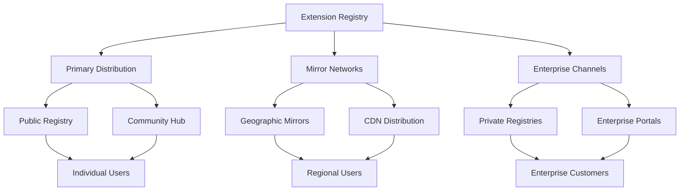

# Distribution

Comprehensive distribution system for Anya Extensions providing secure, reliable, and efficient delivery of Bitcoin, Web5, and ML extensions across multiple channels and platforms.

## Overview

The Anya Extensions distribution system ensures that high-quality extensions reach users efficiently while maintaining security, integrity, and compatibility across different deployment environments. Our multi-tier distribution approach supports various user needs from individual developers to enterprise deployments.

## Distribution Architecture



## Distribution Channels

### 1. Primary Public Registry

The main distribution channel for all approved extensions.

#### Registry Structure

```
anya-extensions-registry/
├── core/                   # Core system extensions
│   ├── bitcoin/           # Bitcoin-specific extensions
│   ├── web5/              # Web5 protocol extensions
│   └── ml/                # Machine learning extensions
├── community/             # Community-developed extensions
│   ├── verified/          # Verified community extensions
│   └── experimental/      # Experimental/beta extensions
├── enterprise/            # Enterprise-grade extensions
│   ├── custody/           # Custody and security solutions
│   ├── compliance/        # Regulatory compliance tools
│   └── infrastructure/    # Infrastructure management
└── metadata/              # Registry metadata and indices
    ├── index.json         # Primary registry index
    ├── signatures/        # Cryptographic signatures
    └── checksums/         # File integrity checksums
```

#### Access Patterns

```rust
// Example registry client usage
use anya_extensions::registry::{Registry, RegistryConfig};

#[tokio::main]
async fn main() -> Result<(), Box<dyn std::error::Error>> {
    let config = RegistryConfig {
        primary_url: "https://registry.anya-extensions.org".to_string(),
        mirrors: vec![
            "https://mirror1.anya-extensions.org".to_string(),
            "https://mirror2.anya-extensions.org".to_string(),
        ],
        cache_dir: Some("/tmp/anya-cache".to_string()),
        verify_signatures: true,
    };
    
    let registry = Registry::new(config).await?;
    
    // Search for Bitcoin extensions
    let bitcoin_extensions = registry
        .search("bitcoin")
        .category("core")
        .min_rating(4.0)
        .execute()
        .await?;
    
    for extension in bitcoin_extensions {
        println!("Found: {} v{}", extension.name, extension.version);
    }
    
    Ok(())
}
```

### 2. Community Distribution Hub

Collaborative platform for community-driven extension sharing and discovery.

#### Features

- **Community Ratings**: User ratings and reviews for extensions
- **Curated Collections**: Expert-curated extension bundles
- **Discussion Forums**: Community discussion and support
- **Tutorial Integration**: Step-by-step guides and tutorials
- **Contribution Tracking**: Recognition for community contributors

#### Community API

```rust
// Community hub interaction
use anya_extensions::community::{CommunityHub, Rating, Review};

let hub = CommunityHub::new("https://community.anya-extensions.org").await?;

// Submit a review
let review = Review {
    extension_id: "bitcoin-lightning-manager".to_string(),
    rating: Rating::FiveStars,
    title: "Excellent Lightning Network integration".to_string(),
    content: "Easy to use, well documented, secure implementation.".to_string(),
    verified_purchase: true,
};

hub.submit_review(review).await?;

// Get community recommendations
let recommendations = hub
    .get_recommendations()
    .for_user_profile(&user_profile)
    .category("bitcoin")
    .limit(10)
    .execute()
    .await?;
```

### 3. Enterprise Distribution

Specialized distribution channels for enterprise customers with enhanced security and support.

#### Enterprise Features

- **Private Registries**: Organization-specific extension repositories
- **Security Audits**: Enhanced security validation and auditing
- **Support Tiers**: Professional support and maintenance contracts
- **Compliance Reporting**: Detailed compliance and audit reporting
- **Custom Deployment**: Tailored deployment and integration services

#### Enterprise Registry Configuration

```yaml
# enterprise-registry.yml
enterprise:
  organization: "acme-corp"
  registry_url: "https://registry.acme-corp.internal"
  
  security:
    require_signatures: true
    allowed_publishers: 
      - "anya-core-team"
      - "acme-security-team"
    audit_logging: true
    vulnerability_scanning: true
  
  compliance:
    standards: ["SOC2", "ISO27001", "PCI-DSS"]
    reporting: 
      frequency: "monthly"
      recipients: ["security@acme-corp.com"]
  
  support:
    tier: "enterprise"
    sla: "24x7"
    contacts: ["support@acme-corp.com"]
```

## Package Management

### Installation Methods

#### Command Line Interface

```bash
# Install from primary registry
anya-ext install bitcoin-core-wallet

# Install specific version
anya-ext install bitcoin-core-wallet@1.2.3

# Install from community hub
anya-ext install --source community lightning-network-tools

# Install enterprise extension
anya-ext install --source enterprise \
  --org acme-corp \
  custody-management-suite

# Install with specific configuration
anya-ext install bitcoin-core-wallet \
  --config testnet=true \
  --config rpc_url="https://testnet.bitcoin.org"
```

#### Programmatic Installation

```rust
use anya_extensions::installer::{Installer, InstallOptions};

let installer = Installer::new().await?;

let options = InstallOptions {
    extension_name: "bitcoin-core-wallet".to_string(),
    version: Some("1.2.3".to_string()),
    source: Source::Primary,
    verify_signatures: true,
    auto_configure: true,
    config_overrides: HashMap::from([
        ("network".to_string(), "testnet".to_string()),
    ]),
};

let installation = installer.install(options).await?;
println!("Installed: {} at {}", installation.name, installation.path);
```

#### Configuration Management

```rust
// Extension configuration system
use anya_extensions::config::{ConfigManager, ConfigSource};

let config_manager = ConfigManager::new()?;

// Load configuration from multiple sources
config_manager
    .add_source(ConfigSource::File("~/.anya/extensions.toml"))
    .add_source(ConfigSource::Environment)
    .add_source(ConfigSource::CommandLine)
    .load()?;

// Apply configuration to extension
let bitcoin_config = config_manager
    .get_extension_config("bitcoin-core-wallet")?;

bitcoin_config.apply_to_extension().await?;
```

### Dependency Management

#### Dependency Resolution

```toml
# Extension manifest with dependencies
[package]
name = "lightning-payment-processor"
version = "1.0.0"

[dependencies]
bitcoin-core-wallet = "^1.2.0"
lightning-network-tools = "^2.1.0"
web5-identity = "^1.0.0"

[dependencies.ml-fraud-detection]
version = "^0.5.0"
optional = true
features = ["real-time-scoring"]

[features]
default = ["basic-payments"]
advanced = ["ml-fraud-detection", "batch-processing"]
enterprise = ["advanced", "audit-logging", "compliance-reporting"]
```

#### Conflict Resolution

```rust
// Dependency conflict resolution
use anya_extensions::resolver::{DependencyResolver, ConflictStrategy};

let resolver = DependencyResolver::new()
    .strategy(ConflictStrategy::PreferLatest)
    .allow_prerelease(false)
    .security_audit_required(true);

let resolution = resolver
    .resolve_dependencies(&extension_manifest)
    .await?;

if let Some(conflicts) = resolution.conflicts() {
    for conflict in conflicts {
        println!("Conflict: {} vs {}", 
            conflict.package_a, 
            conflict.package_b
        );
        
        // Apply resolution strategy
        let resolution = resolver
            .resolve_conflict(&conflict)
            .await?;
        
        println!("Resolved to: {}", resolution.chosen_version);
    }
}
```

## Security and Integrity

### Cryptographic Verification

#### Package Signing

```rust
// Package signature verification
use anya_extensions::crypto::{SignatureVerifier, PublicKey};

let verifier = SignatureVerifier::new();

// Load trusted public keys
let trusted_keys = vec![
    PublicKey::from_pem(include_str!("keys/anya-core.pem"))?,
    PublicKey::from_pem(include_str!("keys/community.pem"))?,
];

verifier.add_trusted_keys(trusted_keys);

// Verify package signature
let package_path = "bitcoin-core-wallet-1.2.3.tar.gz";
let signature_path = "bitcoin-core-wallet-1.2.3.tar.gz.sig";

let verification_result = verifier
    .verify_package(package_path, signature_path)
    .await?;

match verification_result {
    VerificationResult::Valid(signer) => {
        println!("Package verified, signed by: {}", signer.name);
    }
    VerificationResult::Invalid(reason) => {
        return Err(format!("Verification failed: {}", reason).into());
    }
}
```

#### Checksum Verification

```rust
// File integrity verification
use anya_extensions::integrity::{ChecksumVerifier, HashAlgorithm};

let verifier = ChecksumVerifier::new(HashAlgorithm::SHA256);

// Verify downloaded package
let expected_checksum = "a1b2c3d4e5f6..."; // From registry metadata
let actual_checksum = verifier
    .calculate_checksum("bitcoin-core-wallet-1.2.3.tar.gz")
    .await?;

if expected_checksum != actual_checksum {
    return Err("Checksum mismatch - package may be corrupted".into());
}
```

### Vulnerability Management

#### Security Scanning

```rust
// Vulnerability scanning integration
use anya_extensions::security::{VulnerabilityScanner, ScanResult};

let scanner = VulnerabilityScanner::new()
    .database_url("https://vulndb.anya-extensions.org")
    .scan_dependencies(true)
    .check_signatures(true);

let scan_result = scanner
    .scan_extension("bitcoin-core-wallet")
    .await?;

match scan_result {
    ScanResult::Clean => {
        println!("No vulnerabilities found");
    }
    ScanResult::Vulnerabilities(vulns) => {
        for vuln in vulns {
            println!("Vulnerability: {} - Severity: {:?}", 
                vuln.id, 
                vuln.severity
            );
        }
    }
}
```

## Performance and Scalability

### Content Delivery Network

#### CDN Configuration

```yaml
# CDN distribution configuration
cdn:
  providers:
    - name: "cloudflare"
      regions: ["global"]
      priority: 1
    - name: "aws-cloudfront"
      regions: ["americas", "europe"]
      priority: 2
    - name: "azure-cdn"
      regions: ["asia-pacific"]
      priority: 2
  
  caching:
    max_age: 3600  # 1 hour
    immutable_packages: true
    edge_cache_size: "10GB"
  
  compression:
    algorithms: ["gzip", "brotli"]
    min_size: 1024  # bytes
```

#### Geographic Distribution

```rust
// Geographic-aware distribution
use anya_extensions::distribution::{GeographicRouter, Region};

let router = GeographicRouter::new()
    .add_mirror(Region::NorthAmerica, "https://na.mirror.anya-extensions.org")
    .add_mirror(Region::Europe, "https://eu.mirror.anya-extensions.org")
    .add_mirror(Region::AsiaPacific, "https://ap.mirror.anya-extensions.org")
    .fallback("https://registry.anya-extensions.org");

// Automatically route to nearest mirror
let download_url = router
    .get_optimal_url("bitcoin-core-wallet-1.2.3.tar.gz", user_location)
    .await?;
```

### Caching Strategies

#### Local Caching

```rust
// Local package caching
use anya_extensions::cache::{PackageCache, CachePolicy};

let cache = PackageCache::new("/var/cache/anya-extensions")
    .policy(CachePolicy {
        max_size: "1GB".parse()?,
        ttl: Duration::from_secs(3600),
        cleanup_interval: Duration::from_secs(300),
    })
    .build()?;

// Cache-aware package installation
let package = cache
    .get_or_fetch("bitcoin-core-wallet", "1.2.3")
    .await?;
```

## Monitoring and Analytics

### Distribution Metrics

#### Usage Analytics

```rust
// Usage tracking and analytics
use anya_extensions::analytics::{AnalyticsCollector, Event};

let collector = AnalyticsCollector::new()
    .endpoint("https://analytics.anya-extensions.org")
    .privacy_compliant(true);

// Track installation events
collector.track(Event::Installation {
    extension_name: "bitcoin-core-wallet".to_string(),
    version: "1.2.3".to_string(),
    source: "primary-registry".to_string(),
    user_agent: "anya-cli/1.0.0".to_string(),
    success: true,
}).await?;

// Generate usage reports
let usage_report = collector
    .generate_report()
    .time_range(last_30_days())
    .group_by("extension_category")
    .metrics(vec!["downloads", "installations", "active_users"])
    .execute()
    .await?;
```

#### Performance Monitoring

```yaml
# Monitoring configuration
monitoring:
  metrics:
    - name: "download_latency"
      type: "histogram"
      buckets: [0.1, 0.5, 1.0, 2.0, 5.0, 10.0]
    
    - name: "installation_success_rate"
      type: "gauge"
      labels: ["extension", "version", "platform"]
    
    - name: "registry_availability"
      type: "gauge"
      targets: ["primary", "mirrors"]
  
  alerts:
    - name: "high_download_latency"
      condition: "download_latency_p95 > 5.0"
      severity: "warning"
    
    - name: "low_success_rate"
      condition: "installation_success_rate < 0.95"
      severity: "critical"
```

## Platform Support

### Multi-Platform Distribution

#### Platform-Specific Packages

```toml
# Platform-specific package configurations
[platforms.linux-x86_64]
package_format = "tar.gz"
binary_suffix = ""
additional_deps = ["openssl", "libsecp256k1"]

[platforms.macos-arm64]
package_format = "tar.gz"
binary_suffix = ""
signing_required = true
notarization_required = true

[platforms.windows-x86_64]
package_format = "zip"
binary_suffix = ".exe"
code_signing_required = true

[platforms.docker]
base_images = ["alpine:3.18", "ubuntu:22.04"]
package_format = "container"
```

#### Cross-Platform Compatibility

```rust
// Platform detection and compatibility
use anya_extensions::platform::{Platform, Compatibility};

let current_platform = Platform::detect()?;
let extension_info = registry.get_extension_info("bitcoin-core-wallet").await?;

let compatibility = Compatibility::check(
    &current_platform,
    &extension_info.supported_platforms
)?;

match compatibility {
    Compatibility::Supported => {
        println!("Extension is compatible with this platform");
    }
    Compatibility::Unsupported(reason) => {
        println!("Extension not supported: {}", reason);
    }
    Compatibility::RequiresEmulation(emulator) => {
        println!("Extension requires emulation: {}", emulator);
    }
}
```

## Enterprise Features

### Private Registries

#### Setup and Configuration

```bash
# Deploy private registry
anya-registry deploy \
  --type private \
  --organization acme-corp \
  --storage s3://acme-registry-bucket \
  --auth ldap://ldap.acme-corp.com \
  --ssl-cert /path/to/cert.pem \
  --ssl-key /path/to/key.pem

# Configure client for private registry
anya-ext config set registry.private.url https://registry.acme-corp.internal
anya-ext config set registry.private.auth-method ldap
anya-ext config set registry.private.verify-ssl true
```

#### Access Control

```yaml
# Private registry access control
access_control:
  authentication:
    method: "ldap"
    ldap_server: "ldap://ldap.acme-corp.com"
    base_dn: "ou=users,dc=acme-corp,dc=com"
  
  authorization:
    roles:
      - name: "developer"
        permissions: ["read", "install"]
        extensions: ["core/*", "community/verified/*"]
      
      - name: "admin"
        permissions: ["read", "install", "publish", "manage"]
        extensions: ["*"]
      
      - name: "security"
        permissions: ["read", "audit", "security-scan"]
        extensions: ["*"]
```

### Compliance and Auditing

#### Audit Logging

```rust
// Comprehensive audit logging
use anya_extensions::audit::{AuditLogger, AuditEvent};

let audit_logger = AuditLogger::new()
    .output_format(AuditFormat::Json)
    .destination("file:///var/log/anya-extensions/audit.log")
    .compliance_standards(vec!["SOX", "PCI-DSS", "GDPR"]);

// Log installation events
audit_logger.log(AuditEvent::Installation {
    user_id: "john.doe@acme-corp.com".to_string(),
    extension_name: "bitcoin-custody-manager".to_string(),
    version: "2.1.0".to_string(),
    timestamp: Utc::now(),
    ip_address: Some("192.168.1.100".to_string()),
    success: true,
    compliance_notes: Some("SOX compliance verified".to_string()),
}).await?;
```

## Future Enhancements

### Planned Features

- **Blockchain-Based Distribution**: Decentralized package distribution using Bitcoin and Web5
- **AI-Powered Recommendations**: Machine learning-driven extension discovery
- **Cross-Chain Integration**: Support for multi-blockchain extension ecosystems
- **Zero-Trust Security**: Enhanced security model with continuous verification
- **Developer Analytics**: Advanced analytics for extension developers

### Community Roadmap

- **Decentralized Governance**: Community-driven distribution decisions
- **Incentive Mechanisms**: Token-based rewards for quality contributions
- **Global Mirrors**: Expanded geographic distribution network
- **Educational Platform**: Integrated learning and certification programs

*Last updated: June 7, 2025*
